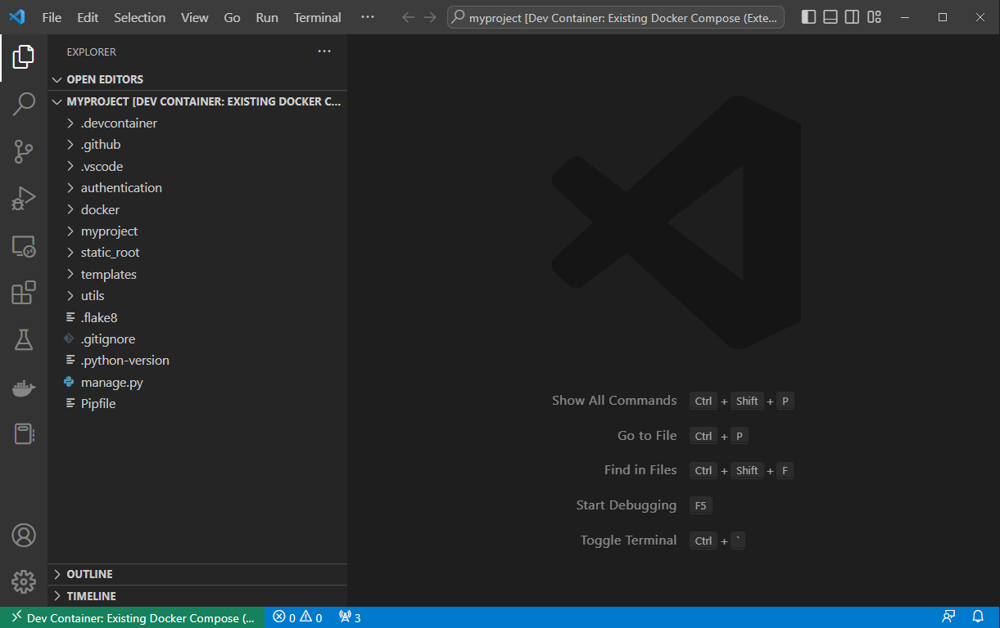
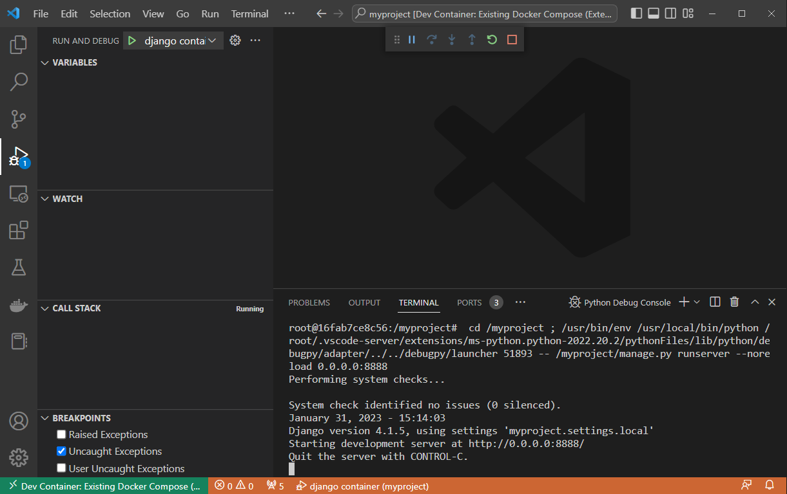

<div align="center">
  <h1 align="center">Broth Django Backend Server Template</h1>

  <strong align="center">
A django server template for jumpstarting you project using a standardized workflow using reliable and tested technology.
<br/><br/>
   <a href="https://github.com/source-maker/broth/issues">Request Feature</a>・
   <a href="https://github.com/source-maker/broth/issues">Report Bug</a>
  </strong>
</div>
<hr />

<!-- ABOUT THE PROJECT -->

# Concept

Broth is boilerplate that provide a production-ready foundation for applications due to the focus of cherry picking OSS projects that ensure long term stability.
It comes equipped with numerous, premade components and features that are ready to be customized and used in your project.

## Flexibile Architecture

Flexible scalability is achieved by developing backend and frontend separately, integrating them together via API endpoints. This allows for the backend to be developed in any language and the frontend to be developed in any framework. The boilerplate is designed to be used with NextJS, a React framework for production-grade apps, while the backend is developed in Django, a Python-based backend framework for web applications.

## Standardized Workflow

Our boilerplate is designed to be used with a standardized workflow that is easy to learn and use.<br />The workflow is based on the following principles:

1. Design - Designers customize the UI to match the client's brand and product via Figma.
2. Develop - The designs are then delivered to the engineers for implementation of the features.
3. Test - The engineers test the features to ensure they are working as intended.
4. Deploy - The engineers deploy the features to the production environment.

## Reliable and Tested Technology

We have chosen various OSS projects to build on top of this framework that have proven to be stable and secure, powered by a large community of contributors.
This ensures that the features are reliable and secure.


## Features

-   For Django 4.0
-   Quick and simple setup identical to your remote server environment
-   Preconfigured with nginx/redis/Postgres
-   Optimized for container development
-   Built-in code formatter 
-   Supports OAuth signup and loging including LINE
-   Easy setup for multi-stage server deployments (i.e. dev/stg/prod)
-   Customizable PostgreSQL version
-   Comes with OpenAPI 3.0 support with Swagger 
-   Run tests with unittest or pytest

# Starting a New Project


## How to Get Started

[](https://www.youtube.com/watch?v=5UaUy7t0FQU)
(Click to play)


Use [cookiecutter](https://github.com/cookiecutter/cookiecutter) to create your project

Install and run cokkiecutter as following

```
pip install cookiecutter
pip install https://github.com/source-maker/broth.git
```

Answer the prompts with your options. For example,

```
project_name [Django Web Project Name]: Sample Project
project_slug [sample_project]: myproject
author_name [Source Maker]: Source Maker
email [sample@source-maker.co.jp]: shinkawa@source-maker.co.jp
description [Django website template.]: My First Django Project!
python_version [3.10.3]:
psql_version [13.4]:
base_domain [xxxx.com]: mydjango.com
```

Next, open your project with VSCode.

Broth comes with a preconfigured [devcontainer.json](https://code.visualstudio.com/docs/devcontainers/containers#_create-a-devcontainerjson-file) to support a remote container development. See [Developing inside a Container](https://code.visualstudio.com/docs/devcontainers/containers) for the detail and configuration.

After opening it in Container, your screen will look something like this



Conguratioration! You have just created a full-backend server system ready for your needs!


## Starting a Server for Development

Press F5 or select server start button from Run and Debug. Then the server will start at `http://localhost:8888` with the following messages on the VSCode.




Open a web browser of your choice and access your local
[admin site](http://localhost:8888/admin/).


### Important Notes
- <b>Watch for Conflicting Ports</b> - If another service on your computer is using either of these ports, the command may start with a different port. If you have trouble accessing any of the local servers, please refer to your terminal for the correct url address.

- Due to some technical constrain there is another server running at `http://localhost:8000`. However, you should not access it for testing/development purpose. It is only there to keep the container running.

# Basic File Structure
- .devcontainer
  - Setting files for VSCode remote container
- .vscode
  - Setting for VSCode coding style
- docker
  - Docker image for each component（django/nginx/psql)
- {{cookiecutter.project_slug}}
  - django setting files


# How to Contribute

We welcome contributions from the community! 
If you would like to contribute to this project, please follow the following steps:

## How to Submit a Feature Request

1. Create a new issue
2. Provide a detailed description of the feature to build. We may ask for clarification if needed.
3. Develop the page/component. If new, please include a matching storybook story so it is added into our storybook showcase
4. Provide any relevant screenshots and links to access the feature


## How to Submit a Bug Report

If you find a bug, please follow the following steps:

1. Create a new issue
2. Provide a detailed description of the bug
3. Provide steps to reproduce the bug
4. Provide any relevant screenshots

<!-- LICENSE -->

# License

This project is licensed under the terms of the [3-Clause BSD License](./LICENSE).

<!-- CONTACT -->

# Contact

- Source Maker - broth@source-maker.co.jp
- Kohei Shinkawa - shinkawa@source-maker.co.jp
