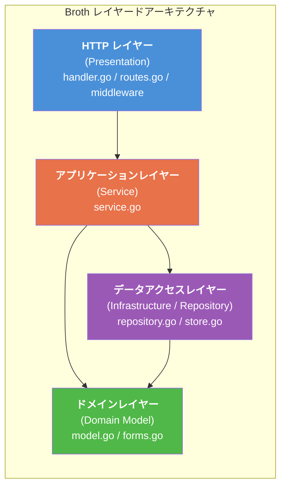
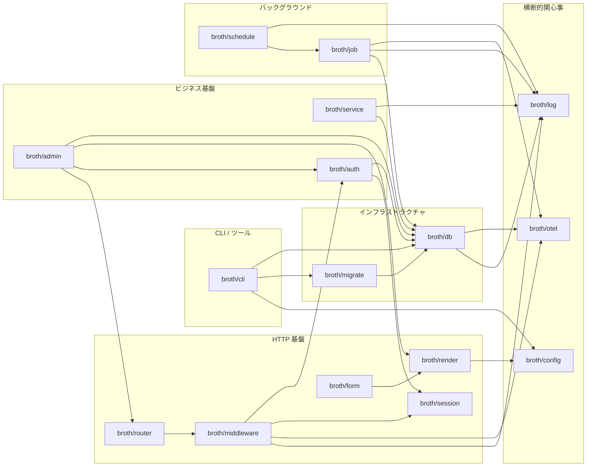
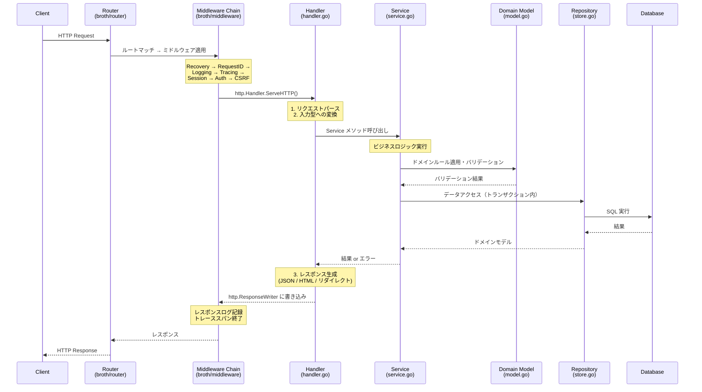

# Broth -- アーキテクチャ設計書

> **バージョン**: 0.1.0-draft
> **最終更新**: 2026-02-08
> **ステータス**: 初期設計

---

## 目次

1. [設計思想](#1-設計思想)
2. [Broth が解決する問題](#2-broth-が解決する問題)
3. [レイヤードアーキテクチャ](#3-レイヤードアーキテクチャ)
4. [フレームワークコアモジュール一覧](#4-フレームワークコアモジュール一覧)
5. [リクエストライフサイクル](#5-リクエストライフサイクル)
6. [設計判断の記録](#6-設計判断の記録)

---

## 1. 設計思想

Broth は **Goで中規模Webアプリケーションを構築するためのフルスタックフレームワーク** である。
Django/Rails が確立した「batteries included + 強い規約」のアプローチを、Go のイディオム（明示性・型安全・並列処理）を損なわずに実現する。

### 5つの柱

| 柱 | 説明 |
|---|---|
| **Majestic Monolith + モジュラモノリス** | 単一デプロイ。内部はモジュール境界で構造化し、将来の分割にも備える |
| **Convention over Configuration** | 「どこに何を書くか」をフレームワークが規定する。AI支援コーディングとの相性を最大化 |
| **Secure by Default** | SSR/API 文脈に応じた CSRF・CORS・認証を自動適用 |
| **Single Binary** | ジョブキュー・スケジューラを内蔵し、`go build` 一発でデプロイ可能な単一バイナリを生成 |
| **Observable by Default** | 構造化ログ（slog）・OpenTelemetry をコアに統合。計装をアプリ開発者に意識させない |

### Go イディオムへの忠誠

Broth は以下の制約を自らに課す。

1. **リフレクションは最小限** -- `go generate` ベースのコード生成を優先する
2. **`go build` 一発** -- CGO不要、単一バイナリ
3. **標準ライブラリ最大活用** -- `net/http`, `database/sql`, `log/slog`, `html/template`
4. **サードパーティ依存は最小限** -- SQLドライバ程度に留める（ただし設計原則と整合し実績のあるライブラリは例外として許容。例: `golang-jwt/jwt`（セキュリティ）、Bob（database-first コード生成、`interface{}` 不使用・リフレクション不使用で P1 原則に合致））
5. **`interface{}` を公開APIに使わない** -- 全ての公開APIに型を持たせる
6. **DI コンテナ不要** -- コンストラクタ注入（明示的な `New*`）で依存を解決する

---

## 2. Broth が解決する問題

### Go でフルスタックフレームワークが台頭しなかった理由

Go コミュニティには「標準ライブラリで十分」「フレームワークは不要」という文化がある。
これには合理的な理由があった。

| 要因 | 詳細 | 現在の状況 |
|---|---|---|
| ジェネリクスの不足 | 汎用的なコレクション操作や型安全なDIが困難だった | Go 1.18 で解消 |
| リフレクション忌避 | 実行時型情報に依存するFWへの不信 | `go generate` でコンパイル時解決が主流に |
| 標準ライブラリの充実 | `net/http` が十分に強力 | 逆に「薄いラッパー」が乱立し、構造がブレる原因に |
| 「Goらしさ」の圧力 | 明示性を好む文化がFWの規約と相性が悪い | 規約の形式が問題であり、規約そのものは有用 |

### 結果として生じた問題

Gin/Echo/Chi 等の「薄いルーター」を中心にアプリケーションを構築すると、以下の問題が生じる。

- **構造の収束性が低い**: プロジェクトごとにディレクトリ構造・レイヤリングがバラバラ
- **ビジネスロジックの置き場所が曖昧**: fat handler（= fat controller）問題が頻発
- **AI支援との相性が悪い**: 「どこに何を書くか」が不明確だとLLMの生成精度が下がる
- **チームスケーリングが困難**: 新メンバーが全体像を把握するのに時間がかかる

### Broth のアプローチ

Broth は **Goの明示性を保ちながら、構造の収束性を最大化する** ことでこれらの問題を解決する。

- ディレクトリ構造・ファイル命名・レイヤー責務を規約で定める
- 規約はリフレクションではなく **コード生成 + コンパイル時チェック** で強制する
- フレームワークのAPIは全て **型安全** であり、`interface{}` を公開しない
- DI は **コンストラクタ注入** のみ。暗黙的なサービスロケータは使わない

---

## 3. レイヤードアーキテクチャ

Broth は 4 層のレイヤードアーキテクチャを採用する。
依存方向は **上位 → 下位のみ** であり、下位レイヤーが上位レイヤーを参照することは禁止する。

### レイヤー依存関係図



> **依存ルール**: 矢印の方向にのみ依存可能。`DATA → APP` や `DOMAIN → HTTP` は禁止。

### 横断的関心事（Cross-Cutting Concerns）

以下はレイヤーを横断して利用されるが、各レイヤーの責務を侵食しない。

- `broth/log` -- 構造化ログ
- `broth/otel` -- トレーシング・メトリクス
- `broth/config` -- 設定値の読み取り
- `broth/auth` -- 認証・認可コンテキスト

---

### 3.1 HTTPレイヤー (Presentation Layer)

**責務**: HTTPリクエストの受付・ルーティング・レスポンスの返却。ビジネスロジックを含まない。

#### ルーター設計

`net/http` の `http.Handler` / `http.HandlerFunc` を基盤とし、独自の型を上から被せない。
Go 1.22 で導入されたパターンマッチ強化（`GET /users/{id}`）を活用する。

```go
// broth/router パッケージ
package router

import "net/http"

// Router は net/http.ServeMux をラップし、モジュール単位のルート登録を提供する。
// http.Handler インターフェースを満たす。
type Router struct {
    mux        *http.ServeMux
    middleware []Middleware
}

// Middleware は標準的な Go のミドルウェアパターン。
type Middleware = func(http.Handler) http.Handler

// Route はルート定義の型安全な表現。
type Route struct {
    Pattern string       // "GET /users/{id}" 形式
    Handler http.Handler
}

// Module はモジュールからルートを収集するためのインターフェース。
type Module interface {
    Routes() []Route
}
```

#### ミドルウェアチェーン

標準的な `func(http.Handler) http.Handler` パターンを採用する。
フレームワーク独自のミドルウェア型は定義しない。

```go
// ミドルウェアの適用順序（外側から内側へ）
//
// Recovery → Logging → Tracing → Auth → CSRF → Handler
//
// 各ミドルウェアは http.Handler を受け取り http.Handler を返す。
func (r *Router) Use(mw ...Middleware) {
    r.middleware = append(r.middleware, mw...)
}
```

#### リクエスト/レスポンスのラッパー

独自の `Context` 型は作らない。`context.Context` に型安全なキーで値を注入する。

```go
// broth/httputil パッケージ
package httputil

import "context"

// 型安全なコンテキストキー（string キーの衝突を防ぐ）
type ctxKey[T any] struct{ name string }

// RequestID はリクエストIDをコンテキストから取得する。
var RequestID = ctxKey[string]{name: "request_id"}

// Get はコンテキストから型安全に値を取得する。
func Get[T any](ctx context.Context, key ctxKey[T]) (T, bool) {
    v, ok := ctx.Value(key).(T)
    return v, ok
}

// Set はコンテキストに型安全に値を設定する。
func Set[T any](ctx context.Context, key ctxKey[T], val T) context.Context {
    return context.WithValue(ctx, key, val)
}
```

**設計判断**: Gin/Echo の `c.Get("key")` は `interface{}` を返し型安全でない。Broth はジェネリクスを用いて型安全なコンテキストアクセスを提供する。独自 Context 型を作らないことで `net/http` との互換性を維持する。

---

### 3.2 アプリケーションレイヤー (Application / Service Layer) -- 最重要

**責務**: ビジネスロジックの実行。トランザクション境界の管理。ドメインモデルとリポジトリの協調。

**これが Broth の最大の差別化ポイントである。**

#### 問題: ビジネスロジックの置き場所

| フレームワーク | 問題 |
|---|---|
| **Rails** | 「fat model」か「fat controller」かの二択。Service Object パターンは規約外 |
| **Django** | views.py にロジックが肥大化。「service層をどこに置くか」が永遠の議論 |
| **Gin/Echo** | ハンドラ関数にロジックが直書きされがち。レイヤーの規約がない |

Broth は **`service.go` をビジネスロジックの公式の置き場所** と明確に定義する。

#### Service 構造体のパターン

```go
// modules/account/service.go
package account

import (
    "context"
    "fmt"

    "myapp/modules/account/internal/store"
    "myapp/broth/db"
)

// Service はアカウントモジュールのビジネスロジックを提供する。
// 依存はコンストラクタで注入する。メソッドにビジネスロジックを記述する。
type Service struct {
    repo  Repository   // interface（repository.go で定義）
    txMgr db.TxManager // トランザクション管理
}

// NewService は Service を生成する。依存は全て引数で明示的に渡す。
func NewService(repo Repository, txMgr db.TxManager) *Service {
    return &Service{repo: repo, txMgr: txMgr}
}

// Register はユーザー登録のビジネスロジック。
// ハンドラから呼ばれ、リポジトリを使ってデータを永続化する。
func (s *Service) Register(ctx context.Context, input RegisterInput) (*User, error) {
    // 1. バリデーション（ドメインルール）
    if err := input.Validate(); err != nil {
        return nil, fmt.Errorf("account: validation failed: %w", err)
    }

    // 2. ビジネスルールの適用
    user := NewUser(input.Email, input.Name)
    if err := user.SetPassword(input.Password); err != nil {
        return nil, fmt.Errorf("account: password hash: %w", err)
    }

    // 3. トランザクション内での永続化
    err := s.txMgr.RunInTx(ctx, func(ctx context.Context) error {
        return s.repo.Create(ctx, user)
    })
    if err != nil {
        return nil, fmt.Errorf("account: create user: %w", err)
    }

    return user, nil
}
```

#### ルール

1. **ハンドラはServiceを呼ぶだけ**: HTTPの関心事（パース・レスポンス生成）のみを持つ
2. **Serviceはドメインモデルとリポジトリを協調させる**: ビジネスロジックの唯一の置き場所
3. **ドメインモデルは自身のバリデーションを持つ**: ただしDB等の外部依存は持たない
4. **リポジトリはデータアクセスのみ**: ビジネスルールを含まない

```
Handler (HTTP の関心事)
  └─→ Service (ビジネスロジック)
        ├─→ Domain Model (バリデーション・ドメインルール)
        └─→ Repository (データアクセス)
```

#### 依存注入: コンストラクタ注入

Broth は DI コンテナを使わない。全ての依存はコンストラクタの引数で明示的に渡す。

```go
// cmd/server/main.go（アプリケーションの組み立て）
func main() {
    // インフラストラクチャの構築
    database := db.Open(cfg.DatabaseURL)
    txMgr := db.NewTxManager(database)

    // リポジトリの構築
    accountRepo := accountstore.New(database)

    // サービスの構築（依存を明示的に注入）
    accountSvc := account.NewService(accountRepo, txMgr)

    // ハンドラの構築
    accountHandler := account.NewHandler(accountSvc)

    // ルーターの組み立て
    r := router.New()
    r.Mount("/accounts", accountHandler)

    // サーバー起動
    log.Info("starting server", "addr", cfg.Addr)
    http.ListenAndServe(cfg.Addr, r)
}
```

**設計判断 -- なぜ DI コンテナを使わないか**:
- Go のコンストラクタ注入は十分に明示的で型安全
- DI コンテナは「何が注入されるか」をコードから読み取りにくくする
- Wire 等のコード生成 DI は選択肢としてあるが、Broth のモジュール規模（7+2人チーム）ではコンストラクタの手動組み立てで十分管理可能
- 依存グラフが複雑化した場合に Wire を導入するドキュメントは別途提供する

---

### 3.3 ドメインレイヤー (Domain Layer)

**責務**: ビジネスエンティティの定義。ドメインルール・バリデーションの保持。外部依存を持たない。

#### ドメインモデル

```go
// modules/account/model.go
package account

import (
    "errors"
    "time"

    "golang.org/x/crypto/bcrypt"
)

// User はアカウントモジュールのドメインモデル。
// DB のテーブル構造ではなく、ビジネス上の概念を表現する。
type User struct {
    ID           int64
    Email        string
    Name         string
    PasswordHash string
    CreatedAt    time.Time
    UpdatedAt    time.Time
}

// NewUser は User を生成する。
func NewUser(email, name string) *User {
    now := time.Now()
    return &User{
        Email:     email,
        Name:      name,
        CreatedAt: now,
        UpdatedAt: now,
    }
}

// SetPassword はパスワードをハッシュ化して設定する。
func (u *User) SetPassword(plain string) error {
    hash, err := bcrypt.GenerateFromPassword([]byte(plain), bcrypt.DefaultCost)
    if err != nil {
        return err
    }
    u.PasswordHash = string(hash)
    return nil
}
```

#### バリデーション

バリデーションはドメインモデルに隣接する入力型（Input / Form）に持たせる。

```go
// modules/account/model.go（続き）
// RegisterInput はユーザー登録の入力を表す。
type RegisterInput struct {
    Email    string
    Name     string
    Password string
}

// Validate はドメインルールに基づくバリデーションを行う。
// DB問い合わせ等の外部依存を持たない純粋なバリデーション。
func (in RegisterInput) Validate() error {
    var errs []error
    if in.Email == "" {
        errs = append(errs, errors.New("email is required"))
    }
    if len(in.Password) < 8 {
        errs = append(errs, errors.New("password must be at least 8 characters"))
    }
    return errors.Join(errs...)
}
```

**設計判断 -- バリデーションの位置づけ**:
- **純粋バリデーション**（フォーマット・必須チェック等）→ ドメインレイヤー（`model.go` 内の `Validate()` メソッド）
- **ビジネスルールバリデーション**（重複チェック等、外部依存が必要）→ アプリケーションレイヤー（`service.go`）
- **入力パースバリデーション**（HTTPリクエストのデコード）→ HTTPレイヤー（`handler.go` または `forms.go`）

---

### 3.4 データアクセスレイヤー (Infrastructure / Repository Layer)

**責務**: データの永続化と取得。SQL の発行。ドメインモデルとDBレコードの変換。

#### Repository パターン

インターフェースはモジュールの公開パッケージに定義し、実装は `internal/store` に隔離する。

```go
// modules/account/repository.go（公開パッケージ -- インターフェース定義）
package account

import "context"

// Repository はユーザーデータへのアクセスを抽象化する。
// テスト時にモック実装に差し替え可能。
type Repository interface {
    Create(ctx context.Context, user *User) error
    FindByID(ctx context.Context, id int64) (*User, error)
    FindByEmail(ctx context.Context, email string) (*User, error)
    Update(ctx context.Context, user *User) error
    Delete(ctx context.Context, id int64) error
}
```

```go
// modules/account/internal/store/user.go（非公開パッケージ -- 実装）
package store

import (
    "context"

    "github.com/stephenafamo/bob"
    "myapp/modules/account"
    "myapp/modules/account/internal/store/models" // bobgen-psql が生成
)

// UserStore は Repository の Bob ベース実装。
type UserStore struct {
    exec bob.Executor // *sql.DB または *sql.Tx を受け入れる
}

// New は UserStore を生成する。account.Repository を満たす。
func New(exec bob.Executor) *UserStore {
    return &UserStore{exec: exec}
}

// Create はユーザーをDBに挿入する。
func (s *UserStore) Create(ctx context.Context, user *account.User) error {
    inserted, err := models.Users.Insert(
        models.UserSetter{
            Email:        omit.From(user.Email),
            Name:         omit.From(user.Name),
            PasswordHash: omit.From(user.PasswordHash),
        },
    ).One(ctx, s.exec)
    if err != nil {
        return err
    }
    user.ID = inserted.ID
    return nil
}

// ...他のメソッドも同様
```

#### Bob（database-first コード生成）+ broth/db

- Broth は Bob（`github.com/stephenafamo/bob`）を推奨データアクセスライブラリとして採用する（ADR-D001）
- `broth generate model` コマンドは内部で `bobgen-psql` を呼び出し、DB スキーマから型安全なモデルコード・テスト用ファクトリーを生成する
- Bob の `bob.Executor` インターフェースが `*sql.DB` / `*sql.Tx` を受け入れるため、`broth/db` の `ConnFromContext` との統合が自然
- 複雑な手書き SQL クエリには `bobgen-sql` または sqlc を補助的に利用可能

#### トランザクション管理

```go
// broth/db パッケージ
package db

import "context"

// TxManager はトランザクションのライフサイクルを管理する。
type TxManager interface {
    // RunInTx はトランザクション内で fn を実行する。
    // fn が error を返した場合はロールバック、nil の場合はコミットする。
    RunInTx(ctx context.Context, fn func(ctx context.Context) error) error
}
```

トランザクション内の `*sql.Tx` は `context.Context` 経由でリポジトリに伝搬する。これにより Service は DB の実装詳細を意識せず、リポジトリ側でコンテキストから `*sql.Tx` を取得して使用する。

---

## 4. フレームワークコアモジュール一覧

### モジュール依存関係図



### モジュール詳細

| パッケージ | 責務 | 主な依存 | 備考 |
|---|---|---|---|
| `broth/router` | HTTPルーティング | `net/http`, `broth/middleware` | `http.ServeMux` ラッパー。モジュール単位のマウントを提供 |
| `broth/middleware` | 標準ミドルウェア群 | `broth/log`, `broth/otel`, `broth/session`, `broth/auth` | Recovery, Logging, Tracing, CORS, CSRF, Auth, RequestID |
| `broth/service` | サービスライフサイクル | `broth/db`, `broth/log` | サービスの起動・停止・ヘルスチェックの統一管理 |
| `broth/db` | DB接続・トランザクション | `database/sql`, `broth/log`, `broth/otel` | コネクションプール管理、TxManager、コンテキスト伝搬 |
| `broth/migrate` | マイグレーション | `broth/db` | SQL ファイルベース。Up/Down/Status。`broth migrate` コマンド |
| `broth/auth` | 認証・認可 | `broth/session`, `broth/db` | セッション認証 + Bearer Token。ロールベースアクセス制御 |
| `broth/session` | セッション管理 | `broth/db` or cookie | Cookie/DBバックエンド選択可能。Gorilla非依存 |
| `broth/render` | テンプレートレンダリング | `html/template`, `broth/config` | レイアウト・パーシャル・ヘルパー関数。ホットリロード（開発時） |
| `broth/form` | フォーム処理・バリデーション | `broth/render` | 構造体タグベースのバインド + バリデーション。CSRFトークン自動埋め込み |
| `broth/job` | バックグラウンドジョブ | `broth/db`, `broth/log`, `broth/otel` | DBベースキュー。リトライ・デッドレター。Single Binary 内蔵 |
| `broth/schedule` | スケジューラ | `broth/job`, `broth/log` | cron 式定期実行。リーダー選出（DB行ロック） |
| `broth/admin` | 管理画面 | `broth/router`, `broth/auth`, `broth/render`, `broth/db` | モデル定義から CRUD UI を自動生成。Django Admin 相当 |
| `broth/config` | 設定管理 | なし（標準ライブラリのみ） | 環境変数 + `.env` ファイル。構造体へのバインド |
| `broth/log` | 構造化ログ | `log/slog` | slog ラッパー。リクエストスコープのログ付与 |
| `broth/otel` | OpenTelemetry統合 | `broth/log` | トレース・メトリクス・ログの相関。HTTP/DB/Job の自動計装 |
| `broth/cli` | CLIツール | `broth/config`, `broth/migrate`, `broth/db` | `broth new`, `broth generate`, `broth migrate`, `broth serve` |

---

## 5. リクエストライフサイクル

### リクエスト処理フロー図



### 処理フローの詳細

| ステップ | レイヤー | 責務 |
|---|---|---|
| 1. ルーティング | HTTP | URLパターンからハンドラを解決 |
| 2. ミドルウェア | HTTP | 横断的関心事（ログ・認証・CSRF等）を処理 |
| 3. リクエストパース | HTTP (Handler) | HTTPリクエストを入力型に変換。パースエラーは即座に返却 |
| 4. サービス呼び出し | Application | ハンドラからサービスメソッドを呼ぶ。1リクエスト = 1サービスメソッド呼び出しが基本 |
| 5. ドメインルール | Domain | 入力のバリデーション、ドメインモデルの生成・更新 |
| 6. データアクセス | Infrastructure | リポジトリ経由でDBを操作。トランザクション境界はサービスが管理 |
| 7. レスポンス生成 | HTTP (Handler) | サービスの戻り値をHTTPレスポンスに変換（JSON / HTML / リダイレクト） |
| 8. ミドルウェア復帰 | HTTP | レスポンスログ記録、トレーススパン終了、リカバリ |

---

## 6. 設計判断の記録

### ADR-001: 独自 Context 型を作らない

**状況**: Gin/Echo は独自の `Context` 型を提供し、リクエスト/レスポンスの操作を集約する。

**決定**: Broth は独自 Context 型を作らず、`context.Context` + ジェネリクスベースの型安全アクセサを使う。

**根拠**:
- `net/http` のハンドラシグネチャ `(w http.ResponseWriter, r *http.Request)` との互換性を維持
- 標準ライブラリのミドルウェアをそのまま利用可能
- 独自型は学習コストを増やし、エコシステムとの互換性を損なう
- ジェネリクス（Go 1.18+）により `interface{}` なしで型安全なコンテキスト値アクセスが可能になった

### ADR-002: DI コンテナを使わない

**状況**: NestJS は DI コンテナで依存を管理する。Go にも Wire, Fx 等のDIライブラリがある。

**決定**: Broth はDIコンテナを使わない。コンストラクタ注入（`New*` 関数）で依存を解決する。

**根拠**:
- Go の明示性の文化に合致する。「何が注入されるか」がコードを読むだけで分かる
- ターゲット規模（7+2人チーム）では、手動の依存組み立て（main.go のワイヤリング）で十分管理可能
- DI コンテナは実行時エラーを発生させうるが、コンストラクタ注入はコンパイル時にエラーを検出する
- Wire 等のコード生成DIは、依存グラフが複雑化した場合のエスケープハッチとしてドキュメントで案内する

### ADR-003: リフレクションの使用方針

**状況**: ORMやフォームバインディングでリフレクションを使うのが一般的。

**決定**: リフレクションは以下の場面でのみ許可する。

| 許可する場面 | 理由 |
|---|---|
| `broth/form` のフォームバインディング | 構造体タグの読み取りは Go の標準的パターン（`encoding/json` と同等） |
| `broth/config` の環境変数バインディング | 同上 |
| `broth/admin` のモデル一覧表示 | 管理画面のUIで構造体フィールドを動的に列挙する必要がある |

それ以外では `go generate` によるコード生成を優先する。特にリポジトリのスキャフォールドやルーティングの登録はコード生成で行う。

### ADR-004: ビジネスロジック層の明示的定義

**状況**: Go のWebアプリケーションではビジネスロジックの置き場所が曖昧になりがちである。

**決定**: `service.go` をビジネスロジックの公式の置き場所と定義する。

**根拠**:
- Rails の「fat model / fat controller」問題を回避
- Django の「views.py にロジックが肥大化する」問題を回避
- 1モジュール1サービス構造体を原則とし、ロジックの分散を防ぐ
- テスタビリティ: サービスの依存はインターフェースで注入されるため、モック差し替えが容易

### ADR-005: パッケージ構造の深さ

**状況**: Go は「フラットなパッケージ」を好む文化がある一方、モジュール境界の明確化には一定の深さが必要。

**決定**: 2~3階層のネストを許容する。具体的には `modules/{name}/internal/store/` まで。

**根拠**:
- Go の `internal/` ディレクトリによるアクセス制御を活用するには最低2階層が必要
- 3階層（`modules/account/internal/store/`）は Go プロジェクトで一般的に受け入れられている深さ
- 4階層以上は避ける。過度なネストは Go の文化に反し、可読性を損なう
- `modules/` プレフィックスにより「フレームワークのコード」と「アプリケーションのコード」を視覚的に分離する

---

## 付録: ディレクトリ構造の全体像

```
myapp/
├── cmd/
│   └── server/
│       └── main.go              # エントリポイント（依存の組み立て）
├── modules/                     # アプリケーションモジュール群
│   ├── account/                 # アカウントモジュール
│   │   ├── handler.go           #   HTTPハンドラ
│   │   ├── service.go           #   ビジネスロジック
│   │   ├── model.go             #   ドメインモデル
│   │   ├── repository.go        #   リポジトリインターフェース
│   │   ├── routes.go            #   ルーティング定義
│   │   ├── forms.go             #   フォーム定義
│   │   ├── templates/           #   テンプレート
│   │   │   ├── login.html
│   │   │   └── register.html
│   │   └── internal/            #   外部非公開
│   │       └── store/
│   │           └── user.go      #     リポジトリ実装
│   ├── article/                 # 記事モジュール（同構造）
│   │   └── ...
│   └── notification/            # 通知モジュール（同構造）
│       └── ...
├── broth/                         # フレームワークコア（将来的に別リポジトリ化）
│   ├── router/
│   ├── middleware/
│   ├── service/
│   ├── db/
│   ├── migrate/
│   ├── auth/
│   ├── session/
│   ├── render/
│   ├── form/
│   ├── job/
│   ├── schedule/
│   ├── admin/
│   ├── config/
│   ├── log/
│   ├── otel/
│   └── cli/
├── migrations/                  # SQLマイグレーションファイル
│   ├── 001_create_users.up.sql
│   └── 001_create_users.down.sql
├── templates/                   # 共通テンプレート（レイアウト等）
│   ├── layouts/
│   │   └── base.html
│   └── partials/
│       ├── header.html
│       └── footer.html
├── static/                      # 静的ファイル
├── go.mod
├── go.sum
└── .env                         # 環境変数（gitignore対象）
```
