# Broth -- 並列処理・バックグラウンドジョブ・スケジューラ設計書

> **バージョン**: 0.1.0-draft
> **最終更新**: 2026-02-08
> **ステータス**: 初期設計
> **前提ドキュメント**: [ARCHITECTURE.md](./ARCHITECTURE.md), [MODULE_DESIGN.md](./MODULE_DESIGN.md)

---

## 目次

1. [設計思想 -- Go の並列処理優位性を活かす3レイヤー](#1-設計思想----go-の並列処理優位性を活かす3レイヤー)
2. [レイヤー配置とARCHITECTURE.mdとの整合](#2-レイヤー配置とarchitecturemdとの整合)
3. [リクエスト内並列処理パターン](#3-リクエスト内並列処理パターン)
4. [軽量バックグラウンドタスク（インプロセス）](#4-軽量バックグラウンドタスクインプロセス)
5. [永続ジョブキュー](#5-永続ジョブキュー)
6. [スケジュールタスク（cron的定期実行）](#6-スケジュールタスクcron的定期実行)
7. [WebSocket / SSE](#7-websocket--sse)
8. [デプロイ構成](#8-デプロイ構成)
9. [graceful shutdown の統合設計](#9-graceful-shutdown-の統合設計)
10. [設計判断の記録](#10-設計判断の記録)

---

## 1. 設計思想 -- Go の並列処理優位性を活かす3レイヤー

Django + Celery + Redis の構成では、「Webリクエスト処理」「バックグラウンドジョブ」「定期実行」がそれぞれ別プロセス（Django / Celery Worker / Celery Beat）+ 別インフラ（Redis）として動作する。この4コンポーネント構成は運用の複雑さを大きく増す。

Go の goroutine と channel は、これらを **単一バイナリ内で** 実現する能力を持つ。Broth はこの優位性を最大限に活かし、以下の3レイヤーで並列処理を設計する。

### 並列処理の3レイヤー

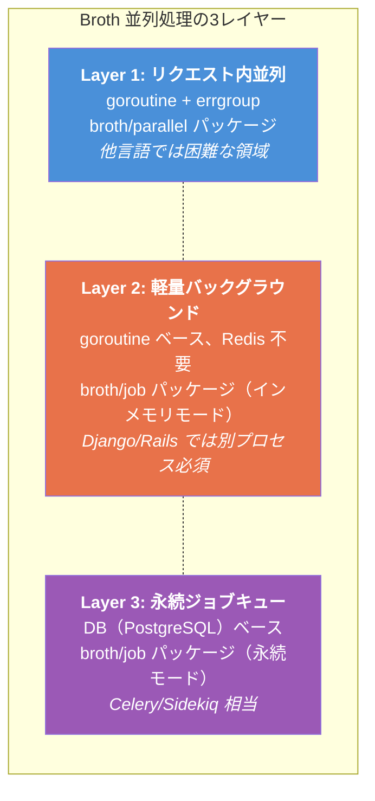

| レイヤー | 用途 | 永続性 | 外部依存 | 例 |
|---|---|---|---|---|
| **Layer 1** | リクエスト処理中の並列I/O | なし | なし | 複数APIの同時呼び出し、N+1回避 |
| **Layer 2** | fire-and-forget 型の軽量タスク | なし（プロセス再起動で消失） | なし | メール送信、Webhook通知、キャッシュ更新 |
| **Layer 3** | 失敗時リトライが必要な重要タスク | あり（DB永続化） | DB | 決済処理、外部API連携、レポート生成 |

**設計方針**: 「Layer 2 で十分な処理を Layer 3 に投げない」。永続化のオーバーヘッド（DB書き込み + ポーリング）は、本当に必要な場合にのみ支払う。

---

## 2. レイヤー配置とARCHITECTURE.mdとの整合

ARCHITECTURE.md で定義された4層レイヤードアーキテクチャに対して、並列処理の各要素は以下のように配置される。

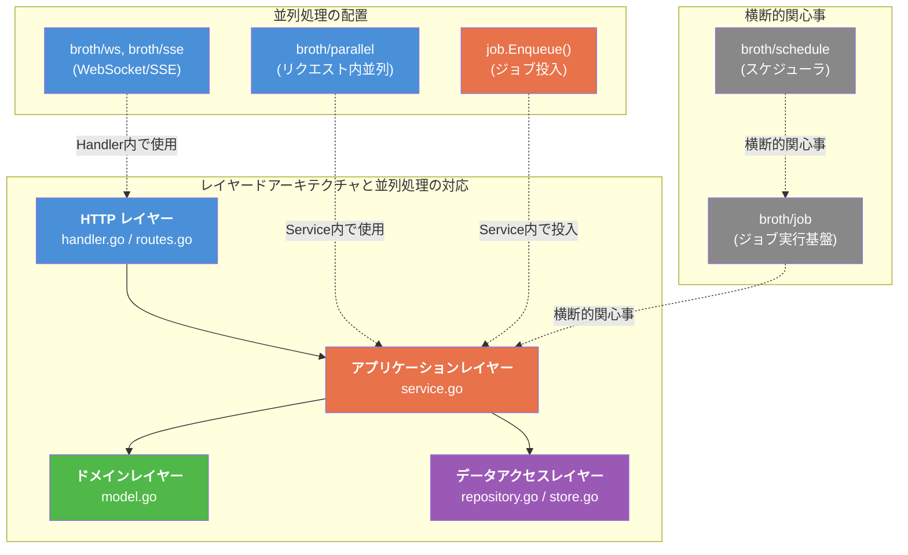

### 配置ルール

| 要素 | 所属レイヤー | 理由 |
|---|---|---|
| `broth/parallel`（リクエスト内並列ヘルパー） | アプリケーションレイヤーで使用 | Service 内での並列I/Oを支援する |
| `job.Enqueue()`（ジョブ投入） | アプリケーションレイヤーで呼び出し | ビジネスロジックの一部としてジョブを投入する |
| ジョブハンドラ（`Execute` メソッド） | アプリケーションレイヤー | ジョブの実体はビジネスロジックである |
| `broth/job`（ジョブ実行基盤） | 横断的関心事 | `broth/log`, `broth/otel` と同様、レイヤーを横断して機能する |
| `broth/schedule`（スケジューラ） | 横断的関心事 | `broth/job` に依存し、定期実行を管理する |
| WebSocket / SSE のハンドラ | HTTPレイヤー | HTTP接続の管理はプレゼンテーション層の責務 |

**重要**: ジョブの **投入** はアプリケーションレイヤー（service.go）で行い、ジョブの **実行基盤** は横断的関心事として扱う。これは「Service がログを書く（broth/log を使う）」のと同じ構造である。

---

## 3. リクエスト内並列処理パターン

### 3.1 概要

リクエスト処理中に複数の独立したI/O操作を並列実行するパターン。Go の goroutine + errgroup で自然に実現でき、他言語（Python/Ruby）では困難な領域である。

Broth は `broth/parallel` パッケージで、errgroup をベースにした型安全なヘルパーを提供する。

### 3.2 `broth/parallel` パッケージ

```go
// broth/parallel/parallel.go
package parallel

import (
    "context"

    "golang.org/x/sync/errgroup"
)

// Group は errgroup.Group のラッパーで、型安全な結果収集を提供する。
// 標準の errgroup は結果の受け渡しにクロージャ変数を使う必要があるが、
// parallel.Collect は型パラメータで結果の型を指定できる。
type Group struct {
    g   *errgroup.Group
    ctx context.Context
}

// New は並列実行グループを作成する。
// context のキャンセル伝播と同時実行数制限を設定できる。
func New(ctx context.Context, opts ...Option) (*Group, context.Context) {
    g, ctx := errgroup.WithContext(ctx)

    o := defaultOptions()
    for _, opt := range opts {
        opt(&o)
    }
    if o.limit > 0 {
        g.SetLimit(o.limit)
    }

    return &Group{g: g, ctx: ctx}, ctx
}

// Go はタスクをグループに追加する。
func (pg *Group) Go(fn func(ctx context.Context) error) {
    ctx := pg.ctx
    pg.g.Go(func() error {
        return fn(ctx)
    })
}

// Wait は全タスクの完了を待つ。いずれかがエラーを返した場合、最初のエラーを返す。
func (pg *Group) Wait() error {
    return pg.g.Wait()
}

// Option は Group の設定オプション。
type Option func(*options)

type options struct {
    limit int
}

func defaultOptions() options {
    return options{limit: 0} // 0 = 無制限
}

// WithLimit は同時実行数の上限を設定する。
func WithLimit(n int) Option {
    return func(o *options) { o.limit = n }
}
```

```go
// broth/parallel/collect.go
package parallel

import (
    "context"
    "sync"
)

// Task は並列実行されるタスクとその結果を表す。
type Task[T any] struct {
    mu     sync.Mutex
    result T
    fn     func(ctx context.Context) (T, error)
}

// NewTask は型安全なタスクを作成する。
func NewTask[T any](fn func(ctx context.Context) (T, error)) *Task[T] {
    return &Task[T]{fn: fn}
}

// Execute はタスクを実行し、結果を内部に保持する。Group.Go に渡す用途。
func (t *Task[T]) Execute(ctx context.Context) error {
    result, err := t.fn(ctx)
    if err != nil {
        return err
    }
    t.mu.Lock()
    t.result = result
    t.mu.Unlock()
    return nil
}

// Result はタスクの結果を返す。Wait() 後に呼ぶこと。
func (t *Task[T]) Result() T {
    t.mu.Lock()
    defer t.mu.Unlock()
    return t.result
}
```

### 3.3 使用例: ダッシュボード画面での並列データ取得

```go
// modules/dashboard/service.go
package dashboard

import (
    "context"
    "fmt"

    "myapp/broth/parallel"
)

// DashboardData はダッシュボード画面に必要なデータ。
type DashboardData struct {
    User           *UserSummary
    RecentArticles []*ArticleSummary
    Notifications  []*Notification
    Stats          *Stats
}

// GetDashboard はダッシュボードデータを並列に取得する。
// 4つの独立したクエリを同時実行し、レイテンシを最小化する。
func (s *Service) GetDashboard(ctx context.Context, userID int64) (*DashboardData, error) {
    // 各タスクを型安全に定義
    userTask := parallel.NewTask(func(ctx context.Context) (*UserSummary, error) {
        return s.accountSvc.GetSummary(ctx, userID)
    })

    articlesTask := parallel.NewTask(func(ctx context.Context) ([]*ArticleSummary, error) {
        return s.articleSvc.ListRecent(ctx, userID, 10)
    })

    notifsTask := parallel.NewTask(func(ctx context.Context) ([]*Notification, error) {
        return s.notifSvc.ListUnread(ctx, userID, 20)
    })

    statsTask := parallel.NewTask(func(ctx context.Context) (*Stats, error) {
        return s.statsSvc.GetUserStats(ctx, userID)
    })

    // 並列実行（いずれかが失敗したら他もキャンセルされる）
    g, ctx := parallel.New(ctx)
    g.Go(userTask.Execute)
    g.Go(articlesTask.Execute)
    g.Go(notifsTask.Execute)
    g.Go(statsTask.Execute)

    if err := g.Wait(); err != nil {
        return nil, fmt.Errorf("dashboard: parallel fetch: %w", err)
    }

    return &DashboardData{
        User:           userTask.Result(),
        RecentArticles: articlesTask.Result(),
        Notifications:  notifsTask.Result(),
        Stats:          statsTask.Result(),
    }, nil
}
```

### 3.4 使用例: 外部API並列呼び出し（同時実行数制限付き）

```go
// modules/product/service.go
package product

import (
    "context"
    "fmt"
    "sync"

    "myapp/broth/parallel"
)

// EnrichProducts は複数商品の外部APIデータを並列で付与する。
// 同時実行数を5に制限し、外部APIへの過負荷を防ぐ。
func (s *Service) EnrichProducts(ctx context.Context, products []*Product) error {
    var mu sync.Mutex

    g, ctx := parallel.New(ctx, parallel.WithLimit(5))

    for _, p := range products {
        p := p // ループ変数キャプチャ（Go 1.22 以降は不要だが明示）
        g.Go(func(ctx context.Context) error {
            price, err := s.priceAPI.GetCurrentPrice(ctx, p.SKU)
            if err != nil {
                return fmt.Errorf("product: enrich %s: %w", p.SKU, err)
            }
            mu.Lock()
            p.CurrentPrice = price
            mu.Unlock()
            return nil
        })
    }

    return g.Wait()
}
```

### 3.5 context 伝播の標準パターン

全てのリクエスト内並列処理で `context.Context` が正しく伝播されることを保証する。

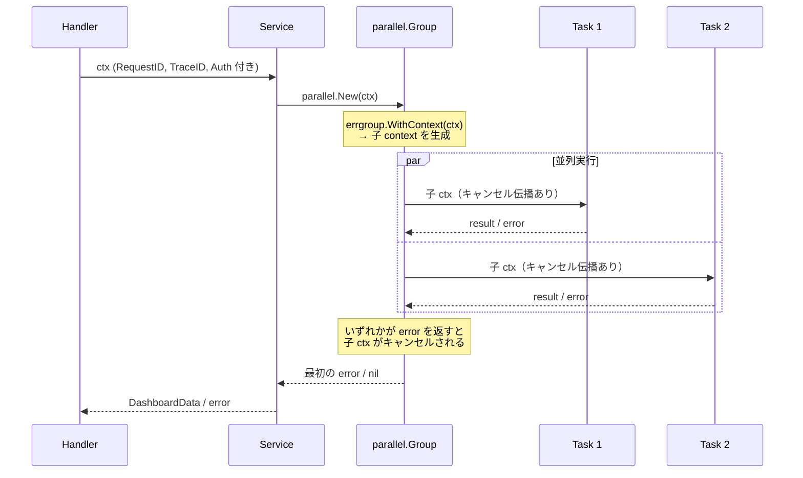

**ルール**:
- `parallel.New(ctx)` は呼び出し元の context を継承し、errgroup の子 context を生成する
- 子タスクのいずれかがエラーを返すと、他のタスクの context がキャンセルされる
- タイムアウトは呼び出し元の context に設定する（`context.WithTimeout`）
- `parallel.Group` 内で新たに `parallel.Group` をネストしない（デッドロック防止）

---

## 4. 軽量バックグラウンドタスク（インプロセス）

### 4.1 概要

goroutine ベースの軽量ジョブ実行基盤。Redis などの外部依存なしで、単一プロセス内でバックグラウンドタスクを実行する。Django/Rails では Celery/Sidekiq という別プロセスが必要な領域を、Go では goroutine で自然に実現できる。

ただし「goroutine を生で使う」とパニックリカバリ、ログ統合、トレース連携、graceful shutdown が漏れがちになる。Broth はこれらを `broth/job` パッケージで標準化する。

### 4.2 ジョブの定義

```go
// broth/job/job.go
package job

import "context"

// Job はバックグラウンドで実行されるタスクのインターフェース。
// 全てのジョブはこのインターフェースを満たす。
type Job interface {
    // JobName はジョブの一意な名前を返す。ログ・トレース・管理画面で使用する。
    JobName() string

    // Execute はジョブの本体を実行する。
    // context にはトレース情報、リクエストIDが伝播される。
    // error を返した場合、永続ジョブではリトライされる。
    Execute(ctx context.Context) error
}

// JobOption はジョブ投入時のオプション。
type JobOption func(*jobOptions)

type jobOptions struct {
    queue    string // キュー名（デフォルト: "default"）
    persist  bool   // true: DB永続化、false: インメモリ
    priority int    // 優先度（0が最高、デフォルト: 5）
}

// WithQueue はジョブを投入するキュー名を指定する。
func WithQueue(name string) JobOption {
    return func(o *jobOptions) { o.queue = name }
}

// WithPersist はジョブをDB永続化する。
// リトライ・デッドレターキュー・管理画面からの確認が有効になる。
func WithPersist() JobOption {
    return func(o *jobOptions) { o.persist = true }
}

// WithPriority はジョブの優先度を設定する（0=最高、9=最低）。
func WithPriority(p int) JobOption {
    return func(o *jobOptions) { o.priority = p }
}
```

### 4.3 アプリケーション側のジョブ定義例

```go
// modules/notification/jobs.go
package notification

import (
    "context"
    "fmt"

    "myapp/broth/log"
)

// SendWelcomeEmail はユーザー登録後のウェルカムメール送信ジョブ。
type SendWelcomeEmail struct {
    UserID int64
    Email  string
    Name   string
}

// JobName はジョブ名を返す。
func (j SendWelcomeEmail) JobName() string { return "notification.send_welcome_email" }

// Execute はメール送信を実行する。
func (j SendWelcomeEmail) Execute(ctx context.Context) error {
    logger := log.FromContext(ctx)
    logger.Info("sending welcome email", "user_id", j.UserID, "email", j.Email)

    // メール送信の実装
    if err := sendEmail(ctx, j.Email, "Welcome!", welcomeBody(j.Name)); err != nil {
        return fmt.Errorf("notification: send welcome email to %s: %w", j.Email, err)
    }

    logger.Info("welcome email sent", "user_id", j.UserID)
    return nil
}
```

### 4.4 ジョブの投入（Service から）

```go
// modules/account/service.go
package account

import (
    "context"
    "fmt"

    "myapp/modules/notification"
    "myapp/broth/db"
    "myapp/broth/job"
    "myapp/broth/log"
)

type Service struct {
    repo     Repository
    txMgr    db.TxManager
    log      *log.Logger
    enqueuer *job.Enqueuer // ジョブ投入器
}

func NewService(repo Repository, txMgr db.TxManager, log *log.Logger, enqueuer *job.Enqueuer) *Service {
    return &Service{repo: repo, txMgr: txMgr, log: log, enqueuer: enqueuer}
}

func (s *Service) Register(ctx context.Context, input RegisterInput) (*User, error) {
    if err := input.Validate(); err != nil {
        return nil, fmt.Errorf("account: validation: %w", err)
    }

    user := NewUser(input.Email, input.Name)
    if err := user.SetPassword(input.Password); err != nil {
        return nil, fmt.Errorf("account: password hash: %w", err)
    }

    err := s.txMgr.RunInTx(ctx, func(ctx context.Context) error {
        return s.repo.Create(ctx, user)
    })
    if err != nil {
        return nil, fmt.Errorf("account: create user: %w", err)
    }

    // バックグラウンドでウェルカムメールを送信（fire-and-forget）
    // メール送信の失敗でユーザー登録は失敗させない
    s.enqueuer.Enqueue(ctx, notification.SendWelcomeEmail{
        UserID: user.ID,
        Email:  user.Email,
        Name:   user.Name,
    })

    s.log.Info(ctx, "user registered", "user_id", user.ID)
    return user, nil
}
```

### 4.5 Enqueuer と Worker の設計

```go
// broth/job/enqueuer.go
package job

import (
    "context"
    "encoding/json"
    "log/slog"
    "time"

    "go.opentelemetry.io/otel"
    "go.opentelemetry.io/otel/trace"
)

// Enqueuer はジョブを投入するためのインターフェース。
// Service に注入され、ジョブの投入のみを担う。
type Enqueuer struct {
    memQueue    chan envelope   // インメモリキュー
    persistBack Backend        // 永続化バックエンド（nil可）
    logger      *slog.Logger
    tracer      trace.Tracer
}

// envelope はジョブの内部表現。
type envelope struct {
    job       Job
    ctx       context.Context
    enqueuedAt time.Time
}

// NewEnqueuer は Enqueuer を生成する。
func NewEnqueuer(logger *slog.Logger, opts ...EnqueuerOption) *Enqueuer {
    o := defaultEnqueuerOptions()
    for _, opt := range opts {
        opt(&o)
    }
    return &Enqueuer{
        memQueue:    make(chan envelope, o.bufferSize),
        persistBack: o.backend,
        logger:      logger,
        tracer:      otel.Tracer("broth/job"),
    }
}

// Enqueue はジョブをキューに投入する。
// デフォルトではインメモリキューに投入される（fire-and-forget）。
// WithPersist() オプション付きの場合はDB永続化される。
func (e *Enqueuer) Enqueue(ctx context.Context, j Job, opts ...JobOption) {
    o := defaultJobOptions()
    for _, opt := range opts {
        opt(&o)
    }

    // トレーススパンの開始
    ctx, span := e.tracer.Start(ctx, "job.enqueue/"+j.JobName())
    defer span.End()

    if o.persist && e.persistBack != nil {
        // 永続ジョブ: DBに書き込み
        if err := e.persistBack.Enqueue(ctx, j, o); err != nil {
            e.logger.ErrorContext(ctx, "failed to enqueue persistent job",
                "job", j.JobName(), "error", err)
        }
        return
    }

    // 軽量ジョブ: インメモリキューに投入
    select {
    case e.memQueue <- envelope{job: j, ctx: ctx, enqueuedAt: time.Now()}:
        e.logger.DebugContext(ctx, "job enqueued (in-memory)", "job", j.JobName())
    default:
        // バッファが満杯の場合はログ警告（ジョブは破棄される）
        e.logger.WarnContext(ctx, "in-memory job queue full, job dropped",
            "job", j.JobName())
    }
}
```

### 4.6 ワーカープール設計

```go
// broth/job/worker.go
package job

import (
    "context"
    "fmt"
    "log/slog"
    "runtime/debug"
    "sync"
    "time"

    "go.opentelemetry.io/otel"
    "go.opentelemetry.io/otel/attribute"
    "go.opentelemetry.io/otel/trace"
)

// Worker はインメモリキューからジョブを取り出して実行するワーカープール。
type Worker struct {
    enqueuer    *Enqueuer
    concurrency int          // 同時実行ワーカー数
    logger      *slog.Logger
    tracer      trace.Tracer
    wg          sync.WaitGroup
    stopCh      chan struct{}
}

// WorkerConfig はワーカーの設定。
type WorkerConfig struct {
    // Concurrency は同時実行ワーカー数。デフォルト: runtime.NumCPU()。
    Concurrency int

    // ShutdownTimeout は graceful shutdown のタイムアウト。
    ShutdownTimeout time.Duration
}

// NewWorker はワーカープールを生成する。
func NewWorker(enqueuer *Enqueuer, cfg WorkerConfig, logger *slog.Logger) *Worker {
    if cfg.Concurrency <= 0 {
        cfg.Concurrency = 4
    }
    return &Worker{
        enqueuer:    enqueuer,
        concurrency: cfg.Concurrency,
        logger:      logger,
        tracer:      otel.Tracer("broth/job"),
        stopCh:      make(chan struct{}),
    }
}

// Start はワーカープールを起動する。
func (w *Worker) Start(ctx context.Context) {
    w.logger.Info("starting job workers", "concurrency", w.concurrency)
    for i := 0; i < w.concurrency; i++ {
        w.wg.Add(1)
        go w.loop(ctx, i)
    }
}

// Shutdown はワーカープールを停止する。
// 実行中のジョブの完了を待ち、新しいジョブの取り出しを停止する。
func (w *Worker) Shutdown(ctx context.Context) error {
    w.logger.Info("shutting down job workers...")
    close(w.stopCh) // 新しいジョブの取り出しを停止

    // 実行中のジョブの完了を待つ（タイムアウト付き）
    done := make(chan struct{})
    go func() {
        w.wg.Wait()
        close(done)
    }()

    select {
    case <-done:
        w.logger.Info("all job workers stopped")
        return nil
    case <-ctx.Done():
        w.logger.Warn("job worker shutdown timed out, some jobs may not have completed")
        return ctx.Err()
    }
}

// loop は個別ワーカーのメインループ。
func (w *Worker) loop(ctx context.Context, workerID int) {
    defer w.wg.Done()
    logger := w.logger.With("worker_id", workerID)
    logger.Debug("job worker started")

    for {
        select {
        case <-w.stopCh:
            logger.Debug("job worker stopping")
            return
        case <-ctx.Done():
            logger.Debug("job worker context cancelled")
            return
        case env := <-w.enqueuer.memQueue:
            w.executeWithRecovery(env, workerID)
        }
    }
}

// executeWithRecovery はジョブをパニックリカバリ付きで実行する。
func (w *Worker) executeWithRecovery(env envelope, workerID int) {
    ctx := env.ctx
    jobName := env.job.JobName()

    // トレーススパンの開始
    ctx, span := w.tracer.Start(ctx, "job.execute/"+jobName,
        trace.WithAttributes(
            attribute.String("job.name", jobName),
            attribute.Int("job.worker_id", workerID),
        ),
    )
    defer span.End()

    logger := w.logger.With(
        "job", jobName,
        "worker_id", workerID,
        "queued_duration", time.Since(env.enqueuedAt).String(),
    )

    logger.InfoContext(ctx, "job started")
    start := time.Now()

    // パニックリカバリ
    defer func() {
        if r := recover(); r != nil {
            stack := string(debug.Stack())
            logger.ErrorContext(ctx, "job panicked",
                "panic", fmt.Sprintf("%v", r),
                "stack", stack,
            )
            span.RecordError(fmt.Errorf("panic: %v", r))
        }
    }()

    // ジョブ実行
    if err := env.job.Execute(ctx); err != nil {
        logger.ErrorContext(ctx, "job failed",
            "error", err,
            "duration", time.Since(start).String(),
        )
        span.RecordError(err)
        return
    }

    logger.InfoContext(ctx, "job completed",
        "duration", time.Since(start).String(),
    )
}
```

### 4.7 アーキテクチャ図

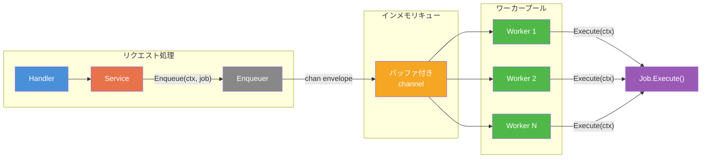

---

## 5. 永続ジョブキュー

### 5.1 概要

DB（PostgreSQL）をバックエンドとした永続ジョブキュー。リトライ、デッドレターキュー、排他制御を提供する。Celery/Sidekiq 相当の機能を、Redis なしで実現する。

**永続ジョブを使うべきケース**:
- 失敗時のリトライが必要（決済処理、外部API連携）
- ジョブの実行状況を追跡したい（管理画面での確認）
- プロセス再起動後もジョブが消失してはならない

### 5.2 テーブル設計

```sql
-- migrations/003_create_broth_jobs.up.sql

CREATE TYPE broth_job_status AS ENUM (
    'pending',    -- 実行待ち
    'running',    -- 実行中
    'completed',  -- 完了
    'failed',     -- 失敗（リトライ対象）
    'dead'        -- デッドレター（リトライ上限到達）
);

CREATE TABLE broth_jobs (
    id            BIGSERIAL PRIMARY KEY,
    name          TEXT NOT NULL,                            -- ジョブ名（例: "notification.send_welcome_email"）
    queue         TEXT NOT NULL DEFAULT 'default',          -- キュー名
    priority      SMALLINT NOT NULL DEFAULT 5,              -- 優先度（0=最高、9=最低）
    payload       JSONB NOT NULL,                           -- ジョブのペイロード（シリアライズされた構造体）
    status        broth_job_status NOT NULL DEFAULT 'pending',
    attempts      SMALLINT NOT NULL DEFAULT 0,              -- 実行試行回数
    max_attempts  SMALLINT NOT NULL DEFAULT 3,              -- 最大試行回数
    last_error    TEXT,                                     -- 最後のエラーメッセージ
    run_at        TIMESTAMPTZ NOT NULL DEFAULT NOW(),       -- 実行予定時刻（遅延実行対応）
    locked_by     TEXT,                                     -- ロック中のワーカーID
    locked_at     TIMESTAMPTZ,                              -- ロック取得時刻
    created_at    TIMESTAMPTZ NOT NULL DEFAULT NOW(),
    updated_at    TIMESTAMPTZ NOT NULL DEFAULT NOW(),
    completed_at  TIMESTAMPTZ,                              -- 完了時刻

    -- トレース情報
    trace_id      TEXT,                                     -- OpenTelemetry TraceID
    parent_span_id TEXT                                     -- 親スパンID
);

-- ジョブ取得用インデックス（pending ジョブを優先度・実行予定時刻順に取得）
CREATE INDEX idx_broth_jobs_fetchable
    ON broth_jobs (queue, priority, run_at)
    WHERE status = 'pending' AND run_at <= NOW();

-- ステータス別の検索用インデックス
CREATE INDEX idx_broth_jobs_status ON broth_jobs (status);

-- 古いジョブのクリーンアップ用インデックス
CREATE INDEX idx_broth_jobs_completed_at ON broth_jobs (completed_at)
    WHERE status IN ('completed', 'dead');

-- スタックしたジョブの検出用インデックス
CREATE INDEX idx_broth_jobs_stuck
    ON broth_jobs (locked_at)
    WHERE status = 'running';
```

### 5.3 ジョブの状態遷移

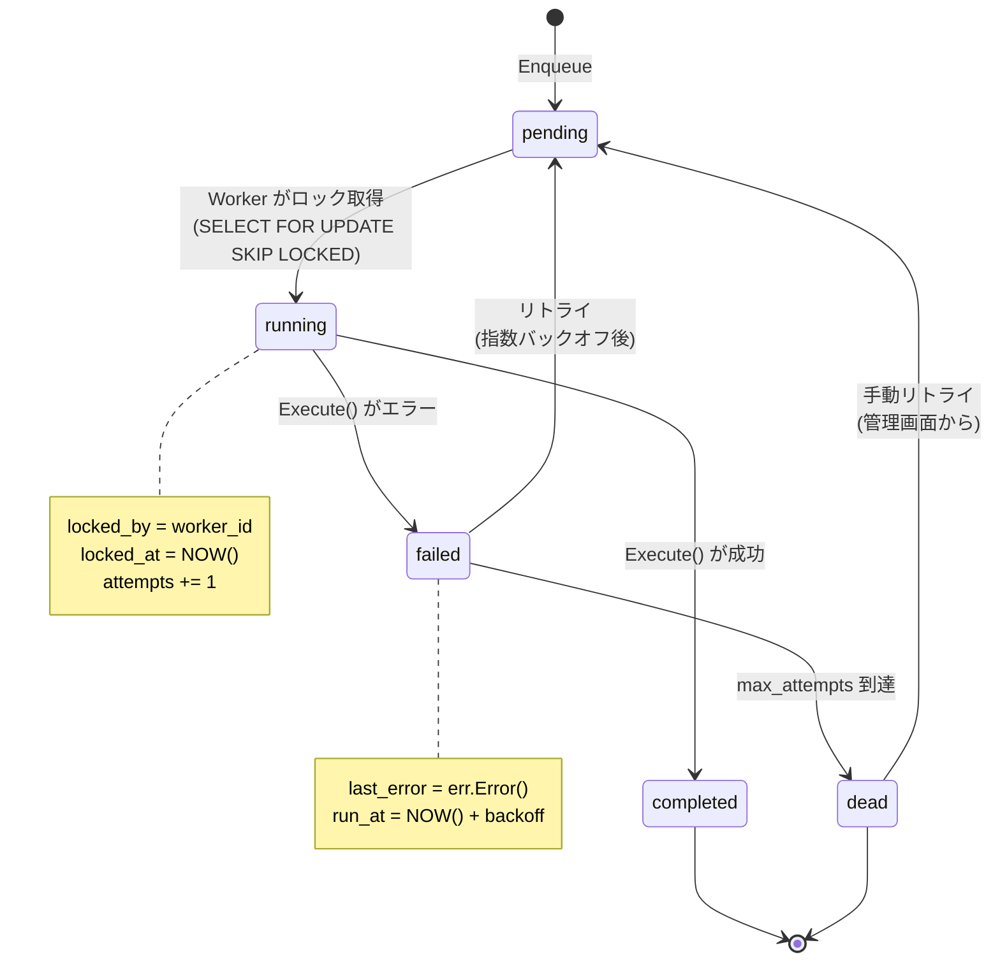

### 5.4 Backend インターフェース（抽象化レイヤー）

将来的な Redis 対応やテスト用のモック差し替えのため、Backend インターフェースで永続化を抽象化する。

```go
// broth/job/backend.go
package job

import (
    "context"
    "time"
)

// Backend はジョブの永続化バックエンドのインターフェース。
// Phase 1: PostgreSQL 実装のみ。
// Phase 2: Redis 実装を追加予定。
type Backend interface {
    // Enqueue はジョブをキューに投入する。
    Enqueue(ctx context.Context, j Job, opts jobOptions) error

    // Fetch は実行可能なジョブを1件取得しロックする。
    // ジョブがない場合は nil を返す（エラーではない）。
    Fetch(ctx context.Context, queues []string, workerID string) (*PersistedJob, error)

    // Complete はジョブを完了にする。
    Complete(ctx context.Context, jobID int64) error

    // Fail はジョブを失敗にする。リトライ可能な場合は pending に戻す。
    Fail(ctx context.Context, jobID int64, err error) error

    // Dead はジョブをデッドレターに移動する。
    Dead(ctx context.Context, jobID int64, err error) error

    // RetryDead はデッドレターのジョブを再実行キューに戻す。
    RetryDead(ctx context.Context, jobID int64) error

    // Stats はキューの統計情報を返す。
    Stats(ctx context.Context) (*QueueStats, error)

    // Cleanup は古いジョブを削除する。
    Cleanup(ctx context.Context, completedBefore time.Time) (int64, error)
}

// PersistedJob はDBから取得したジョブの表現。
type PersistedJob struct {
    ID          int64
    Name        string
    Queue       string
    Priority    int
    Payload     []byte // JSON
    Attempts    int
    MaxAttempts int
    TraceID     string
    CreatedAt   time.Time
}

// QueueStats はキューの統計情報。
type QueueStats struct {
    Pending   int64
    Running   int64
    Completed int64
    Failed    int64
    Dead      int64
    Queues    map[string]QueueDetail
}

// QueueDetail はキュー別の統計情報。
type QueueDetail struct {
    Name    string
    Pending int64
    Running int64
}
```

### 5.5 PostgreSQL Backend 実装

```go
// broth/job/pgbackend/backend.go
package pgbackend

import (
    "context"
    "database/sql"
    "encoding/json"
    "fmt"
    "math"
    "time"

    "myapp/broth/job"
)

// PGBackend は PostgreSQL ベースのジョブバックエンド。
type PGBackend struct {
    db *sql.DB
}

// New は PGBackend を生成する。
func New(db *sql.DB) *PGBackend {
    return &PGBackend{db: db}
}

// Enqueue はジョブをDBに永続化する。
func (b *PGBackend) Enqueue(ctx context.Context, j job.Job, opts job.JobOptions) error {
    payload, err := json.Marshal(j)
    if err != nil {
        return fmt.Errorf("pgbackend: marshal job: %w", err)
    }

    const q = `
        INSERT INTO broth_jobs (name, queue, priority, payload, max_attempts, run_at, trace_id)
        VALUES ($1, $2, $3, $4, $5, $6, $7)`

    _, err = b.db.ExecContext(ctx, q,
        j.JobName(), opts.Queue, opts.Priority, payload,
        opts.MaxAttempts, opts.RunAt, traceIDFromContext(ctx),
    )
    return err
}

// Fetch は SELECT FOR UPDATE SKIP LOCKED で排他的にジョブを取得する。
// 複数ワーカーが同時に Fetch しても、同じジョブが二重実行されることはない。
func (b *PGBackend) Fetch(ctx context.Context, queues []string, workerID string) (*job.PersistedJob, error) {
    // SELECT FOR UPDATE SKIP LOCKED: ロック中の行をスキップし、
    // 実行可能なジョブを1件取得してロックする。
    // これにより、複数ワーカーが同一ジョブを取得することを防ぐ。
    const q = `
        UPDATE broth_jobs
        SET status = 'running',
            locked_by = $1,
            locked_at = NOW(),
            attempts = attempts + 1,
            updated_at = NOW()
        WHERE id = (
            SELECT id FROM broth_jobs
            WHERE status = 'pending'
              AND queue = ANY($2)
              AND run_at <= NOW()
            ORDER BY priority ASC, run_at ASC
            FOR UPDATE SKIP LOCKED
            LIMIT 1
        )
        RETURNING id, name, queue, priority, payload, attempts, max_attempts, trace_id, created_at`

    pj := &job.PersistedJob{}
    err := b.db.QueryRowContext(ctx, q, workerID, queues).Scan(
        &pj.ID, &pj.Name, &pj.Queue, &pj.Priority,
        &pj.Payload, &pj.Attempts, &pj.MaxAttempts,
        &pj.TraceID, &pj.CreatedAt,
    )
    if err == sql.ErrNoRows {
        return nil, nil // ジョブなし（エラーではない）
    }
    if err != nil {
        return nil, fmt.Errorf("pgbackend: fetch job: %w", err)
    }
    return pj, nil
}

// Fail はジョブを失敗にする。
// リトライ可能な場合は pending に戻し、指数バックオフで run_at を設定する。
func (b *PGBackend) Fail(ctx context.Context, jobID int64, jobErr error) error {
    // attempts と max_attempts をまず取得
    var attempts, maxAttempts int
    err := b.db.QueryRowContext(ctx,
        `SELECT attempts, max_attempts FROM broth_jobs WHERE id = $1`, jobID,
    ).Scan(&attempts, &maxAttempts)
    if err != nil {
        return fmt.Errorf("pgbackend: get job for fail: %w", err)
    }

    if attempts >= maxAttempts {
        // リトライ上限到達 → デッドレター
        return b.Dead(ctx, jobID, jobErr)
    }

    // 指数バックオフ: 15s, 60s, 240s, 960s, ...
    // backoff = 15 * 4^(attempts-1) 秒
    backoffSec := 15 * math.Pow(4, float64(attempts-1))
    if backoffSec > 86400 { // 最大24時間
        backoffSec = 86400
    }
    runAt := time.Now().Add(time.Duration(backoffSec) * time.Second)

    const q = `
        UPDATE broth_jobs
        SET status = 'pending',
            locked_by = NULL,
            locked_at = NULL,
            last_error = $2,
            run_at = $3,
            updated_at = NOW()
        WHERE id = $1`

    _, err = b.db.ExecContext(ctx, q, jobID, jobErr.Error(), runAt)
    return err
}

// Complete はジョブを完了にする。
func (b *PGBackend) Complete(ctx context.Context, jobID int64) error {
    const q = `
        UPDATE broth_jobs
        SET status = 'completed',
            locked_by = NULL,
            locked_at = NULL,
            completed_at = NOW(),
            updated_at = NOW()
        WHERE id = $1`
    _, err := b.db.ExecContext(ctx, q, jobID)
    return err
}

// Dead はジョブをデッドレターに移動する。
func (b *PGBackend) Dead(ctx context.Context, jobID int64, jobErr error) error {
    const q = `
        UPDATE broth_jobs
        SET status = 'dead',
            locked_by = NULL,
            locked_at = NULL,
            last_error = $2,
            updated_at = NOW()
        WHERE id = $1`
    _, err := b.db.ExecContext(ctx, q, jobID, jobErr.Error())
    return err
}

// RetryDead はデッドレターのジョブを再実行キューに戻す。
func (b *PGBackend) RetryDead(ctx context.Context, jobID int64) error {
    const q = `
        UPDATE broth_jobs
        SET status = 'pending',
            attempts = 0,
            last_error = NULL,
            run_at = NOW(),
            updated_at = NOW()
        WHERE id = $1 AND status = 'dead'`
    _, err := b.db.ExecContext(ctx, q, jobID)
    return err
}

// Cleanup は完了済み・デッドレターのジョブを削除する。
func (b *PGBackend) Cleanup(ctx context.Context, completedBefore time.Time) (int64, error) {
    const q = `
        DELETE FROM broth_jobs
        WHERE status IN ('completed', 'dead')
          AND updated_at < $1`
    result, err := b.db.ExecContext(ctx, q, completedBefore)
    if err != nil {
        return 0, err
    }
    return result.RowsAffected()
}
```

### 5.6 永続ジョブワーカー

```go
// broth/job/persistent_worker.go
package job

import (
    "context"
    "fmt"
    "log/slog"
    "runtime/debug"
    "sync"
    "time"
)

// PersistentWorker はDBからジョブを取得して実行するワーカー。
type PersistentWorker struct {
    backend     Backend
    registry    *Registry           // ジョブ名 → ジョブファクトリのマッピング
    queues      []string            // 監視するキュー名
    concurrency int
    pollInterval time.Duration      // ポーリング間隔
    workerID    string              // このワーカーの一意なID
    logger      *slog.Logger
    wg          sync.WaitGroup
    stopCh      chan struct{}
}

// PersistentWorkerConfig は永続ジョブワーカーの設定。
type PersistentWorkerConfig struct {
    Queues       []string      // 監視するキュー名。デフォルト: ["default"]
    Concurrency  int           // 同時実行数。デフォルト: 4
    PollInterval time.Duration // ポーリング間隔。デフォルト: 1秒
    WorkerID     string        // ワーカーID。デフォルト: ホスト名+PID
}

// Registry はジョブ名からジョブ構造体を復元するレジストリ。
type Registry struct {
    mu       sync.RWMutex
    factories map[string]func(payload []byte) (Job, error)
}

// NewRegistry はレジストリを生成する。
func NewRegistry() *Registry {
    return &Registry{factories: make(map[string]func([]byte) (Job, error))}
}

// Register はジョブファクトリをレジストリに登録する。
// アプリケーション起動時に全ジョブを登録する。
func Register[T Job](r *Registry, factory func() T) {
    dummy := factory()
    name := dummy.JobName()
    r.mu.Lock()
    defer r.mu.Unlock()
    r.factories[name] = func(payload []byte) (Job, error) {
        j := factory()
        if err := json.Unmarshal(payload, &j); err != nil {
            return nil, fmt.Errorf("job registry: unmarshal %s: %w", name, err)
        }
        return j, nil
    }
}

// Resolve はジョブ名からジョブ構造体を復元する。
func (r *Registry) Resolve(name string, payload []byte) (Job, error) {
    r.mu.RLock()
    factory, ok := r.factories[name]
    r.mu.RUnlock()
    if !ok {
        return nil, fmt.Errorf("job registry: unknown job %q", name)
    }
    return factory(payload)
}
```

### 5.7 永続ジョブの投入例

```go
// 重要な処理（決済完了通知）は永続ジョブとして投入
s.enqueuer.Enqueue(ctx, notification.SendPaymentReceipt{
    OrderID: order.ID,
    UserID:  order.UserID,
},
    job.WithPersist(),         // DB永続化
    job.WithQueue("critical"), // 専用キュー
    job.WithPriority(1),       // 高優先度
)
```

### 5.8 リトライ戦略

```
試行回数  バックオフ時間    累積時間
1回目     即座に実行       0s
2回目     15秒後           15s
3回目     60秒後           1m15s
4回目     240秒後          5m15s
5回目     960秒後          21m15s
6回目     3840秒後         1h5m15s
(上限: 24時間)
```

| 設定 | デフォルト値 | 説明 |
|---|---|---|
| `max_attempts` | 3 | 最大試行回数 |
| バックオフ計算式 | `15 * 4^(n-1)` 秒 | 指数バックオフ |
| バックオフ上限 | 24時間 | これ以上は延びない |
| デッドレター | `max_attempts` 到達後 | 手動リトライ可能 |

### 5.9 スタックジョブの検出

ワーカーが異常終了した場合、`running` ステータスのまま残るジョブが発生しうる。これを定期的にチェックし、自動的にリトライキューに戻す。

```go
// broth/job/stuck_detector.go

// DetectStuckJobs は一定時間以上 running のままのジョブを検出し、
// pending に戻す。ワーカー異常終了時の自動復旧機構。
func (b *PGBackend) DetectStuckJobs(ctx context.Context, stuckThreshold time.Duration) (int64, error) {
    const q = `
        UPDATE broth_jobs
        SET status = 'pending',
            locked_by = NULL,
            locked_at = NULL,
            last_error = 'stuck job detected: worker may have crashed',
            run_at = NOW(),
            updated_at = NOW()
        WHERE status = 'running'
          AND locked_at < $1`
    result, err := b.db.ExecContext(ctx, q, time.Now().Add(-stuckThreshold))
    if err != nil {
        return 0, err
    }
    return result.RowsAffected()
}
```

### 5.10 Celery / Sidekiq との機能比較

| 機能 | Celery (Python) | Sidekiq (Ruby) | Broth/job (Go) Phase 1 | 備考 |
|---|---|---|---|---|
| **バックエンド** | Redis / RabbitMQ / DB | Redis 必須 | PostgreSQL (+ 将来 Redis) | Broth は最小構成で DB のみ |
| **インメモリジョブ** | 不可（必ずブローカー経由） | 不可（必ずRedis経由） | 可能（goroutine 直接） | Broth の差別化ポイント |
| **リトライ** | 指数バックオフ | 指数バックオフ | 指数バックオフ | 同等 |
| **デッドレターキュー** | あり | あり（Dead Set） | あり | 同等 |
| **優先度キュー** | あり（キュー単位） | あり（キュー単位 + 重み付け） | あり（行レベル優先度） | |
| **遅延実行** | `countdown` / `eta` | `perform_at` | `run_at` | 同等 |
| **定期実行** | Celery Beat（別プロセス） | sidekiq-cron（gem追加） | broth/schedule（同一プロセス） | Broth は別プロセス不要 |
| **排他制御** | ロック自前実装が必要 | sidekiq-unique-jobs | SELECT FOR UPDATE SKIP LOCKED | DB ネイティブ |
| **Web UI** | Flower（別プロセス） | Sidekiq Web | broth/admin に統合（同一プロセス） | Broth は別プロセス不要 |
| **デプロイ構成** | 4コンポーネント | 3コンポーネント | 1バイナリ + DB | Broth の最大の利点 |
| **スケーラビリティ** | ワーカー数の水平スケール | ワーカー数の水平スケール | バイナリ数の水平スケール | 全て同等 |
| **成熟度** | 非常に高い（10年+） | 非常に高い（10年+） | Phase 1（新規） | 正直に認める |
| **チェーン/グループ** | Canvas（chord, group, chain） | なし（gem必要） | Phase 2 で検討 | Celery が最も充実 |
| **結果バックエンド** | あり（result_backend） | なし | Phase 2 で検討 | |

**Phase 1 で意図的に含めない機能**:
- ジョブチェーン / ワークフロー（Celery Canvas 相当）
- 結果バックエンド（ジョブの戻り値を後から取得）
- レート制限（ジョブ実行の流量制御）

これらは成熟した Celery/Sidekiq でも段階的に追加された機能であり、Broth も段階的に導入する。

---

## 6. スケジュールタスク（cron的定期実行）

### 6.1 概要

`broth/schedule` パッケージはインプロセスのスケジューラを提供する。Celery Beat や sidekiq-cron に相当するが、別プロセスを必要としない。

### 6.2 スケジュール定義

```go
// broth/schedule/schedule.go
package schedule

import (
    "context"
    "time"

    "myapp/broth/job"
)

// Definition はスケジュールタスクの定義。
type Definition struct {
    // Name はスケジュールの一意な名前。
    Name string

    // Cron は cron 式。標準5フィールド形式 + 秒（オプション）。
    // 例: "0 * * * *"（毎時0分）、 "*/5 * * * *"（5分ごと）
    Cron string

    // Job は実行するジョブ。
    Job job.Job

    // Options はジョブ投入時のオプション。
    Options []job.JobOption

    // Overlap は同一ジョブの重複実行を許可するか。デフォルト: false（禁止）。
    Overlap bool

    // Timezone はスケジュールのタイムゾーン。デフォルト: UTC。
    Timezone *time.Location
}
```

### 6.3 アプリケーション側のスケジュール定義例

```go
// modules/notification/module.go
package notification

import (
    "myapp/broth/job"
    "myapp/broth/schedule"
)

// Schedules はこのモジュールのスケジュールタスクを返す。
// MODULE_DESIGN.md の ScheduleProvider インターフェースを満たす。
func (m *Module) Schedules() []schedule.Definition {
    return []schedule.Definition{
        {
            Name: "digest_email",
            Cron: "0 9 * * *", // 毎日9:00 AM
            Job:  SendDigestEmail{},
            Options: []job.JobOption{
                job.WithPersist(), // 確実に実行するため永続化
                job.WithQueue("email"),
            },
        },
        {
            Name: "cleanup_read_notifications",
            Cron: "0 3 * * 0", // 毎週日曜3:00 AM
            Job:  CleanupReadNotifications{RetentionDays: 30},
        },
    }
}

// SendDigestEmail は日次ダイジェストメール送信ジョブ。
type SendDigestEmail struct{}

func (j SendDigestEmail) JobName() string { return "notification.send_digest_email" }
func (j SendDigestEmail) Execute(ctx context.Context) error {
    // ダイジェストメール送信の実装
    return nil
}

// CleanupReadNotifications は既読通知のクリーンアップジョブ。
type CleanupReadNotifications struct {
    RetentionDays int
}

func (j CleanupReadNotifications) JobName() string { return "notification.cleanup_read_notifications" }
func (j CleanupReadNotifications) Execute(ctx context.Context) error {
    // 古い既読通知の削除
    return nil
}
```

### 6.4 スケジューラ実装

```go
// broth/schedule/scheduler.go
package schedule

import (
    "context"
    "log/slog"
    "sync"
    "time"

    "myapp/broth/job"
)

// Scheduler はインプロセスのスケジューラ。
// cron 式に従ってジョブを定期実行する。
type Scheduler struct {
    definitions []Definition
    enqueuer    *job.Enqueuer
    logger      *slog.Logger
    leader      LeaderElector // リーダー選出（分散環境対応）
    wg          sync.WaitGroup
    stopCh      chan struct{}
}

// NewScheduler は Scheduler を生成する。
func NewScheduler(enqueuer *job.Enqueuer, logger *slog.Logger, leader LeaderElector) *Scheduler {
    return &Scheduler{
        enqueuer: enqueuer,
        logger:   logger,
        leader:   leader,
        stopCh:   make(chan struct{}),
    }
}

// Register はスケジュール定義を登録する。
func (s *Scheduler) Register(defs ...Definition) {
    s.definitions = append(s.definitions, defs...)
}

// Start はスケジューラを起動する。
func (s *Scheduler) Start(ctx context.Context) {
    s.logger.Info("starting scheduler", "schedules", len(s.definitions))

    for _, def := range s.definitions {
        s.wg.Add(1)
        go s.runSchedule(ctx, def)
    }
}

// Shutdown はスケジューラを停止する。
func (s *Scheduler) Shutdown(ctx context.Context) error {
    s.logger.Info("shutting down scheduler...")
    close(s.stopCh)

    done := make(chan struct{})
    go func() {
        s.wg.Wait()
        close(done)
    }()

    select {
    case <-done:
        s.logger.Info("scheduler stopped")
        return nil
    case <-ctx.Done():
        return ctx.Err()
    }
}

// runSchedule は個別スケジュールのループ。
func (s *Scheduler) runSchedule(ctx context.Context, def Definition) {
    defer s.wg.Done()

    parsed, err := parseCron(def.Cron)
    if err != nil {
        s.logger.Error("invalid cron expression", "schedule", def.Name, "cron", def.Cron, "error", err)
        return
    }

    tz := def.Timezone
    if tz == nil {
        tz = time.UTC
    }

    for {
        now := time.Now().In(tz)
        next := parsed.Next(now)
        waitDuration := next.Sub(now)

        s.logger.Debug("schedule waiting", "schedule", def.Name, "next_run", next, "wait", waitDuration)

        select {
        case <-s.stopCh:
            return
        case <-ctx.Done():
            return
        case <-time.After(waitDuration):
            s.fire(ctx, def)
        }
    }
}

// fire はスケジュールタスクを発火する。
func (s *Scheduler) fire(ctx context.Context, def Definition) {
    // リーダー選出: 分散環境では1インスタンスのみが実行する
    if s.leader != nil {
        acquired, err := s.leader.TryAcquire(ctx, "schedule:"+def.Name)
        if err != nil {
            s.logger.Error("leader election failed", "schedule", def.Name, "error", err)
            return
        }
        if !acquired {
            s.logger.Debug("not leader, skipping", "schedule", def.Name)
            return
        }
        defer s.leader.Release(ctx, "schedule:"+def.Name)
    }

    s.logger.Info("firing scheduled job", "schedule", def.Name, "job", def.Job.JobName())
    s.enqueuer.Enqueue(ctx, def.Job, def.Options...)
}
```

### 6.5 分散環境でのリーダー選出

複数インスタンスで同じスケジュールが重複実行されることを防ぐため、DBロックベースのリーダー選出を行う。

```go
// broth/schedule/leader.go
package schedule

import (
    "context"
    "database/sql"
    "time"
)

// LeaderElector はスケジュール実行のリーダー選出インターフェース。
type LeaderElector interface {
    // TryAcquire はリーダーロックの取得を試みる。
    // 取得できた場合は true を返す。
    TryAcquire(ctx context.Context, key string) (bool, error)

    // Release はリーダーロックを解放する。
    Release(ctx context.Context, key string) error
}

// DBLeaderElector は PostgreSQL の行ロックを使ったリーダー選出。
type DBLeaderElector struct {
    db       *sql.DB
    ttl      time.Duration // ロックの有効期限
    workerID string        // このワーカーの一意なID
}

// NewDBLeaderElector は DBLeaderElector を生成する。
func NewDBLeaderElector(db *sql.DB, workerID string, ttl time.Duration) *DBLeaderElector {
    return &DBLeaderElector{db: db, workerID: workerID, ttl: ttl}
}
```

```sql
-- migrations/004_create_broth_schedule_locks.up.sql

CREATE TABLE broth_schedule_locks (
    name       TEXT PRIMARY KEY,            -- スケジュール名
    locked_by  TEXT NOT NULL,               -- ロックを保持しているワーカーID
    locked_at  TIMESTAMPTZ NOT NULL,        -- ロック取得時刻
    expires_at TIMESTAMPTZ NOT NULL         -- ロック有効期限
);
```

```go
// TryAcquire は行ロックの取得を試みる。
func (le *DBLeaderElector) TryAcquire(ctx context.Context, key string) (bool, error) {
    now := time.Now()
    expiresAt := now.Add(le.ttl)

    // INSERT ... ON CONFLICT: 未登録なら INSERT、期限切れなら UPDATE
    const q = `
        INSERT INTO broth_schedule_locks (name, locked_by, locked_at, expires_at)
        VALUES ($1, $2, $3, $4)
        ON CONFLICT (name) DO UPDATE
        SET locked_by = $2, locked_at = $3, expires_at = $4
        WHERE broth_schedule_locks.expires_at < $3
           OR broth_schedule_locks.locked_by = $2`

    result, err := le.db.ExecContext(ctx, q, key, le.workerID, now, expiresAt)
    if err != nil {
        return false, err
    }
    rows, err := result.RowsAffected()
    if err != nil {
        return false, err
    }
    return rows > 0, nil
}

// Release はリーダーロックを解放する。
func (le *DBLeaderElector) Release(ctx context.Context, key string) error {
    const q = `DELETE FROM broth_schedule_locks WHERE name = $1 AND locked_by = $2`
    _, err := le.db.ExecContext(ctx, q, key, le.workerID)
    return err
}
```

### 6.6 管理画面との統合

`broth/admin` からスケジュールの一覧確認、手動実行が可能。

```go
// broth/schedule/admin.go
package schedule

// ListSchedules は登録済みスケジュールの一覧を返す（管理画面用）。
func (s *Scheduler) ListSchedules() []ScheduleInfo {
    infos := make([]ScheduleInfo, len(s.definitions))
    for i, def := range s.definitions {
        infos[i] = ScheduleInfo{
            Name:     def.Name,
            Cron:     def.Cron,
            JobName:  def.Job.JobName(),
            Overlap:  def.Overlap,
            Timezone: def.Timezone.String(),
        }
    }
    return infos
}

// ScheduleInfo はスケジュールの表示用情報。
type ScheduleInfo struct {
    Name     string
    Cron     string
    JobName  string
    Overlap  bool
    Timezone string
}

// RunNow はスケジュールタスクを即座に実行する（管理画面からの手動実行）。
func (s *Scheduler) RunNow(ctx context.Context, name string) error {
    for _, def := range s.definitions {
        if def.Name == name {
            s.logger.Info("manual schedule execution", "schedule", name)
            s.enqueuer.Enqueue(ctx, def.Job, def.Options...)
            return nil
        }
    }
    return fmt.Errorf("schedule: unknown schedule %q", name)
}
```

---

## 7. WebSocket / SSE

### 7.1 概要

Broth は WebSocket と SSE（Server-Sent Events）の両方をサポートする。特に SSE は LLM ストリーミング応答の配信に最適である。

### 7.2 SSE 設計（LLM ストリーミング対応）

```go
// broth/sse/sse.go
package sse

import (
    "context"
    "fmt"
    "log/slog"
    "net/http"
    "time"
)

// Event は SSE イベント。
type Event struct {
    // ID はイベントID。クライアントの再接続時にLast-Event-IDとして送信される。
    ID string

    // Type はイベントタイプ。デフォルト: "message"。
    Type string

    // Data はイベントデータ。複数行可能。
    Data string

    // Retry は再接続間隔（ミリ秒）。0の場合は送信しない。
    Retry int
}

// Stream は SSE ストリームのハンドラ。
// 1クライアント = 1 goroutine のモデルで動作する。
type Stream struct {
    w       http.ResponseWriter
    flusher http.Flusher
    ctx     context.Context
    logger  *slog.Logger
}

// NewStream は SSE ストリームを開始する。
// ハンドラ内で呼び出し、返された Stream に対して Send を繰り返す。
func NewStream(w http.ResponseWriter, r *http.Request, logger *slog.Logger) (*Stream, error) {
    flusher, ok := w.(http.Flusher)
    if !ok {
        return nil, fmt.Errorf("sse: ResponseWriter does not support Flusher")
    }

    w.Header().Set("Content-Type", "text/event-stream")
    w.Header().Set("Cache-Control", "no-cache")
    w.Header().Set("Connection", "keep-alive")
    w.Header().Set("X-Accel-Buffering", "no") // nginx のバッファリングを無効化

    return &Stream{
        w:       w,
        flusher: flusher,
        ctx:     r.Context(),
        logger:  logger,
    }, nil
}

// Send は SSE イベントを送信する。
func (s *Stream) Send(event Event) error {
    if s.ctx.Err() != nil {
        return s.ctx.Err()
    }

    if event.ID != "" {
        fmt.Fprintf(s.w, "id: %s\n", event.ID)
    }
    if event.Type != "" && event.Type != "message" {
        fmt.Fprintf(s.w, "event: %s\n", event.Type)
    }
    if event.Retry > 0 {
        fmt.Fprintf(s.w, "retry: %d\n", event.Retry)
    }
    fmt.Fprintf(s.w, "data: %s\n\n", event.Data)

    s.flusher.Flush()
    return nil
}

// Context はストリームのコンテキストを返す。
// クライアントが切断した場合にキャンセルされる。
func (s *Stream) Context() context.Context {
    return s.ctx
}

// SendKeepAlive はキープアライブ（コメント行）を送信する。
func (s *Stream) SendKeepAlive() error {
    if s.ctx.Err() != nil {
        return s.ctx.Err()
    }
    fmt.Fprintf(s.w, ": keepalive %d\n\n", time.Now().Unix())
    s.flusher.Flush()
    return nil
}
```

### 7.3 LLM ストリーミング応答の実装例

```go
// modules/chat/handler.go
package chat

import (
    "encoding/json"
    "net/http"

    "myapp/broth/log"
    "myapp/broth/sse"
)

// StreamChat は LLM のストリーミング応答を SSE で配信する。
func (h *Handler) StreamChat(w http.ResponseWriter, r *http.Request) {
    logger := log.FromContext(r.Context())

    // SSE ストリームの開始
    stream, err := sse.NewStream(w, r, logger.Slog())
    if err != nil {
        http.Error(w, err.Error(), http.StatusInternalServerError)
        return
    }

    // リクエストのパース
    var input ChatInput
    if err := json.NewDecoder(r.Body).Decode(&input); err != nil {
        http.Error(w, "invalid request", http.StatusBadRequest)
        return
    }

    // LLM ストリーミング呼び出し（channel で受信）
    ctx := stream.Context()
    tokenCh, errCh := h.svc.StreamCompletion(ctx, input)

    for {
        select {
        case <-ctx.Done():
            // クライアントが切断
            logger.Info("client disconnected during streaming")
            return

        case token, ok := <-tokenCh:
            if !ok {
                // ストリーム終了
                stream.Send(sse.Event{Type: "done", Data: "[DONE]"})
                return
            }
            // トークンを SSE で送信
            data, _ := json.Marshal(ChatChunk{Token: token})
            if err := stream.Send(sse.Event{Data: string(data)}); err != nil {
                logger.Error("failed to send SSE event", "error", err)
                return
            }

        case err := <-errCh:
            if err != nil {
                logger.Error("LLM streaming error", "error", err)
                data, _ := json.Marshal(ChatError{Error: err.Error()})
                stream.Send(sse.Event{Type: "error", Data: string(data)})
            }
            return
        }
    }
}
```

### 7.4 WebSocket Hub/Broadcaster 設計

```go
// broth/ws/hub.go
package ws

import (
    "context"
    "log/slog"
    "net/http"
    "sync"

    "golang.org/x/net/websocket"
)

// Hub は WebSocket 接続を管理する中央ハブ。
// 同一プロセス内の全接続に対するブロードキャストを提供する。
type Hub struct {
    mu          sync.RWMutex
    connections map[string]map[*Conn]struct{} // room → connections
    logger      *slog.Logger
}

// NewHub は Hub を生成する。
func NewHub(logger *slog.Logger) *Hub {
    return &Hub{
        connections: make(map[string]map[*Conn]struct{}),
        logger:      logger,
    }
}

// Conn は WebSocket 接続を表す。
type Conn struct {
    ID     string
    UserID int64
    ws     *websocket.Conn
    hub    *Hub
    room   string
    sendCh chan []byte
}

// Join は接続をルームに参加させる。
func (h *Hub) Join(room string, conn *Conn) {
    h.mu.Lock()
    defer h.mu.Unlock()
    if h.connections[room] == nil {
        h.connections[room] = make(map[*Conn]struct{})
    }
    h.connections[room][conn] = struct{}{}
    conn.room = room
    h.logger.Debug("connection joined room", "room", room, "conn_id", conn.ID)
}

// Leave は接続をルームから退出させる。
func (h *Hub) Leave(room string, conn *Conn) {
    h.mu.Lock()
    defer h.mu.Unlock()
    if conns, ok := h.connections[room]; ok {
        delete(conns, conn)
        if len(conns) == 0 {
            delete(h.connections, room)
        }
    }
    h.logger.Debug("connection left room", "room", room, "conn_id", conn.ID)
}

// Broadcast は指定ルームの全接続にメッセージを送信する。
func (h *Hub) Broadcast(room string, message []byte) {
    h.mu.RLock()
    conns := h.connections[room]
    h.mu.RUnlock()

    for conn := range conns {
        select {
        case conn.sendCh <- message:
        default:
            // 送信バッファが満杯の場合は接続を閉じる
            h.logger.Warn("send buffer full, closing connection",
                "room", room, "conn_id", conn.ID)
            h.Leave(room, conn)
            close(conn.sendCh)
        }
    }
}

// HandleWebSocket は WebSocket 接続を処理するハンドラ。
// goroutine per connection パターンで動作する。
func (h *Hub) HandleWebSocket(w http.ResponseWriter, r *http.Request) {
    // WebSocket のアップグレードと接続管理
    // 1接続 = 2 goroutine（読み取り + 書き込み）
    //
    // 詳細な実装は golang.org/x/net/websocket または
    // nhooyr.io/websocket を使用する。
    // ここではパターンの概要のみ示す。
}
```

### 7.5 goroutine per connection パターン

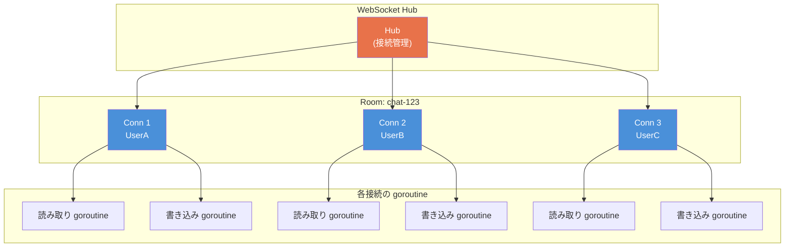

各接続は2つの goroutine で管理される:
- **読み取り goroutine**: クライアントからのメッセージを受信し、Hub に転送
- **書き込み goroutine**: `sendCh` からメッセージを取り出し、クライアントに送信

接続のライフサイクルは `context.Context` で管理され、クライアント切断時に両 goroutine が終了する。

---

## 8. デプロイ構成

### 8.1 最小構成: 単一バイナリ + DB

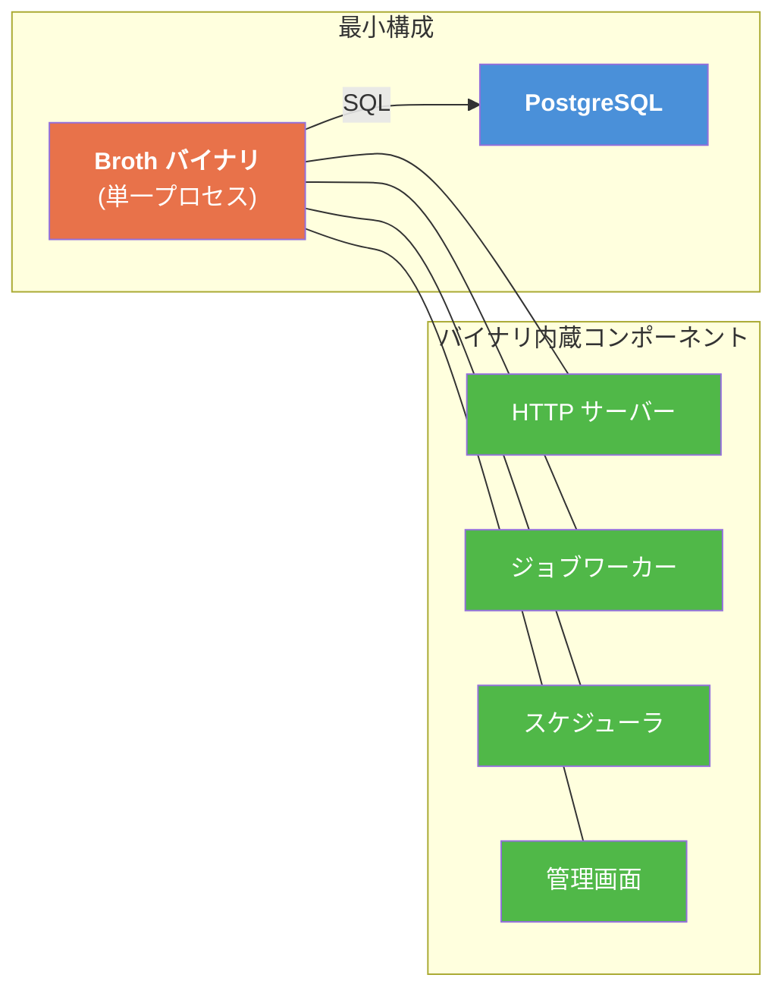

**この構成でできること**:

| 機能 | 対応状況 | 備考 |
|---|---|---|
| Web リクエスト処理 | 可能 | net/http 標準サーバー |
| リクエスト内並列 | 可能 | goroutine + errgroup |
| 軽量バックグラウンドジョブ | 可能 | インメモリキュー |
| 永続ジョブキュー | 可能 | PostgreSQL ベース |
| 定期実行スケジューラ | 可能 | インプロセス |
| 管理画面 | 可能 | 同一バイナリ内蔵 |
| WebSocket / SSE | 可能 | 単一インスタンス内 |
| セッション管理 | 可能 | DB バックエンド |

### 8.2 拡張構成: + Redis

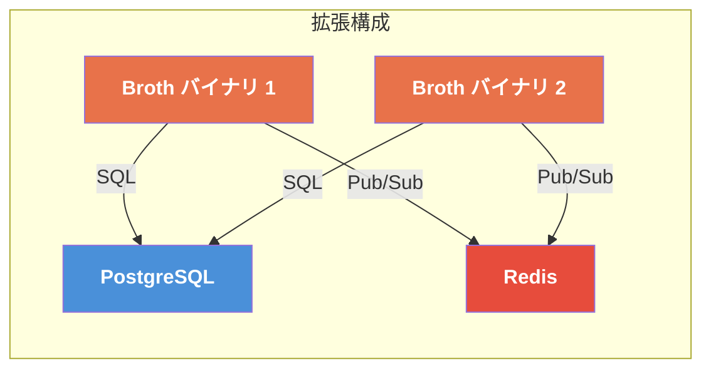

**Redis 追加で拡張される機能**:

| 機能 | 最小構成（DB のみ） | 拡張構成（+ Redis） |
|---|---|---|
| セッション管理 | DB バックエンド（遅め） | Redis バックエンド（高速） |
| ジョブキュー | DB ポーリング（秒単位遅延） | Redis Pub/Sub（ミリ秒遅延） |
| WebSocket ブロードキャスト | 単一インスタンス内のみ | Redis Pub/Sub で跨インスタンス |
| キャッシュ | なし | Redis キャッシュ |
| レート制限 | DB ベース（遅め） | Redis ベース（高速） |

### 8.3 Django + Celery + Redis 構成との比較

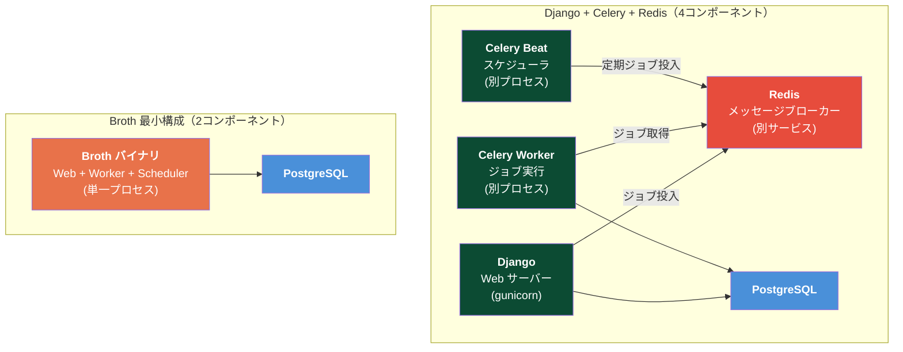

| 観点 | Django + Celery + Redis | Broth 最小構成 |
|---|---|---|
| **プロセス数** | 4（Django + Worker + Beat + Redis） | 1 |
| **デプロイの複雑さ** | 高い（4つのサービスを管理） | 低い（バイナリ1つ + DB） |
| **障害点** | 4箇所 | 2箇所 |
| **ジョブのレイテンシ** | 数ms（Redis経由） | 数us（インメモリ）/ 数s（DB） |
| **スケーラビリティ** | ワーカー数の独立スケール | バイナリ数のスケール |
| **監視対象** | 4サービス分のメトリクス | 1バイナリ + DB |
| **メモリ使用量** | 高い（Python GIL + Redis） | 低い（Go の効率的メモリ管理） |
| **開発環境セットアップ** | Docker Compose 推奨 | `go run` 一発 |

### 8.4 スケールアウト戦略

```
フェーズ 1: 単一インスタンス（最小構成）
├── 1 Broth バイナリ + 1 PostgreSQL
├── 想定規模: ~1000 req/s、同時接続 ~1000
└── ジョブ: インメモリ + DB永続の2層

フェーズ 2: 水平スケール（複数インスタンス）
├── N Broth バイナリ + 1 PostgreSQL
├── ロードバランサーで HTTP リクエストを分散
├── ジョブ: DB の SELECT FOR UPDATE SKIP LOCKED で排他制御
├── スケジューラ: DB ロックでリーダー選出（1インスタンスのみ実行）
└── 想定規模: ~10000 req/s

フェーズ 3: 拡張構成（+ Redis）
├── N Broth バイナリ + 1 PostgreSQL + 1 Redis
├── セッション: Redis バックエンドに移行
├── WebSocket: Redis Pub/Sub で跨インスタンスブロードキャスト
├── ジョブキュー: Redis バックエンド（低レイテンシ）
└── 想定規模: ~50000 req/s
```

---

## 9. graceful shutdown の統合設計

### 9.1 シャットダウンフロー

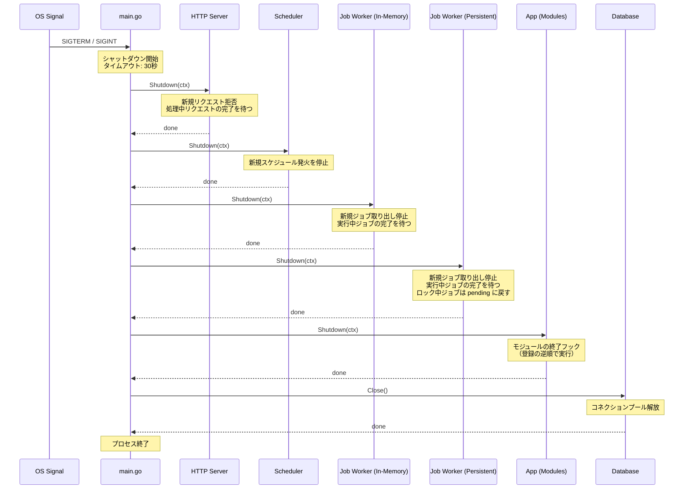

### 9.2 実装

```go
// cmd/server/main.go
package main

import (
    "context"
    "log/slog"
    "net/http"
    "os"
    "os/signal"
    "syscall"
    "time"

    "myapp/modules/account"
    "myapp/modules/notification"
    "myapp/broth"
    "myapp/broth/config"
    "myapp/broth/db"
    "myapp/broth/job"
    "myapp/broth/job/pgbackend"
    "myapp/broth/log"
    "myapp/broth/middleware"
    "myapp/broth/render"
    "myapp/broth/schedule"
)

func main() {
    // === 設定の読み込み ===
    cfg := config.MustLoad()
    logger := log.New(cfg.LogLevel)

    // === インフラストラクチャの構築 ===
    database := db.MustOpen(cfg.DatabaseURL)
    defer database.Close()
    renderer := render.New("templates/")

    // === ジョブ基盤の構築 ===
    pgBack := pgbackend.New(database.DB())

    enqueuer := job.NewEnqueuer(logger.Slog(),
        job.WithBackend(pgBack),
        job.WithBufferSize(1000),
    )

    // インメモリワーカー
    memWorker := job.NewWorker(enqueuer, job.WorkerConfig{
        Concurrency:     8,
        ShutdownTimeout: 10 * time.Second,
    }, logger.Slog())

    // 永続ジョブワーカー
    registry := job.NewRegistry()
    job.Register(registry, func() notification.SendWelcomeEmail { return notification.SendWelcomeEmail{} })
    job.Register(registry, func() notification.SendDigestEmail { return notification.SendDigestEmail{} })

    persistWorker := job.NewPersistentWorker(pgBack, registry, job.PersistentWorkerConfig{
        Queues:       []string{"default", "critical", "email"},
        Concurrency:  4,
        PollInterval: 1 * time.Second,
    }, logger.Slog())

    // スケジューラ
    leaderElector := schedule.NewDBLeaderElector(database.DB(), hostname(), 60*time.Second)
    scheduler := schedule.NewScheduler(enqueuer, logger.Slog(), leaderElector)

    // === モジュールの構築 ===
    accountMod := account.NewModule(database, renderer, logger, enqueuer)
    notifMod := notification.NewModule(database, logger, enqueuer, accountMod.Service())

    // スケジュールの収集・登録
    for _, mod := range []any{accountMod, notifMod} {
        if sp, ok := mod.(broth.ScheduleProvider); ok {
            scheduler.Register(sp.Schedules()...)
        }
    }

    // === アプリケーションの組み立て ===
    app := broth.New(logger.Slog())
    app.Register(accountMod, notifMod)

    handler := middleware.Chain(
        app.Handler(),
        middleware.Recovery(logger),
        middleware.RequestID(),
        middleware.Logger(logger),
        middleware.Tracing(),
    )

    srv := &http.Server{Addr: cfg.Addr, Handler: handler}

    // === 起動 ===
    ctx, stop := signal.NotifyContext(context.Background(), syscall.SIGTERM, syscall.SIGINT)
    defer stop()

    // アプリケーション起動
    if err := app.Start(ctx); err != nil {
        slog.Error("app start failed", "error", err)
        os.Exit(1)
    }

    // ワーカー・スケジューラ起動
    memWorker.Start(ctx)
    persistWorker.Start(ctx)
    scheduler.Start(ctx)

    // HTTP サーバー起動
    go func() {
        slog.Info("server starting", "addr", cfg.Addr)
        if err := srv.ListenAndServe(); err != http.ErrServerClosed {
            slog.Error("server error", "error", err)
            os.Exit(1)
        }
    }()

    // === シグナル待ち ===
    <-ctx.Done()
    slog.Info("shutdown signal received")

    // === graceful shutdown ===
    shutdownCtx, cancel := context.WithTimeout(context.Background(), 30*time.Second)
    defer cancel()

    // 1. HTTP サーバー停止（新規リクエスト拒否、処理中リクエスト完了待ち）
    slog.Info("shutting down HTTP server...")
    if err := srv.Shutdown(shutdownCtx); err != nil {
        slog.Error("HTTP server shutdown error", "error", err)
    }

    // 2. スケジューラ停止（新規スケジュール発火停止）
    slog.Info("shutting down scheduler...")
    if err := scheduler.Shutdown(shutdownCtx); err != nil {
        slog.Error("scheduler shutdown error", "error", err)
    }

    // 3. インメモリワーカー停止（実行中ジョブ完了待ち）
    slog.Info("shutting down in-memory job workers...")
    if err := memWorker.Shutdown(shutdownCtx); err != nil {
        slog.Error("in-memory worker shutdown error", "error", err)
    }

    // 4. 永続ジョブワーカー停止（実行中ジョブ完了待ち）
    slog.Info("shutting down persistent job workers...")
    if err := persistWorker.Shutdown(shutdownCtx); err != nil {
        slog.Error("persistent worker shutdown error", "error", err)
    }

    // 5. モジュール終了フック
    slog.Info("shutting down modules...")
    if err := app.Shutdown(shutdownCtx); err != nil {
        slog.Error("app shutdown error", "error", err)
    }

    // 6. DB 接続クローズ（defer で実行される）
    slog.Info("shutdown complete")
}

func hostname() string {
    h, _ := os.Hostname()
    return fmt.Sprintf("%s-%d", h, os.Getpid())
}
```

### 9.3 シャットダウンの順序と理由

| 順序 | コンポーネント | タイムアウト | 理由 |
|---|---|---|---|
| 1 | HTTP サーバー | 全体の30秒に含まれる | 新規リクエストを最初に拒否し、処理中のリクエストを完了させる |
| 2 | スケジューラ | 即座 | 新規ジョブの投入を停止する。ジョブ自体はワーカーで完了させる |
| 3 | インメモリワーカー | 全体の30秒に含まれる | HTTPからの投入が止まった後、残りのジョブを処理する |
| 4 | 永続ジョブワーカー | 全体の30秒に含まれる | 実行中のジョブを完了させる。未着手のジョブはDBに残り、再起動後に再実行される |
| 5 | モジュール終了フック | 全体の30秒に含まれる | モジュール固有のクリーンアップ処理 |
| 6 | DB 接続 | なし（即座にクローズ） | 全コンポーネント停止後にコネクションプールを解放 |

**重要**: 永続ジョブワーカーが停止時に処理中のジョブを完了できなかった場合、そのジョブの `locked_at` が古くなる。スタックジョブ検出機構（5.9節）により、次回起動時に自動的にリトライキューに戻される。

---

## 10. 設計判断の記録

### ADR-C001: インメモリジョブと永続ジョブの2層構造

**状況**: バックグラウンドジョブの実行方法を決定する必要がある。

**選択肢**:

| 選択肢 | メリット | デメリット |
|---|---|---|
| A. 全てDB永続化 | 統一的。リトライが常に可能 | 軽量タスクにDBオーバーヘッド |
| B. 全てインメモリ | 最速。実装がシンプル | プロセス再起動でジョブ消失 |
| C. 2層構造（インメモリ + DB） | 用途に応じた最適化 | 2つの仕組みを理解する必要 |

**決定**: **C. 2層構造** を採用。

**根拠**:
- ウェルカムメール送信（失敗しても再送可能）にDBオーバーヘッドは不要
- 決済処理（失敗時リトライ必須）にはDB永続化が必要
- Go のチャネルによるインメモリキューは極めて軽量（ns単位）
- 開発者は `job.WithPersist()` オプションの有無で明示的に選択する

### ADR-C002: DB ポーリング vs LISTEN/NOTIFY

**状況**: 永続ジョブの取得方法を決定する必要がある。

**選択肢**:

| 選択肢 | メリット | デメリット |
|---|---|---|
| A. ポーリング（SELECT + SKIP LOCKED） | 実装がシンプル。他DB対応が容易 | ポーリング間隔分のレイテンシ |
| B. PostgreSQL LISTEN/NOTIFY | リアルタイム通知 | PostgreSQL 固有。接続管理が複雑 |
| C. ポーリング + LISTEN/NOTIFY 併用 | 最適化 | 実装の複雑さ |

**決定**: **A. ポーリング** を Phase 1 で採用。Phase 2 で B への最適化を検討。

**根拠**:
- ポーリング間隔1秒はほとんどのユースケースで十分
- `SELECT FOR UPDATE SKIP LOCKED` は PostgreSQL のネイティブ機能で高効率
- 将来的な MySQL / Redis 対応時にポーリングモデルの方が移植しやすい
- LISTEN/NOTIFY は最適化として後から追加可能

> **DB サポート方針**: Phase 1 は **PostgreSQL 専用**とする。`SELECT FOR UPDATE SKIP LOCKED` は PostgreSQL 9.5+ のネイティブ機能であり、ジョブキューの排他制御の基盤となる。MySQL 8.0+ も同構文をサポートしているため、Phase 2 以降で MySQL 対応を検討する際の移行パスは確保されている。ただし、`LISTEN/NOTIFY`（Phase 2 最適化）は PostgreSQL 固有のため、MySQL 対応時は別途ポーリング最適化が必要となる。

### ADR-C003: ジョブのシリアライズ方式

**状況**: ジョブのペイロードをDBに保存する際のシリアライズ方式を決定する必要がある。

**決定**: JSON（`encoding/json`）を使用する。

**根拠**:
- `JSONB` カラムによりDB上での検索・フィルタリングが可能
- 管理画面でのペイロード表示がヒューマンリーダブル
- Go の `encoding/json` は標準ライブラリであり、追加依存なし
- パフォーマンスが問題になった場合に `encoding/gob` や Protocol Buffers への移行パスがある

### ADR-C004: WebSocket ライブラリの選定

**状況**: WebSocket の実装ライブラリを決定する必要がある。

**選択肢**:

| 選択肢 | メリット | デメリット |
|---|---|---|
| A. `golang.org/x/net/websocket` | 準標準ライブラリ | 機能が最小限。非推奨気味 |
| B. `nhooyr.io/websocket` | モダン。context 統合。依存最小 | サードパーティ |
| C. `github.com/gorilla/websocket` | 実績豊富。高機能 | メンテナンス状況が不安定 |

**決定**: **B. `nhooyr.io/websocket`** を推奨する。ただしフレームワークコアには含めず、アプリケーション側の依存とする。

**根拠**:
- `context.Context` との統合が設計段階から組み込まれている
- 依存が最小限（Broth の設計思想に合致）
- WebSocket 自体がアプリケーション固有の機能であり、フレームワークコアに含めるべきではない
- `broth/ws` パッケージは Hub パターンのヘルパーのみを提供し、WebSocket ライブラリの選択はアプリケーションに委ねる

### ADR-C005: スケジューラのリーダー選出方式

**状況**: 複数インスタンスで同一スケジュールが重複実行されることを防ぐ方式を決定する必要がある。

**選択肢**:

| 選択肢 | メリット | デメリット |
|---|---|---|
| A. DB 行ロック | 追加依存なし | ポーリングベース |
| B. Redis 分散ロック（Redlock） | 高速 | Redis 必須 |
| C. etcd / Consul | 本格的なリーダー選出 | 大きな追加依存 |
| D. 「スケジューラ専用インスタンス」の運用規約 | 実装不要 | 運用の複雑さ |

**決定**: **A. DB 行ロック** を Phase 1 で採用。

**根拠**:
- 「最小構成: 単一バイナリ + DB」の設計思想に合致
- 定期実行の粒度（分単位）ではDBロックのレイテンシは問題にならない
- 単一インスタンス構成では リーダー選出自体が不要（常に自分がリーダー）
- Redis 導入時に B への移行パスがある

---

## 付録A: パッケージ構成の全体像

```
broth/
├── parallel/               # リクエスト内並列処理ヘルパー
│   ├── parallel.go         #   Group（errgroup ラッパー）
│   └── collect.go          #   Task（型安全な結果収集）
├── job/                    # バックグラウンドジョブ基盤
│   ├── job.go              #   Job インターフェース、オプション
│   ├── enqueuer.go         #   Enqueuer（ジョブ投入）
│   ├── worker.go           #   Worker（インメモリワーカープール）
│   ├── persistent_worker.go #  PersistentWorker（永続ジョブワーカー）
│   ├── registry.go         #   Registry（ジョブ名 → ファクトリ）
│   ├── backend.go          #   Backend インターフェース（抽象化）
│   └── pgbackend/          #   PostgreSQL Backend 実装
│       └── backend.go
├── schedule/               # スケジュールタスク
│   ├── schedule.go         #   Definition（スケジュール定義）
│   ├── scheduler.go        #   Scheduler（インプロセススケジューラ）
│   ├── leader.go           #   LeaderElector（リーダー選出）
│   ├── cron.go             #   cron 式パーサー
│   └── admin.go            #   管理画面統合
├── sse/                    # Server-Sent Events
│   └── sse.go              #   Stream（SSE ハンドラヘルパー）
└── ws/                     # WebSocket
    └── hub.go              #   Hub / Broadcaster
```

## 付録B: 全パターンにおける context.Context の伝播マップ

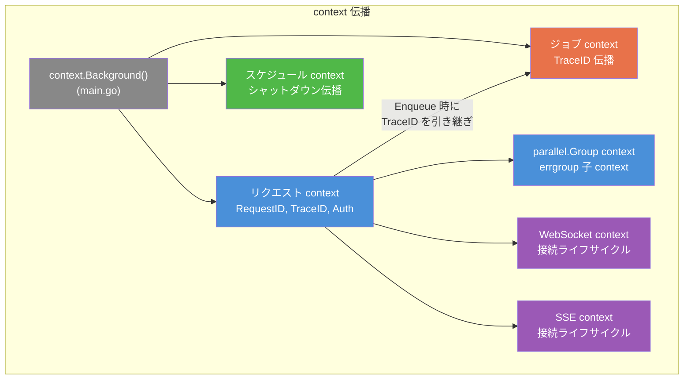

| パターン | context の源泉 | 伝播されるもの | キャンセル条件 |
|---|---|---|---|
| リクエスト内並列 | `r.Context()` | RequestID, TraceID, Auth, タイムアウト | errgroup のいずれかがエラー / クライアント切断 |
| 軽量バックグラウンド | Enqueue 時の ctx からトレース情報をコピー | TraceID（新しいスパンとして） | ワーカーの graceful shutdown |
| 永続ジョブ | DB に TraceID を保存、復元 | TraceID（新しいトレースとしてリンク） | ワーカーの graceful shutdown |
| スケジュール | `context.Background()` + シャットダウンシグナル | シャットダウン伝播 | スケジューラの停止 |
| WebSocket | 接続開始時の `r.Context()` | RequestID, Auth | クライアント切断 / サーバー停止 |
| SSE | 接続開始時の `r.Context()` | RequestID, Auth | クライアント切断 / サーバー停止 |
