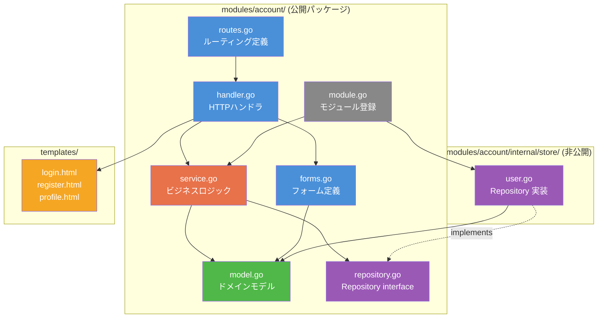
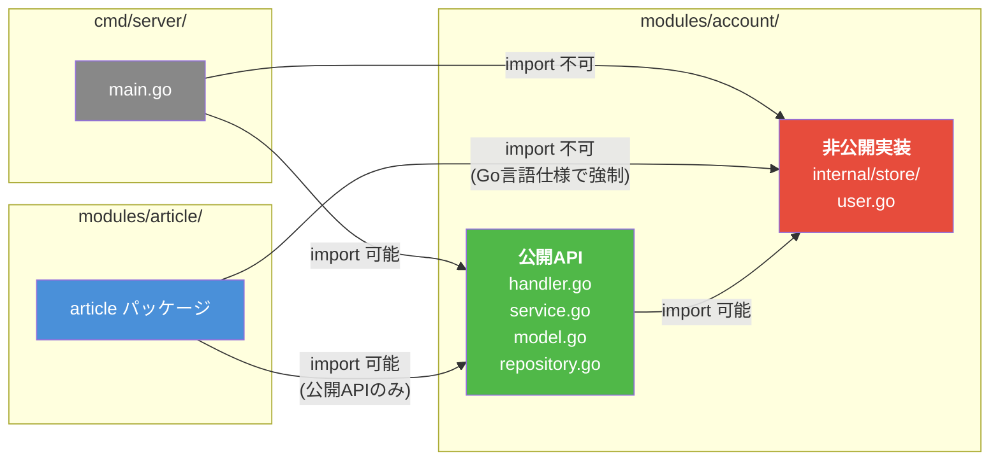
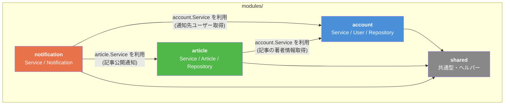
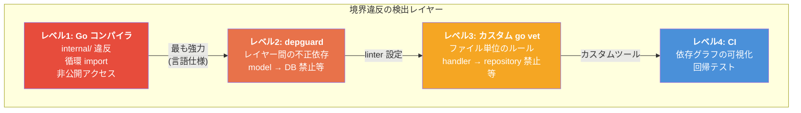
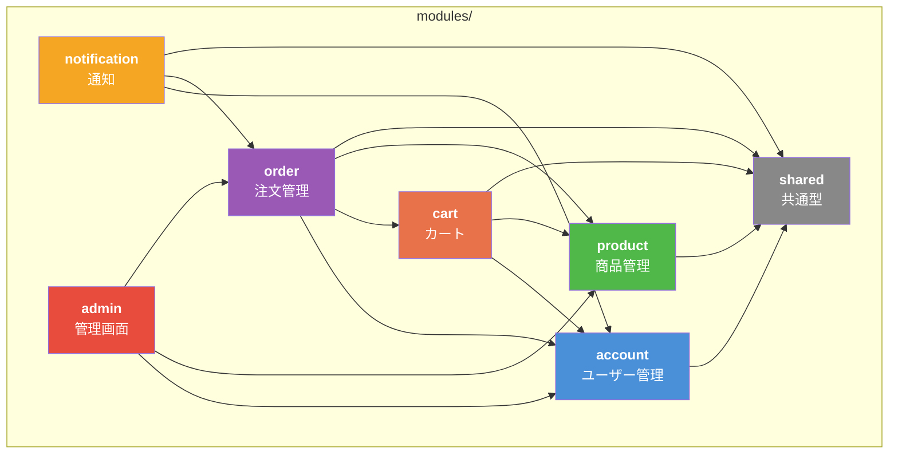

# Broth -- モジュール境界設計書

> **バージョン**: 0.1.0-draft
> **最終更新**: 2026-02-08
> **ステータス**: 初期設計
> **前提ドキュメント**: [ARCHITECTURE.md](./ARCHITECTURE.md)

---

## 目次

1. [モジュール（Feature Module）の定義](#1-モジュールfeature-moduleの定義)
2. [モジュール内部構造](#2-モジュール内部構造)
3. [モジュール境界の強制方法](#3-モジュール境界の強制方法)
4. [モジュール間依存のルール](#4-モジュール間依存のルール)
5. [モジュール登録メカニズム](#5-モジュール登録メカニズム)
6. [境界違反の検出](#6-境界違反の検出)
7. [実践例: ECサイトのモジュール分割](#7-実践例-ecサイトのモジュール分割)
8. [設計判断の記録](#8-設計判断の記録)

---

## 1. モジュール（Feature Module）の定義

### 概要

Broth における **モジュール（Feature Module）** とは、特定のビジネスドメインに対応する機能単位のパッケージ群である。Django の `apps`、NestJS の `Module` に相当する概念を Go のパッケージシステムで実現する。

### モジュールの基本原則

| 原則 | 説明 |
|---|---|
| **1モジュール = 1ビジネスドメイン** | 「アカウント管理」「記事管理」「通知」等のビジネス上の境界に対応 |
| **1モジュール = 1ディレクトリ配下のパッケージ群** | `modules/{name}/` 以下に全てのコードを配置 |
| **公開APIはルートパッケージ** | `modules/{name}/` 直下の `.go` ファイルがそのモジュールの公開API |
| **実装詳細は `internal/` に隔離** | `modules/{name}/internal/` 以下は外部から import 不可（Go 言語仕様で強制） |
| **自己完結** | 1モジュールが handler / service / model / repository を全て内包する |

### Django apps との比較

| 観点 | Django apps | Broth Module |
|---|---|---|
| 境界の強制力 | 規約ベース（弱い）。cross-import は技術的に可能 | `internal/` で言語レベルの強制（強い） |
| 登録方法 | `INSTALLED_APPS` にクラス名を文字列で登録 | `broth.Module` インターフェースを実装し、型安全に登録 |
| 公開API | 暗黙的（Python にアクセス制御がない） | 明示的（ルートパッケージの公開識別子のみ） |
| 内部構造 | `models.py`, `views.py`, `urls.py` 等の規約 | `model.go`, `handler.go`, `routes.go` 等の規約 |

---

## 2. モジュール内部構造

### 標準構造

```
modules/account/
├── handler.go           # HTTPハンドラ（Presentation Layer）
├── service.go           # ビジネスロジック（Application Layer）
├── model.go             # ドメインモデル（Domain Layer）
├── repository.go        # リポジトリインターフェース（境界定義）
├── routes.go            # ルーティング定義
├── forms.go             # フォーム定義・入力バリデーション
├── module.go            # モジュール登録・初期化
├── templates/           # テンプレート（モジュール固有）
│   ├── login.html
│   ├── register.html
│   └── profile.html
└── internal/            # 外部非公開の実装詳細
    └── store/
        ├── user.go      # リポジトリ実装（Bob ベース）
        └── user_test.go # リポジトリのテスト
```

### モジュール内部構造図



**凡例**: 青=HTTPレイヤー / 橙=アプリケーションレイヤー / 緑=ドメインレイヤー / 紫=データアクセスレイヤー / 灰=インフラ

### 各ファイルの責務

#### handler.go -- HTTPハンドラ

HTTPリクエストのパース、サービスの呼び出し、レスポンスの生成を行う。ビジネスロジックを含まない。

```go
// modules/account/handler.go
package account

import (
    "net/http"

    "myapp/broth/render"
)

// Handler はアカウント関連のHTTPハンドラを提供する。
type Handler struct {
    svc      *Service
    renderer *render.Renderer
}

// NewHandler は Handler を生成する。
func NewHandler(svc *Service, renderer *render.Renderer) *Handler {
    return &Handler{svc: svc, renderer: renderer}
}

// Register はユーザー登録を処理する。
func (h *Handler) Register(w http.ResponseWriter, r *http.Request) {
    // 1. リクエストのパース
    var input RegisterInput
    if err := parseForm(r, &input); err != nil {
        h.renderer.Error(w, r, http.StatusBadRequest, err)
        return
    }

    // 2. サービスの呼び出し（ビジネスロジックはここにない）
    user, err := h.svc.Register(r.Context(), input)
    if err != nil {
        h.renderer.Error(w, r, http.StatusUnprocessableEntity, err)
        return
    }

    // 3. レスポンスの生成
    h.renderer.HTML(w, r, http.StatusCreated, "account/register_success.html", map[string]any{
        "User": user,
    })
}
```

#### service.go -- ビジネスロジック

ビジネスロジックの唯一の置き場所。ドメインモデルとリポジトリを協調させる。

```go
// modules/account/service.go
package account

import (
    "context"
    "fmt"

    "myapp/broth/db"
    "myapp/broth/log"
)

// Service はアカウントモジュールのビジネスロジックを提供する。
type Service struct {
    repo  Repository
    txMgr db.TxManager
    log   *log.Logger
}

// NewService は Service を生成する。
func NewService(repo Repository, txMgr db.TxManager, log *log.Logger) *Service {
    return &Service{repo: repo, txMgr: txMgr, log: log}
}

// Register はユーザー登録のビジネスロジック。
func (s *Service) Register(ctx context.Context, input RegisterInput) (*User, error) {
    if err := input.Validate(); err != nil {
        return nil, fmt.Errorf("account: validation: %w", err)
    }

    // ビジネスルール: メールアドレスの重複チェック（DB依存のバリデーション）
    existing, _ := s.repo.FindByEmail(ctx, input.Email)
    if existing != nil {
        return nil, fmt.Errorf("account: email already registered")
    }

    user := NewUser(input.Email, input.Name)
    if err := user.SetPassword(input.Password); err != nil {
        return nil, fmt.Errorf("account: password hash: %w", err)
    }

    err := s.txMgr.RunInTx(ctx, func(ctx context.Context) error {
        return s.repo.Create(ctx, user)
    })
    if err != nil {
        return nil, fmt.Errorf("account: create user: %w", err)
    }

    s.log.Info(ctx, "user registered", "user_id", user.ID, "email", user.Email)
    return user, nil
}
```

#### model.go -- ドメインモデル

ビジネスエンティティと純粋なバリデーション。外部依存を持たない。

```go
// modules/account/model.go
package account

import (
    "errors"
    "net/mail"
    "time"

    "golang.org/x/crypto/bcrypt"
)

// User はアカウントのドメインモデル。
type User struct {
    ID           int64
    Email        string
    Name         string
    PasswordHash string
    CreatedAt    time.Time
    UpdatedAt    time.Time
}

// NewUser は User を生成する。
func NewUser(email, name string) *User {
    now := time.Now()
    return &User{Email: email, Name: name, CreatedAt: now, UpdatedAt: now}
}

// SetPassword はパスワードをハッシュ化して設定する。
func (u *User) SetPassword(plain string) error {
    hash, err := bcrypt.GenerateFromPassword([]byte(plain), bcrypt.DefaultCost)
    if err != nil {
        return err
    }
    u.PasswordHash = string(hash)
    return nil
}

// CheckPassword はパスワードを検証する。
func (u *User) CheckPassword(plain string) bool {
    return bcrypt.CompareHashAndPassword([]byte(u.PasswordHash), []byte(plain)) == nil
}

// RegisterInput はユーザー登録の入力値。
type RegisterInput struct {
    Email    string
    Name     string
    Password string
}

// Validate は入力値の純粋バリデーション（外部依存なし）。
func (in RegisterInput) Validate() error {
    var errs []error
    if _, err := mail.ParseAddress(in.Email); err != nil {
        errs = append(errs, errors.New("invalid email format"))
    }
    if in.Name == "" {
        errs = append(errs, errors.New("name is required"))
    }
    if len(in.Password) < 8 {
        errs = append(errs, errors.New("password must be at least 8 characters"))
    }
    return errors.Join(errs...)
}
```

#### repository.go -- リポジトリインターフェース

データアクセスの抽象。モジュールの公開パッケージに置くことで、テスト時のモック差し替えを可能にする。

```go
// modules/account/repository.go
package account

import "context"

// Repository はユーザーデータへのアクセスを抽象化する。
type Repository interface {
    Create(ctx context.Context, user *User) error
    FindByID(ctx context.Context, id int64) (*User, error)
    FindByEmail(ctx context.Context, email string) (*User, error)
    Update(ctx context.Context, user *User) error
    Delete(ctx context.Context, id int64) error
}
```

#### store.go (internal/store/) -- リポジトリ実装

`internal/` 配下に置くことで、外部モジュールからの直接利用を禁止する。

```go
// modules/account/internal/store/user.go
package store

import (
    "context"

    "github.com/aarondl/opt/omit"
    "github.com/stephenafamo/bob"
    "myapp/modules/account"
    "myapp/modules/account/internal/store/models" // bobgen-psql が生成
    "myapp/broth/db"
)

// UserStore は account.Repository の Bob ベース実装。
type UserStore struct {
    exec bob.Executor
}

// New は UserStore を生成する。
func New(exec bob.Executor) *UserStore {
    return &UserStore{exec: exec}
}

// 以下、account.Repository インターフェースの全メソッドを実装

func (s *UserStore) Create(ctx context.Context, user *account.User) error {
    conn := db.ExecFromContext(ctx, s.exec) // トランザクション対応
    inserted, err := models.Users.Insert(
        models.UserSetter{
            Email:        omit.From(user.Email),
            Name:         omit.From(user.Name),
            PasswordHash: omit.From(user.PasswordHash),
        },
    ).One(ctx, conn)
    if err != nil {
        return err
    }
    user.ID = inserted.ID
    user.CreatedAt = inserted.CreatedAt
    user.UpdatedAt = inserted.UpdatedAt
    return nil
}

func (s *UserStore) FindByID(ctx context.Context, id int64) (*account.User, error) {
    conn := db.ExecFromContext(ctx, s.exec)
    row, err := models.Users.Query(
        models.SelectWhere.Users.ID.EQ(id),
    ).One(ctx, conn)
    if err != nil {
        return nil, err
    }
    return toUser(row), nil
}

func (s *UserStore) FindByEmail(ctx context.Context, email string) (*account.User, error) {
    conn := db.ExecFromContext(ctx, s.exec)
    row, err := models.Users.Query(
        models.SelectWhere.Users.Email.EQ(email),
    ).One(ctx, conn)
    if err != nil {
        return nil, err
    }
    return toUser(row), nil
}

func (s *UserStore) Update(ctx context.Context, user *account.User) error {
    conn := db.ExecFromContext(ctx, s.exec)
    _, err := models.Users.Update(
        models.UpdateWhere.Users.ID.EQ(user.ID),
        models.UserSetter{
            Email:        omit.From(user.Email),
            Name:         omit.From(user.Name),
            PasswordHash: omit.From(user.PasswordHash),
        },
    ).Exec(ctx, conn)
    return err
}

func (s *UserStore) Delete(ctx context.Context, id int64) error {
    conn := db.ExecFromContext(ctx, s.exec)
    _, err := models.Users.Delete(
        models.DeleteWhere.Users.ID.EQ(id),
    ).Exec(ctx, conn)
    return err
}

// toUser は Bob の生成モデルからドメインモデルに変換する。
func toUser(row *models.User) *account.User {
    return &account.User{
        ID:           row.ID,
        Email:        row.Email,
        Name:         row.Name,
        PasswordHash: row.PasswordHash,
        CreatedAt:    row.CreatedAt,
        UpdatedAt:    row.UpdatedAt,
    }
}
```

#### routes.go -- ルーティング定義

モジュールのルーティングを一箇所に集約する。

```go
// modules/account/routes.go
package account

import "myapp/broth/router"

// Routes はこのモジュールのルーティングを返す。
func (h *Handler) Routes() []router.Route {
    return []router.Route{
        {Pattern: "GET /register", Handler: http.HandlerFunc(h.ShowRegisterForm)},
        {Pattern: "POST /register", Handler: http.HandlerFunc(h.Register)},
        {Pattern: "GET /login", Handler: http.HandlerFunc(h.ShowLoginForm)},
        {Pattern: "POST /login", Handler: http.HandlerFunc(h.Login)},
        {Pattern: "POST /logout", Handler: http.HandlerFunc(h.Logout)},
        {Pattern: "GET /profile", Handler: http.HandlerFunc(h.ShowProfile)},
    }
}
```

#### module.go -- モジュール登録

モジュールの初期化と依存の組み立てを行う。

```go
// modules/account/module.go
package account

import (
    "myapp/modules/account/internal/store"
    "myapp/broth"
    "myapp/broth/db"
    "myapp/broth/log"
    "myapp/broth/render"
    "myapp/broth/router"
)

// Module はアカウントモジュールの定義。
type Module struct {
    handler *Handler
    service *Service
}

// NewModule はモジュールを初期化する。
func NewModule(database *db.Database, renderer *render.Renderer, logger *log.Logger) *Module {
    // 内部依存の組み立て（internal/store は外部から見えない）
    repo := store.New(database.Executor()) // bob.Executor を渡す
    txMgr := database.TxManager()
    svc := NewService(repo, txMgr, logger)
    handler := NewHandler(svc, renderer)

    return &Module{handler: handler, service: svc}
}

// Name はモジュール名を返す。
func (m *Module) Name() string { return "account" }

// Routes はモジュールのルーティングを返す。
func (m *Module) Routes() []router.Route { return m.handler.Routes() }

// Service はこのモジュールのサービスを返す（他モジュールへの公開API）。
func (m *Module) Service() *Service { return m.service }

// インターフェース適合チェック（コンパイル時）
var _ broth.Module = (*Module)(nil)
```

#### forms.go -- フォーム定義

HTMLフォームと入力バインディングの定義。

```go
// modules/account/forms.go
package account

import (
    "net/http"

    "myapp/broth/form"
)

// RegisterForm はユーザー登録フォームのHTMLレンダリングとバインディングを定義する。
type RegisterForm struct {
    Email    form.TextField    `form:"email"    label:"メールアドレス" required:"true"`
    Name     form.TextField    `form:"name"     label:"名前"         required:"true"`
    Password form.PasswordField `form:"password" label:"パスワード"    required:"true" min:"8"`
}

// Bind はHTTPリクエストからフォームの値をバインドする。
func (f *RegisterForm) Bind(r *http.Request) error {
    return form.Bind(r, f)
}

// ToInput はフォームの値を RegisterInput に変換する。
func (f *RegisterForm) ToInput() RegisterInput {
    return RegisterInput{
        Email:    f.Email.Value,
        Name:     f.Name.Value,
        Password: f.Password.Value,
    }
}
```

---

## 3. モジュール境界の強制方法

### Go の `internal/` によるアクセス制御

Go 言語仕様により、`internal/` ディレクトリ配下のパッケージは、その親ディレクトリのサブツリー内からしか import できない。これはコンパイラが強制するため、コードレビューや規約に頼る必要がない。

```
modules/
├── account/
│   ├── service.go              # 公開: 他モジュールから import 可能
│   ├── model.go                # 公開: 他モジュールから import 可能
│   ├── repository.go           # 公開: 他モジュールから import 可能
│   └── internal/
│       └── store/
│           └── user.go         # 非公開: account モジュール内からのみ import 可能
└── article/
    └── service.go              # ここから account/internal/store は import 不可（コンパイルエラー）
```

### 可視性の三段階



| レベル | スコープ | 例 | 強制方法 |
|---|---|---|---|
| **公開 (Exported)** | 全モジュールから参照可能 | `account.Service`, `account.User` | Go の大文字ルール |
| **パッケージ内 (Unexported)** | 同一パッケージ内のみ | `account.parseForm` | Go の小文字ルール |
| **モジュール内 (Internal)** | モジュール内パッケージのみ | `account/internal/store.UserStore` | Go の `internal/` ルール |

### NestJS の exports との対比

NestJS では `@Module({ exports: [UserService] })` で公開APIを指定する。Broth では以下が対応する。

| NestJS | Broth (Go) |
|---|---|
| `exports: [UserService]` | `modules/account/` 直下の公開型（`Service`, `User`, `Repository`） |
| `providers: [UserRepository]` | `modules/account/internal/store/` の非公開型 |
| `imports: [DatabaseModule]` | `module.go` の `NewModule` 引数で依存を受け取る |

---

## 4. モジュール間依存のルール

### 基本ルール

1. **モジュール間依存は公開API経由のみ**: `internal/` を跨いだ import は Go コンパイラが禁止する
2. **循環依存の禁止**: Go コンパイラが循環 import を禁止する（言語レベルで強制）
3. **依存方向の一方向性**: 依存は一方向に限定する（A → B かつ B → A は不可）
4. **共通型は共有パッケージに抽出**: 複数モジュールが使う型は `modules/shared/` に配置

### モジュール間依存の例



### モジュール間依存の実装パターン

#### パターン1: サービスの直接参照（推奨）

他モジュールのサービスをコンストラクタで受け取る。

```go
// modules/article/service.go
package article

import (
    "context"
    "myapp/modules/account" // 公開パッケージのみ import 可能
)

type Service struct {
    repo       Repository
    accountSvc *account.Service // 他モジュールのサービスを参照
}

func NewService(repo Repository, accountSvc *account.Service) *Service {
    return &Service{repo: repo, accountSvc: accountSvc}
}

func (s *Service) Publish(ctx context.Context, input PublishInput) (*Article, error) {
    // 著者の存在確認（account モジュールのサービスを利用）
    author, err := s.accountSvc.FindByID(ctx, input.AuthorID)
    if err != nil {
        return nil, err
    }
    // ...
    _ = author
    return nil, nil
}
```

#### パターン2: インターフェースによる疎結合（依存を逆転させたい場合）

循環依存が発生しそうな場合や、テスタビリティを高めたい場合はインターフェースを使う。

```go
// modules/article/service.go
package article

import "context"

// AccountFinder は記事モジュールが必要とするアカウント情報の取得を抽象化する。
// account.Service がこのインターフェースを満たすが、article パッケージは
// account パッケージに直接依存しない。
type AccountFinder interface {
    FindByID(ctx context.Context, id int64) (*AccountInfo, error)
}

// AccountInfo は記事モジュールが必要とするアカウント情報（最小限の型）。
type AccountInfo struct {
    ID   int64
    Name string
}
```

この場合、`main.go` でアダプタを注入する。

```go
// cmd/server/main.go
articleSvc := article.NewService(articleRepo, &accountAdapter{svc: accountSvc})
```

#### パターン3: イベントによる疎結合（将来拡張）

モジュール間のリアクティブな連携にはイベントを使う（Phase 2 で実装予定）。

```go
// modules/article/service.go
func (s *Service) Publish(ctx context.Context, input PublishInput) (*Article, error) {
    // ...記事の保存...

    // イベント発火（notification モジュールがリッスン）
    s.events.Emit(ctx, ArticlePublished{ArticleID: article.ID, AuthorID: article.AuthorID})

    return article, nil
}
```

### 禁止パターン

| パターン | 問題 | 対策 |
|---|---|---|
| `internal/` を跨いだ import | コンパイルエラー（Go 言語仕様） | 自動的に禁止される |
| 循環 import（A→B→A） | コンパイルエラー（Go 言語仕様） | インターフェースで依存を逆転 |
| モデルの直接共有 | モジュール境界が曖昧になる | 各モジュールが必要な型を自前で定義、または `shared/` に抽出 |
| リポジトリの跨モジュール利用 | データアクセス層が結合する | 必ずサービス経由でアクセスする |

---

## 5. モジュール登録メカニズム

### `broth.Module` インターフェース

Django の `INSTALLED_APPS` に相当する仕組みを、Go のインターフェースで型安全に実現する。

```go
// broth/module.go
package broth

import "myapp/broth/router"

// Module はアプリケーションモジュールの共通インターフェース。
// 全てのモジュールはこのインターフェースを満たす。
type Module interface {
    // Name はモジュールの一意な名前を返す。
    Name() string
    // Routes はこのモジュールが提供するルーティングを返す。
    Routes() []router.Route
}
```

### オプショナルなインターフェース

モジュールが追加機能を持つ場合、オプショナルなインターフェースを実装する。

```go
// broth/module.go（続き）

// Migrator はマイグレーションを持つモジュールが実装する。
type Migrator interface {
    MigrationsDir() string // マイグレーションSQLのディレクトリパス
}

// JobProvider はバックグラウンドジョブを持つモジュールが実装する。
type JobProvider interface {
    Jobs() []job.Definition
}

// ScheduleProvider はスケジュール実行を持つモジュールが実装する。
type ScheduleProvider interface {
    Schedules() []schedule.Definition
}

// AdminProvider は管理画面を持つモジュールが実装する。
type AdminProvider interface {
    AdminResources() []admin.Resource
}

// OnStart はアプリケーション起動時にフックを実行するモジュールが実装する。
type OnStart interface {
    Start(ctx context.Context) error
}

// OnShutdown はアプリケーション終了時にフックを実行するモジュールが実装する。
type OnShutdown interface {
    Shutdown(ctx context.Context) error
}
```

### Application（モジュールレジストリ）

```go
// broth/app.go
package broth

import (
    "context"
    "fmt"
    "log/slog"
    "net/http"

    "myapp/broth/router"
)

// App はアプリケーション全体を管理する。
// Django の INSTALLED_APPS + WSGIApplication に相当する。
type App struct {
    modules []Module
    router  *router.Router
    logger  *slog.Logger
}

// New は新しい App を生成する。
func New(logger *slog.Logger) *App {
    return &App{
        router: router.New(),
        logger: logger,
    }
}

// Register はモジュールをアプリケーションに登録する。
// Django の INSTALLED_APPS への追加に相当するが、型安全である。
func (a *App) Register(modules ...Module) {
    for _, m := range modules {
        a.modules = append(a.modules, m)
        a.logger.Info("module registered", "name", m.Name())

        // ルーティングの自動登録
        for _, route := range m.Routes() {
            a.router.Handle(route.Pattern, route.Handler)
        }
    }
}

// Handler は http.Handler を返す。
func (a *App) Handler() http.Handler {
    return a.router
}

// Start は全モジュールの起動フックを実行する。
func (a *App) Start(ctx context.Context) error {
    for _, m := range a.modules {
        if starter, ok := m.(OnStart); ok {
            if err := starter.Start(ctx); err != nil {
                return fmt.Errorf("broth: module %s start failed: %w", m.Name(), err)
            }
        }
    }
    return nil
}

// Shutdown は全モジュールの終了フックを実行する（登録の逆順）。
func (a *App) Shutdown(ctx context.Context) error {
    for i := len(a.modules) - 1; i >= 0; i-- {
        if shutdowner, ok := a.modules[i].(OnShutdown); ok {
            if err := shutdowner.Shutdown(ctx); err != nil {
                a.logger.Error("module shutdown failed",
                    "name", a.modules[i].Name(), "error", err)
            }
        }
    }
    return nil
}
```

### main.go でのモジュール組み立て

```go
// cmd/server/main.go
package main

import (
    "context"
    "log/slog"
    "net/http"
    "os"
    "os/signal"

    "myapp/modules/account"
    "myapp/modules/article"
    "myapp/modules/notification"
    "myapp/broth"
    "myapp/broth/config"
    "myapp/broth/db"
    "myapp/broth/log"
    "myapp/broth/middleware"
    "myapp/broth/render"
)

func main() {
    // 設定の読み込み
    cfg := config.MustLoad()

    // 基盤サービスの構築
    logger := log.New(cfg.LogLevel)
    database := db.MustOpen(cfg.DatabaseURL)
    defer database.Close()
    renderer := render.New("templates/")

    // モジュールの構築（依存を明示的に注入）
    accountMod := account.NewModule(database, renderer, logger)
    articleMod := article.NewModule(database, renderer, logger, accountMod.Service())
    notificationMod := notification.NewModule(database, logger, accountMod.Service(), articleMod.Service())

    // アプリケーションの組み立て
    app := broth.New(logger.Slog())
    app.Register(
        accountMod,
        articleMod,
        notificationMod,
    )

    // ミドルウェアの適用
    handler := middleware.Chain(
        app.Handler(),
        middleware.Recovery(logger),
        middleware.RequestID(),
        middleware.Logger(logger),
        middleware.Tracing(),
    )

    // サーバー起動
    srv := &http.Server{Addr: cfg.Addr, Handler: handler}

    ctx, stop := signal.NotifyContext(context.Background(), os.Interrupt)
    defer stop()

    if err := app.Start(ctx); err != nil {
        slog.Error("app start failed", "error", err)
        os.Exit(1)
    }

    go func() {
        slog.Info("server starting", "addr", cfg.Addr)
        if err := srv.ListenAndServe(); err != http.ErrServerClosed {
            slog.Error("server error", "error", err)
        }
    }()

    <-ctx.Done()
    slog.Info("shutting down...")
    _ = app.Shutdown(context.Background())
    _ = srv.Shutdown(context.Background())
}
```

**設計判断 -- なぜ文字列登録ではなく型安全な登録か**:
- Django の `INSTALLED_APPS = ['myapp.account']` は文字列であり、タイプミスが実行時エラーになる
- Broth はインターフェース適合をコンパイル時にチェックする（`var _ broth.Module = (*Module)(nil)`）
- モジュール間の依存も `NewModule` の引数で明示されるため、依存グラフが見える

---

## 6. 境界違反の検出

### レベル1: Go コンパイラによる自動検出（最強）

以下の違反は Go コンパイラが自動的に検出する。追加の設定は不要。

| 違反 | 検出方法 |
|---|---|
| `internal/` パッケージへの外部からの import | コンパイルエラー |
| パッケージ間の循環 import | コンパイルエラー |
| 非公開識別子（小文字）への外部からのアクセス | コンパイルエラー |

### レベル2: depguard / import-restriction によるカスタムルール

Go コンパイラが検出できない「意味的な境界違反」をリンターで検出する。

#### depguard の設定例

```yaml
# .golangci.yml
linters:
  enable:
    - depguard

linters-settings:
  depguard:
    rules:
      # handler.go は repository パッケージを直接 import してはならない
      prevent-handler-to-store:
        files:
          - "**/handler.go"
        deny:
          - pkg: "myapp/modules/*/internal/*"
            desc: "handler must not import internal packages directly"

      # model.go は database/sql を import してはならない
      prevent-model-to-db:
        files:
          - "**/model.go"
        deny:
          - pkg: "database/sql"
            desc: "domain model must not depend on database/sql"

      # モジュール間の internal/ アクセス禁止（Go コンパイラでも検出されるが明示）
      prevent-cross-module-internal:
        files:
          - "myapp/modules/**"
        deny:
          - pkg: "myapp/modules/*/internal/**"
            desc: "cross-module internal access is forbidden"
```

### レベル3: カスタム go vet アナライザ

プロジェクト固有のルールをカスタムアナライザで検出する。

```go
// tools/ogivet/layercheck.go
// レイヤー違反を検出するカスタム go vet アナライザ。
//
// ルール:
// - handler.go → service.go のみ呼び出し可能（repository.go は不可）
// - service.go → repository.go / model.go のみ呼び出し可能（handler.go は不可）
// - model.go → 外部依存なし（database/sql, net/http は不可）
```

### レベル4: CI パイプラインでのチェック

```yaml
# .github/workflows/ci.yml
jobs:
  lint:
    runs-on: ubuntu-latest
    steps:
      - uses: actions/checkout@v4
      - uses: actions/setup-go@v5
        with:
          go-version: '1.23'
      - name: Run golangci-lint
        uses: golangci/golangci-lint-action@v6
        with:
          version: latest
      - name: Check layer violations
        run: go vet ./tools/ogivet/... ./...
      - name: Check import graph
        run: |
          # モジュール間の依存グラフを出力し、循環がないことを確認
          go run ./tools/depgraph/ ./modules/...
```

### 境界違反検出のまとめ



---

## 7. 実践例: ECサイトのモジュール分割

### モジュール構成

```
modules/
├── account/          # ユーザー管理（認証・プロフィール）
├── product/          # 商品管理（商品マスタ・在庫）
├── cart/             # カート（セッションベース + DB永続化）
├── order/            # 注文管理（注文・決済・配送ステータス）
├── notification/     # 通知（メール・プッシュ）
├── admin/            # 管理画面のカスタマイズ
└── shared/           # 共通型（Money, Pagination, etc.）
```

### モジュール間依存



### main.go での組み立て

```go
func main() {
    cfg := config.MustLoad()
    logger := log.New(cfg.LogLevel)
    database := db.MustOpen(cfg.DatabaseURL)
    renderer := render.New("templates/")

    // 依存グラフの順にモジュールを構築
    accountMod := account.NewModule(database, renderer, logger)
    productMod := product.NewModule(database, renderer, logger)
    cartMod := cart.NewModule(database, renderer, logger, accountMod.Service(), productMod.Service())
    orderMod := order.NewModule(database, renderer, logger, accountMod.Service(), cartMod.Service(), productMod.Service())
    notifMod := notification.NewModule(database, logger, accountMod.Service(), orderMod.Service())
    adminMod := admin.NewModule(database, renderer, logger, accountMod, productMod, orderMod)

    app := broth.New(logger.Slog())
    app.Register(accountMod, productMod, cartMod, orderMod, notifMod, adminMod)

    // ...サーバー起動
}
```

依存グラフが `main.go` のコードに明示的に表現されるため、循環依存が発生した場合はコンパイルエラーで即座に検出される。

### shared パッケージの設計

```go
// modules/shared/money.go
package shared

import "fmt"

// Money は金額を表す値オブジェクト。
// 複数モジュールで共通して使う型は shared パッケージに定義する。
type Money struct {
    Amount   int64  // 最小通貨単位（円なら円、ドルならセント）
    Currency string // ISO 4217 (例: "JPY", "USD")
}

// Add は金額を加算する。通貨が異なる場合はエラーを返す。
func (m Money) Add(other Money) (Money, error) {
    if m.Currency != other.Currency {
        return Money{}, fmt.Errorf("shared: currency mismatch: %s vs %s", m.Currency, other.Currency)
    }
    return Money{Amount: m.Amount + other.Amount, Currency: m.Currency}, nil
}
```

```go
// modules/shared/pagination.go
package shared

// Page はページネーションのリクエストを表す。
type Page struct {
    Number int // 1-origin
    Size   int
}

// PageResult はページネーション付きの結果を表す。
type PageResult[T any] struct {
    Items      []T
    TotalCount int64
    Page       Page
}
```

### shared パッケージのルール

1. **shared はドメインモデルを置かない**: 「Money」「Pagination」等の汎用的な値オブジェクトのみ
2. **shared は他のモジュールに依存しない**: 依存の方向は常に `modules/* → shared`
3. **shared が肥大化したら要注意**: 共通型が増えすぎた場合はモジュール分割の見直しを検討する

---

## 8. 設計判断の記録

### ADR-M001: モジュールのディレクトリ構造 -- フラット vs ネスト

**状況**: Go は「フラットに近い方がGoらしい」という文化がある。一方、モジュール境界の明確化には一定の深さが必要。

**選択肢**:

| 選択肢 | 構造 | メリット | デメリット |
|---|---|---|---|
| A. 完全フラット | `account_handler.go` | Go 文化に忠実 | 境界が曖昧、ファイル数が増えると破綻 |
| B. 1階層 | `account/handler.go` | シンプル | `internal/` が使えない |
| C. 2階層 + internal | `modules/account/internal/store/` | 境界が明確 | やや深い |
| D. 深いネスト | `app/modules/account/domain/model/` | DDD準拠 | Go文化に反する |

**決定**: **C. 2階層 + internal** を採用。

**根拠**:
- Go の `internal/` によるアクセス制御を活用するには最低2階層が必要
- `modules/` プレフィックスにより「アプリコード」と「フレームワークコード」が視覚的に分離される
- 3階層（`modules/account/internal/store/`）は Go の大規模プロジェクト（Kubernetes, Docker）でも一般的
- 4階層以上は避ける。Go の文化では「パッケージ名を見ただけで何のコードか分かる」ことが重視される

### ADR-M002: モジュール間通信 -- 直接参照 vs メッセージング

**状況**: モジュール間の通信方法を決定する必要がある。

**決定**: Phase 1 では直接参照（サービスのメソッド呼び出し）を基本とする。イベントベースの疎結合は Phase 2 で導入する。

**根拠**:
- 7+2人のチームで、最初からイベント駆動にするのはオーバーエンジニアリング
- Go の関数呼び出しはスタックトレースが明確で、デバッグが容易
- 直接参照でも `internal/` による境界制御は機能する
- イベント駆動が必要になった場合（通知、監査ログ等）に部分的に導入する設計余地を残す

### ADR-M003: 共通型の管理方針

**状況**: 複数モジュールで使われる型（Money, Pagination等）の配置場所を決定する必要がある。

**決定**: `modules/shared/` パッケージに配置する。

**根拠**:
- Go は循環 import を禁止するため、共通型を各モジュールに重複定義するのは非効率
- `shared/` は「値オブジェクト」「ヘルパー型」のみに限定し、ビジネスロジックは含めない
- `shared/` が肥大化した場合はモジュール分割の兆候として扱う

### ADR-M004: Repository インターフェースの配置場所

**状況**: Repository インターフェースをどこに定義するか。

**選択肢**:
- A. ドメインモデルと同じファイル（`model.go`）
- B. 専用ファイル（`repository.go`）
- C. フレームワーク側のジェネリックインターフェース（`broth/db.Repository[T]`）

**決定**: **B. 専用ファイル（`repository.go`）** を採用。

**根拠**:
- Repository はドメインモデルとは関心事が異なる（データアクセスの抽象）
- 専用ファイルにすることで、1ファイル1関心事の原則に従う
- フレームワーク側のジェネリックインターフェース（C）は、CRUD以外の操作（複雑なクエリ等）を表現しにくい
- モジュール固有のインターフェースの方が、必要最小限のメソッドを定義でき、テスト時のモック作成も容易

### ADR-M005: form.go の位置づけ -- HTTPレイヤー vs ドメインレイヤー

**状況**: フォーム定義（構造体タグベースのバインディング・バリデーション）はどのレイヤーに属するか。

**決定**: フォーム定義は HTTPレイヤーに属する。ただしバリデーションはドメインレイヤーに委譲する。

**根拠**:
- フォームはHTTPリクエストのバインディングという HTTP固有の関心事
- しかし「メールアドレスの形式」「パスワードの最小長」等のルールはドメイン知識
- そのため、`forms.go` は入力のパース・バインドを担い、バリデーション自体は `model.go` の `Validate()` メソッドに委譲する
- これにより、APIエンドポイント（JSONバインド）とHTMLフォーム（FormDataバインド）で同じバリデーションロジックを共有できる

---

## 付録: モジュール設計チェックリスト

新しいモジュールを追加する際のチェックリスト。

- [ ] `modules/{name}/` ディレクトリを作成した
- [ ] `module.go` で `broth.Module` インターフェースを実装した
- [ ] `model.go` にドメインモデルと `Validate()` メソッドを定義した
- [ ] `repository.go` にリポジトリインターフェースを定義した
- [ ] `internal/store/` にリポジトリ実装を配置した
- [ ] `service.go` にビジネスロジックを記述した（fat handler / fat model になっていない）
- [ ] `handler.go` はサービスを呼ぶだけになっている（ビジネスロジックがない）
- [ ] `routes.go` にルーティングを定義した
- [ ] `cmd/server/main.go` にモジュールを登録した
- [ ] 他モジュールへの依存は公開パッケージ経由のみ（`internal/` を跨いでいない）
- [ ] 循環依存がない
- [ ] `var _ broth.Module = (*Module)(nil)` でインターフェース適合をチェックした
