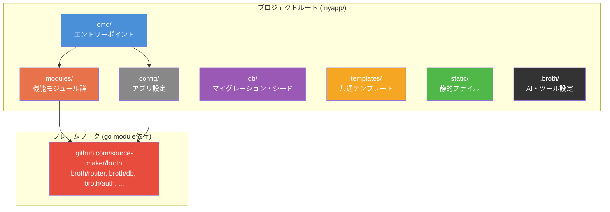
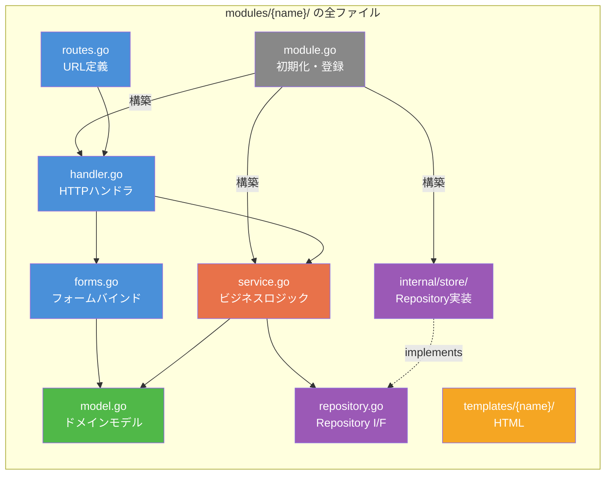
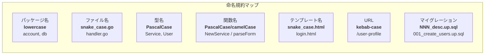
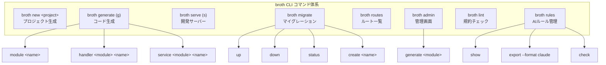
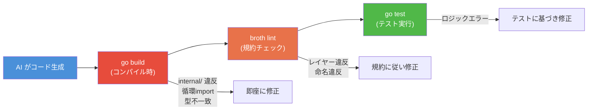
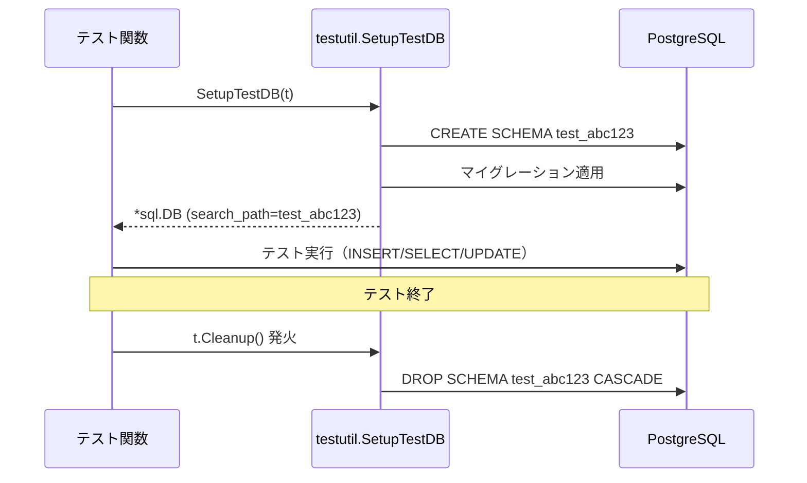
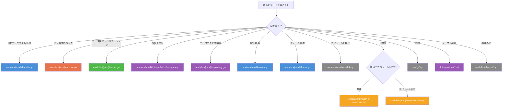

# Broth -- プロジェクト構造・DX設計書

> **バージョン**: 0.1.0-draft
> **最終更新**: 2026-02-08
> **ステータス**: 初期設計
> **前提ドキュメント**: [ARCHITECTURE.md](./ARCHITECTURE.md), [MODULE_DESIGN.md](./MODULE_DESIGN.md)

---

## 目次

1. [設計目標](#1-設計目標)
2. [標準ディレクトリ構成](#2-標準ディレクトリ構成)
3. [各ディレクトリ・ファイルの詳細](#3-各ディレクトリファイルの詳細)
4. [命名規約](#4-命名規約)
5. [CLI設計](#5-cli設計)
6. [AIフレンドリーな設計](#6-aiフレンドリーな設計)
7. [プロジェクトのスケーラビリティ](#7-プロジェクトのスケーラビリティ)
8. [テスト戦略](#8-テスト戦略)
9. [設計判断の記録](#9-設計判断の記録)

---

## 1. 設計目標

### 「構造の収束性」をGoで最大化する

Broth のプロジェクト構造設計の最重要目標は **収束性5（Railsクラス）の構造をGoで実現する** ことである。

| 指標 | 目標値 | 達成手段 |
|---|---|---|
| **構造の収束性** | 5/5 | ディレクトリ・ファイル名・レイヤー責務を規約で規定 |
| **コードの可読性** | 5/5 | Go の言語特性（型安全・gofmt統一）を最大活用 |
| **AI支援との相性** | 5/5 | 「どこに何を書くか」を `.broth/rules.md` で明文化 |

### 収束性とは何か

> **同じ機能要件を受けたとき、誰が書いても（人間でもAIでも）同じファイルの同じ場所にコードが生成されること。**

これはRailsが「convention over configuration」で達成した最大の功績であり、Brothはこれをコンパイル時チェック付きでGoに移植する。

### 全体構造の俯瞰図



---

## 2. 標準ディレクトリ構成

`broth new myapp` で生成されるプロジェクト雛形を以下に示す。
ARCHITECTURE.md のレイヤードアーキテクチャ、MODULE_DESIGN.md のモジュール内部構造と完全に整合する。

```
myapp/
├── cmd/
│   └── myapp/
│       └── main.go                 # エントリーポイント（依存の組み立て・サーバー起動）
├── config/
│   ├── app.go                      # アプリケーション設定構造体（AppConfig）
│   ├── database.go                 # DB接続設定構造体（DatabaseConfig）
│   ├── routes.go                   # グローバルルーティング設定（モジュール→URLプレフィックスのマッピング）
│   └── middleware.go               # グローバルミドルウェア設定（適用順序の定義）
├── modules/                        # 機能モジュール群（MODULE_DESIGN.md 準拠）
│   ├── account/                    # 例: アカウントモジュール
│   │   ├── module.go               #   モジュール登録・初期化（broth.Module インターフェース実装）
│   │   ├── handler.go              #   HTTPハンドラ（Presentationレイヤー）
│   │   ├── service.go              #   ビジネスロジック（Applicationレイヤー）
│   │   ├── model.go                #   ドメインモデル・バリデーション（Domainレイヤー）
│   │   ├── repository.go           #   リポジトリインターフェース（境界定義）
│   │   ├── routes.go               #   モジュール内ルーティング定義
│   │   ├── forms.go                #   フォーム定義・入力バインディング
│   │   ├── internal/               #   外部非公開の実装詳細
│   │   │   └── store/
│   │   │       ├── postgres.go     #     リポジトリのPostgreSQL実装
│   │   │       └── postgres_test.go#     リポジトリ実装のテスト
│   │   └── templates/              #   モジュール固有テンプレート
│   │       └── account/
│   │           ├── login.html
│   │           ├── register.html
│   │           └── profile.html
│   └── shared/                     # 共通型パッケージ（Money, Pagination等の値オブジェクト）
│       ├── money.go
│       └── pagination.go
├── db/
│   ├── migrations/                 # SQLマイグレーションファイル（連番管理）
│   │   ├── 001_create_users.up.sql
│   │   └── 001_create_users.down.sql
│   └── seeds/                      # シードデータ（開発・テスト用の初期データ）
│       └── seed.go
├── static/                         # 静的ファイル（CSS, JS, 画像）
│   ├── css/
│   ├── js/
│   └── images/
├── templates/                      # 共通テンプレート（レイアウト・共通コンポーネント）
│   ├── layouts/
│   │   └── base.html               #   ベースレイアウト
│   └── components/
│       ├── header.html             #   ヘッダーコンポーネント
│       ├── footer.html             #   フッターコンポーネント
│       └── pagination.html         #   ページネーションコンポーネント
├── .broth/                           # Broth 設定ディレクトリ
│   └── rules.md                    #   AI生成ルール定義ファイル
├── .env                            # 環境変数（gitignore対象）
├── .env.example                    # 環境変数テンプレート（git管理対象）
├── .gitignore
├── .golangci.yml                   # golangci-lint設定（レイヤー違反検出含む）
├── go.mod
├── go.sum
├── Makefile                        # 開発用タスクランナー
└── README.md
```

### ARCHITECTURE.md・MODULE_DESIGN.md との整合マッピング

| 本設計書のパス | ARCHITECTURE.md の対応 | MODULE_DESIGN.md の対応 |
|---|---|---|
| `cmd/myapp/main.go` | sec 3.2 依存注入のワイヤリング | sec 5 main.go でのモジュール組み立て |
| `modules/{name}/handler.go` | sec 3.1 HTTPレイヤー | sec 2 handler.go |
| `modules/{name}/service.go` | sec 3.2 アプリケーションレイヤー（最重要） | sec 2 service.go |
| `modules/{name}/model.go` | sec 3.3 ドメインレイヤー | sec 2 model.go |
| `modules/{name}/repository.go` | sec 3.4 Repository パターン（インターフェース） | sec 2 repository.go |
| `modules/{name}/internal/store/` | sec 3.4 Repository パターン（実装） | sec 2 store.go (internal/store/) |
| `modules/{name}/routes.go` | sec 3.1 ルーター設計 | sec 2 routes.go |
| `modules/{name}/module.go` | -- | sec 5 モジュール登録メカニズム |
| `modules/{name}/forms.go` | sec 3.3 バリデーション | sec 2 forms.go |
| `modules/shared/` | -- | sec 7 shared パッケージ |
| `db/migrations/` | sec 4 broth/migrate | -- |
| `config/` | sec 4 broth/config | -- |

---

## 3. 各ディレクトリ・ファイルの詳細

### 3.1 `cmd/myapp/main.go` -- エントリーポイント

**役割**: アプリケーション全体の組み立て（ワイヤリング）とサーバー起動。

**このファイルに書くこと**:
- 設定の読み込み（`config.MustLoad()`）
- 基盤サービスの構築（DB, Logger, Renderer）
- 全モジュールの構築と依存注入
- `broth.App` へのモジュール登録
- ミドルウェアチェーンの構成
- HTTPサーバーの起動とグレースフルシャットダウン

**このファイルに書かないこと**:
- ビジネスロジック
- ルーティング定義の詳細
- データベースクエリ

```go
// cmd/myapp/main.go
package main

import (
    "context"
    "log/slog"
    "net/http"
    "os"
    "os/signal"

    "myapp/config"
    "myapp/modules/account"

    "github.com/source-maker/broth"
    "github.com/source-maker/broth/db"
    "github.com/source-maker/broth/log"
    "github.com/source-maker/broth/middleware"
    "github.com/source-maker/broth/render"
)

func main() {
    // 1. 設定の読み込み
    cfg := config.MustLoad()

    // 2. 基盤サービスの構築
    logger := log.New(cfg.Log.Level)
    database := db.MustOpen(cfg.Database.URL)
    defer database.Close()
    renderer := render.New("templates/")

    // 3. モジュールの構築（依存グラフの順に組み立て）
    accountMod := account.NewModule(database, renderer, logger)
    // articleMod := article.NewModule(database, renderer, logger, accountMod.Service())
    // ...

    // 4. アプリケーションの組み立て
    app := broth.New(logger.Slog())
    app.Register(
        accountMod,
        // articleMod,
    )

    // 5. ミドルウェアの適用（config/middleware.go で定義した順序）
    handler := middleware.Chain(
        app.Handler(),
        config.GlobalMiddleware(logger)...,
    )

    // 6. サーバー起動
    srv := &http.Server{Addr: cfg.App.Addr, Handler: handler}
    ctx, stop := signal.NotifyContext(context.Background(), os.Interrupt)
    defer stop()

    if err := app.Start(ctx); err != nil {
        slog.Error("app start failed", "error", err)
        os.Exit(1)
    }

    go func() {
        slog.Info("server starting", "addr", cfg.App.Addr)
        if err := srv.ListenAndServe(); err != http.ErrServerClosed {
            slog.Error("server error", "error", err)
        }
    }()

    <-ctx.Done()
    slog.Info("shutting down...")
    _ = app.Shutdown(context.Background())
    _ = srv.Shutdown(context.Background())
}
```

---

### 3.2 `config/` -- アプリケーション設定

全ての設定を構造体として型安全に定義する。ARCHITECTURE.md sec 4 の `broth/config` を利用し、環境変数からバインドする。

#### `config/app.go` -- アプリケーション全体の設定ルート

**このファイルに書くこと**: `Config` ルート構造体の定義。`MustLoad()` 関数。サーバーアドレス・環境名等のアプリ全体設定。

```go
// config/app.go
package config

import "github.com/source-maker/broth/config"

// Config はアプリケーション全体の設定を表す。
type Config struct {
    App      AppConfig
    Database DatabaseConfig
    Log      LogConfig
}

// AppConfig はサーバー設定。
type AppConfig struct {
    Addr string `env:"APP_ADDR" default:":8080"`
    Env  string `env:"APP_ENV"  default:"development"`
}

// LogConfig はログ設定。
type LogConfig struct {
    Level string `env:"LOG_LEVEL" default:"info"`
}

// MustLoad は環境変数から設定を読み込む。失敗時は panic する。
func MustLoad() *Config {
    var cfg Config
    config.MustBind(&cfg)
    return &cfg
}
```

#### `config/database.go` -- データベース接続設定

**このファイルに書くこと**: DB接続URL・コネクションプール設定。

```go
// config/database.go
package config

// DatabaseConfig はデータベース接続設定。
type DatabaseConfig struct {
    URL             string `env:"DATABASE_URL"      required:"true"`
    MaxOpenConns    int    `env:"DB_MAX_OPEN_CONNS" default:"25"`
    MaxIdleConns    int    `env:"DB_MAX_IDLE_CONNS" default:"5"`
    ConnMaxLifetime int    `env:"DB_CONN_MAX_LIFE"  default:"300"` // 秒
}
```

#### `config/routes.go` -- グローバルルーティング設定

**このファイルに書くこと**: 各モジュールのURLプレフィックスマッピング。静的ファイルのルーティング。

```go
// config/routes.go
package config

import (
    "github.com/source-maker/broth"
    "github.com/source-maker/broth/router"
)

// RegisterRoutes はモジュールのルーティングをプレフィックス付きで登録する。
// Django の urls.py に相当する。
func RegisterRoutes(app *broth.App) {
    app.Mount("/accounts", app.Module("account"))
    // app.Mount("/articles", app.Module("article"))
    // app.Mount("/api/v1/articles", app.Module("article")) // API も同じモジュールからマウント可能

    // 静的ファイル
    app.Static("/static/", "static/")
}
```

#### `config/middleware.go` -- グローバルミドルウェア設定

**このファイルに書くこと**: アプリケーション全体に適用するミドルウェアの定義と適用順序。

```go
// config/middleware.go
package config

import (
    "github.com/source-maker/broth/log"
    "github.com/source-maker/broth/middleware"
)

// GlobalMiddleware はアプリケーション全体に適用するミドルウェアを返す。
// 適用順序: 外側（先頭）から内側（末尾）へ。
//
//   Recovery → RequestID → Logging → Tracing → Session → Auth → CSRF
//
func GlobalMiddleware(logger *log.Logger) []middleware.Middleware {
    return []middleware.Middleware{
        middleware.Recovery(logger),
        middleware.RequestID(),
        middleware.Logger(logger),
        middleware.Tracing(),
        middleware.Session(),
        middleware.CSRF(),
    }
}
```

---

### 3.3 `modules/{name}/` -- 機能モジュール

MODULE_DESIGN.md で定義されたモジュール内部構造を厳密に踏襲する。以下は各ファイルの一行要約である。



#### ファイル一覧と責務

| ファイル | レイヤー | 責務（1行） | このファイルに書くもの | このファイルに書かないもの |
|---|---|---|---|---|
| `module.go` | インフラ | モジュールの初期化と `broth.Module` インターフェースの実装 | `NewModule()`, `Name()`, `Routes()`, `Service()` | ビジネスロジック、SQL |
| `handler.go` | HTTP | HTTPリクエストの受付・パース・レスポンス生成 | `Handler` 構造体、各エンドポイントのメソッド | ビジネスロジック、直接のDB操作 |
| `service.go` | Application | ビジネスロジックの唯一の置き場所（ARCHITECTURE.md sec 3.2） | `Service` 構造体、ビジネスルール、トランザクション制御 | HTTP固有の処理、SQL文 |
| `model.go` | Domain | ドメインモデルの定義と純粋バリデーション | エンティティ構造体、`Validate()` メソッド、値オブジェクト | DB依存、HTTP依存 |
| `repository.go` | 境界定義 | データアクセスの抽象（インターフェースのみ） | `Repository` interface | 実装（SQL文等） |
| `routes.go` | HTTP | モジュール内のURLルーティング定義 | `Routes() []router.Route` | ハンドラの実装 |
| `forms.go` | HTTP | HTMLフォームのバインディングと入力型変換 | フォーム構造体、`Bind()`, `ToInput()` | バリデーションロジック（model.go に委譲） |
| `internal/store/postgres.go` | Infrastructure | Repository インターフェースの database/sql 実装 | SQL文、行スキャン、`account.Repository` の全メソッド実装 | ビジネスロジック |
| `templates/{name}/*.html` | Presentation | モジュール固有のHTMLテンプレート | HTML/テンプレート構文 | Go コード |

#### ファイル追加のルール

モジュールが成長した場合、以下のルールでファイルを分割する。

| 状況 | 対応 | ファイル名の規約 |
|---|---|---|
| handler.go が長くなった | リソース単位で分割 | `handler_user.go`, `handler_session.go` |
| service.go が長くなった | ユースケース単位で分割 | `service_registration.go`, `service_auth.go` |
| model.go が長くなった | エンティティ単位で分割 | `model_user.go`, `model_role.go` |
| テスト | 各ファイルの隣に配置 | `handler_test.go`, `service_test.go` |
| フィクスチャ | `testdata/` ディレクトリ | `testdata/fixtures.json` |

> **重要**: ファイルを分割しても **パッケージは分割しない**。`modules/account/` 直下のファイルは全て `package account` に属する。これにより Go のフラットパッケージ文化を維持する。

---

### 3.4 `modules/shared/` -- 共通型パッケージ

MODULE_DESIGN.md sec 7 で定義された共通型パッケージ。

**このパッケージに書くこと**: 複数モジュールで共有する値オブジェクト、ヘルパー型。
**このパッケージに書かないこと**: ドメインモデル、ビジネスロジック、サービス。

| ファイル | 内容 |
|---|---|
| `money.go` | `Money` 値オブジェクト（金額・通貨） |
| `pagination.go` | `Page`, `PageResult[T]` ジェネリクス型 |
| `errors.go` | アプリケーション共通のエラー型（`NotFoundError`, `ValidationError` 等） |

---

### 3.5 `db/` -- データベース関連

#### `db/migrations/` -- SQLマイグレーション

**このディレクトリに書くこと**: テーブル作成・変更のSQL（Up/Down ペア）。

ファイル命名規約: `{連番3桁}_{説明}.{up|down}.sql`

```
db/migrations/
├── 001_create_users.up.sql
├── 001_create_users.down.sql
├── 002_create_articles.up.sql
├── 002_create_articles.down.sql
├── 003_add_users_email_index.up.sql
└── 003_add_users_email_index.down.sql
```

#### `db/seeds/` -- シードデータ

**このディレクトリに書くこと**: 開発・テスト用の初期データ投入コード。

```go
// db/seeds/seed.go
package seeds

import (
    "context"
    "database/sql"
)

// Run は開発用のシードデータを投入する。
func Run(ctx context.Context, db *sql.DB) error {
    // 開発用のユーザー、記事等の初期データを投入
    return nil
}
```

---

### 3.6 `templates/` -- 共通テンプレート

**このディレクトリに書くこと**: 全モジュール共通のレイアウト・コンポーネント。

| パス | 役割 |
|---|---|
| `templates/layouts/base.html` | 全ページ共通のベースレイアウト（`<html>`, `<head>`, ナビゲーション等） |
| `templates/components/header.html` | ヘッダーコンポーネント |
| `templates/components/footer.html` | フッターコンポーネント |
| `templates/components/pagination.html` | ページネーションUI |
| `templates/components/flash.html` | フラッシュメッセージ表示 |

テンプレートの解決順序:

```
1. modules/{name}/templates/{name}/*.html  （モジュール固有）
2. templates/components/*.html              （共通コンポーネント）
3. templates/layouts/*.html                 （レイアウト）
```

---

### 3.7 `static/` -- 静的ファイル

**このディレクトリに書くこと**: CSS, JavaScript, 画像等の静的アセット。

```
static/
├── css/
│   └── app.css
├── js/
│   └── app.js
└── images/
    └── logo.png
```

> **設計判断**: Broth はフロントエンドビルドツール（Vite, esbuild等）を強制しない。`static/` ディレクトリの内容をそのまま配信する。フロントエンドのビルドパイプラインが必要な場合は、ビルド成果物を `static/` に出力する構成をドキュメントで案内する。

---

### 3.8 `.broth/` -- Broth 設定ディレクトリ

#### `.broth/rules.md` -- AI生成ルール

AIコーディングアシスタントがコード生成時に参照するルールファイル。詳細は [6. AIフレンドリーな設計](#6-aiフレンドリーな設計) で記述する。

---

### 3.9 プロジェクトルートのファイル群

| ファイル | 役割 |
|---|---|
| `.env` | 環境変数定義。**gitignore対象**。`DATABASE_URL`, `APP_ADDR` 等を記述 |
| `.env.example` | `.env` のテンプレート。git管理対象。新規開発者が参照する |
| `.gitignore` | `.env`, バイナリ等の除外設定 |
| `.golangci.yml` | golangci-lint設定。depguard によるレイヤー違反検出を含む（MODULE_DESIGN.md sec 6） |
| `go.mod` | Go モジュール定義 |
| `go.sum` | 依存ロックファイル |
| `Makefile` | 開発用タスクランナー。`make serve`, `make migrate`, `make test` 等のショートカット |
| `README.md` | プロジェクト概要・セットアップ手順 |

---

## 4. 命名規約

### 4.1 パッケージ名

Go の公式スタイルガイドに準拠する。

| ルール | 例 | 非例 |
|---|---|---|
| 小文字のみ | `account` | `Account`, `ACCOUNT` |
| 短く簡潔に | `db`, `auth` | `database_connection`, `authentication` |
| 単数形 | `account`, `article` | `accounts`, `articles` |
| アンダースコア不可 | `notification` | `push_notification` |
| 汎用的な名前を避ける | `account`, `render` | `util`, `common`, `helper` |
| `shared` は唯一の例外 | `shared` | -- |

### 4.2 ファイル名

| ルール | 例 |
|---|---|
| snake_case.go | `handler.go`, `service.go`, `model.go` |
| テストは `_test.go` サフィックス | `handler_test.go`, `service_test.go` |
| 分割時はプレフィックス付き | `handler_user.go`, `service_registration.go` |

#### モジュール内の標準ファイル名（Django的お作法）

以下のファイル名は Broth の規約として固定する。`broth generate module` で自動生成される。

| ファイル名 | Django の対応 | 必須/任意 |
|---|---|---|
| `module.go` | `apps.py` | 必須 |
| `handler.go` | `views.py` | 必須 |
| `service.go` | (Djangoに公式対応なし) | 必須 |
| `model.go` | `models.py` | 必須 |
| `repository.go` | (Djangoに公式対応なし) | 必須 |
| `routes.go` | `urls.py` | 必須 |
| `forms.go` | `forms.py` | 任意 |
| `internal/store/postgres.go` | (Djangoに対応なし) | 必須 |

### 4.3 型名・関数名

Go の標準命名規則に準拠する。

| 種別 | 規則 | 例 |
|---|---|---|
| 公開型 | PascalCase | `User`, `Service`, `Handler`, `Repository` |
| 非公開型 | camelCase | `ctxKey`, `parseForm` |
| 公開関数 | PascalCase | `NewService`, `Register`, `FindByID` |
| 非公開関数 | camelCase | `hashPassword`, `scanRow` |
| インターフェース | 動詞+er / 名詞 | `Repository`, `Migrator`, `JobProvider` |
| コンストラクタ | `New` + 型名 | `NewService`, `NewHandler`, `NewModule` |

#### モジュール内の標準型名

| 型名 | 定義場所 | 役割 |
|---|---|---|
| `Module` | `module.go` | モジュール定義（`broth.Module` を実装） |
| `Handler` | `handler.go` | HTTPハンドラ構造体 |
| `Service` | `service.go` | ビジネスロジック構造体 |
| `Repository` | `repository.go` | データアクセスインターフェース |
| `{Entity名}` | `model.go` | ドメインモデル（例: `User`, `Article`） |
| `{Action}Input` | `model.go` | サービスへの入力型（例: `RegisterInput`） |
| `{Entity}Form` | `forms.go` | HTMLフォーム定義（例: `RegisterForm`） |

### 4.4 テンプレート名

| ルール | 例 |
|---|---|
| snake_case.html | `login.html`, `register.html`, `user_list.html` |
| アクション名をベースにする | `show_profile.html`, `edit_article.html` |
| モジュール名のサブディレクトリに配置 | `modules/account/templates/account/login.html` |

### 4.5 URL パス

| ルール | 例 |
|---|---|
| kebab-case | `/user-profile`, `/order-history` |
| 複数形リソース | `/articles`, `/users` |
| RESTful パターン | `GET /articles`, `GET /articles/{id}`, `POST /articles` |
| モジュールプレフィックス | `/accounts/login`, `/articles/{id}/comments` |

### 4.6 マイグレーションファイル名

| ルール | 例 |
|---|---|
| `{連番3桁}_{説明}.{up|down}.sql` | `001_create_users.up.sql` |
| 説明は snake_case | `002_add_email_index.up.sql` |
| 動詞で始める | `create_`, `add_`, `drop_`, `alter_` |

### 4.7 命名規約の全体サマリ図



---

## 5. CLI設計

### 5.1 コマンド一覧

```
broth - Broth フレームワーク CLI

Usage:
  broth <command> [arguments]

Commands:
  new          新規プロジェクトを生成する
  generate     コードの雛形を生成する（別名: g）
  serve        開発サーバーを起動する（別名: s）
  migrate      データベースマイグレーションを管理する
  routes       ルーティング一覧を表示する
  admin        管理画面関連の操作
  lint         Broth 規約違反をチェックする
  rules        AI ルールファイルを管理する
  version      バージョンを表示する

Flags:
  -h, --help      ヘルプを表示する
  -v, --verbose   詳細出力を有効にする
```

---

### 5.2 `broth new <project-name>` -- プロジェクト生成

新規プロジェクトの雛形を生成する。

```
Usage:
  broth new <project-name> [flags]

Flags:
  --module <module-path>   Go モジュールパス（デフォルト: github.com/<user>/<project-name>）
  --db <driver>            データベースドライバ（postgres|mysql|sqlite）（デフォルト: postgres）
  --skip-git               git init をスキップする
  --skip-example           サンプルモジュール（account）の生成をスキップする
```

**実行例**:

```bash
$ broth new myapp --module github.com/myorg/myapp --db postgres

Creating new Broth project: myapp
  Module path: github.com/myorg/myapp
  Database:    postgres

  create  myapp/
  create  myapp/cmd/myapp/main.go
  create  myapp/config/app.go
  create  myapp/config/database.go
  create  myapp/config/routes.go
  create  myapp/config/middleware.go
  create  myapp/modules/account/module.go
  create  myapp/modules/account/handler.go
  create  myapp/modules/account/service.go
  create  myapp/modules/account/model.go
  create  myapp/modules/account/repository.go
  create  myapp/modules/account/routes.go
  create  myapp/modules/account/forms.go
  create  myapp/modules/account/internal/store/postgres.go
  create  myapp/modules/account/templates/account/login.html
  create  myapp/modules/account/templates/account/register.html
  create  myapp/modules/shared/errors.go
  create  myapp/modules/shared/pagination.go
  create  myapp/db/migrations/.gitkeep
  create  myapp/db/seeds/seed.go
  create  myapp/static/css/app.css
  create  myapp/static/js/app.js
  create  myapp/templates/layouts/base.html
  create  myapp/templates/components/header.html
  create  myapp/templates/components/footer.html
  create  myapp/.broth/rules.md
  create  myapp/.env.example
  create  myapp/.gitignore
  create  myapp/.golangci.yml
  create  myapp/go.mod
  create  myapp/Makefile
  create  myapp/README.md

  run     go mod tidy
  run     git init
  run     git add -A
  run     git commit -m "Initial commit by broth new"

Done! Your Broth project is ready.

  cd myapp
  broth serve

Happy coding with Broth!
```

---

### 5.3 `broth generate` (`broth g`) -- コード生成

#### `broth generate module <name>` -- モジュール生成

```
Usage:
  broth generate module <name> [flags]
  broth g module <name> [flags]

Flags:
  --skip-templates   テンプレートディレクトリの生成をスキップする
  --skip-forms       forms.go の生成をスキップする
  --api-only         HTMLテンプレート・フォームなしのAPIモジュールを生成する
```

**実行例**:

```bash
$ broth generate module article

Generating module: article

  create  modules/article/module.go
  create  modules/article/handler.go
  create  modules/article/service.go
  create  modules/article/model.go
  create  modules/article/repository.go
  create  modules/article/routes.go
  create  modules/article/forms.go
  create  modules/article/internal/store/postgres.go
  create  modules/article/templates/article/.gitkeep

Module "article" created.

Next steps:
  1. Define your domain model in modules/article/model.go
  2. Define repository interface in modules/article/repository.go
  3. Implement business logic in modules/article/service.go
  4. Add HTTP handlers in modules/article/handler.go
  5. Register the module in cmd/myapp/main.go:
     articleMod := article.NewModule(database, renderer, logger)
     app.Register(articleMod)
  6. Add URL prefix in config/routes.go:
     app.Mount("/articles", app.Module("article"))
```

#### `broth generate handler <module> <name>` -- ハンドラ追加

既存モジュールに新しいハンドラメソッドを追加する。

```
Usage:
  broth generate handler <module> <name> [flags]

Flags:
  --method <method>   HTTPメソッド（GET|POST|PUT|PATCH|DELETE）（デフォルト: GET）
  --path <path>       URLパス（デフォルト: /<name>）
```

**実行例**:

```bash
$ broth generate handler account change-password --method POST --path /change-password

Generating handler: account.ChangePassword

  modify  modules/account/handler.go     (add ChangePassword method)
  modify  modules/account/routes.go      (add POST /change-password route)

Handler "ChangePassword" added to module "account".

Next steps:
  1. Define ChangePasswordInput in modules/account/model.go
  2. Add ChangePassword method to modules/account/service.go
  3. Implement the handler logic in modules/account/handler.go
```

生成されるコード:

```go
// modules/account/handler.go に追記

// ChangePassword はパスワード変更を処理する。
func (h *Handler) ChangePassword(w http.ResponseWriter, r *http.Request) {
    // TODO: 実装してください
    // 1. リクエストのパース
    // 2. h.svc.ChangePassword(r.Context(), input) の呼び出し
    // 3. レスポンスの生成
    w.WriteHeader(http.StatusNotImplemented)
}
```

```go
// modules/account/routes.go の Routes() に追記
{Pattern: "POST /change-password", Handler: http.HandlerFunc(h.ChangePassword)},
```

#### `broth generate service <module> <name>` -- サービスメソッド追加

```
Usage:
  broth generate service <module> <name> [flags]

Flags:
  --input <type>    入力型名（デフォルト: <Name>Input）
  --output <type>   出力型名（デフォルト: なし）
```

**実行例**:

```bash
$ broth generate service account change-password --input ChangePasswordInput

Generating service method: account.Service.ChangePassword

  modify  modules/account/service.go   (add ChangePassword method)
  modify  modules/account/model.go     (add ChangePasswordInput type + Validate)

Service method "ChangePassword" added to module "account".
```

生成されるコード:

```go
// modules/account/service.go に追記

// ChangePassword はパスワード変更のビジネスロジック。
func (s *Service) ChangePassword(ctx context.Context, input ChangePasswordInput) error {
    if err := input.Validate(); err != nil {
        return fmt.Errorf("account: validation: %w", err)
    }
    // TODO: ビジネスロジックを実装してください
    return nil
}
```

```go
// modules/account/model.go に追記

// ChangePasswordInput はパスワード変更の入力値。
type ChangePasswordInput struct {
    UserID          int64
    CurrentPassword string
    NewPassword     string
}

// Validate は入力値の純粋バリデーション。
func (in ChangePasswordInput) Validate() error {
    var errs []error
    if in.UserID == 0 {
        errs = append(errs, errors.New("user_id is required"))
    }
    if len(in.NewPassword) < 8 {
        errs = append(errs, errors.New("new password must be at least 8 characters"))
    }
    return errors.Join(errs...)
}
```

#### `broth generate model` -- データアクセスモデル生成（Bob ベース）

```
Usage:
  broth generate model [flags]

Flags:
  --database <url>   データベースURL（デフォルト: DATABASE_URL 環境変数）
  --output <path>    出力ディレクトリ（デフォルト: modules/*/internal/store/models）
  --factory          テスト用ファクトリーも生成する（デフォルト: true）
```

**実行例**:

```bash
$ broth generate model

Generating models from database schema (via bobgen-psql):

  create  modules/account/internal/store/models/users.go
  create  modules/account/internal/store/models/users_test.go
  create  modules/article/internal/store/models/articles.go
  create  modules/article/internal/store/models/articles_test.go
  create  modules/article/internal/store/models/comments.go
  create  modules/article/internal/store/models/comments_test.go
  create  internal/testutil/factory/factory.go

Models generated for 3 tables. Test factories included.
```

> **注意**: `broth generate model` は内部で `bobgen-psql` を呼び出す（ADR-D006）。実行前に `broth migrate up` でスキーマを最新にしておく必要がある。

---

### 5.4 `broth migrate` -- マイグレーション管理

```
Usage:
  broth migrate <command> [flags]

Commands:
  up         未適用のマイグレーションを全て適用する
  down       最後に適用したマイグレーションを1つロールバックする
  status     マイグレーションの適用状況を表示する
  create     新しいマイグレーションファイルを作成する

Flags:
  --dir <path>       マイグレーションディレクトリ（デフォルト: db/migrations）
  --database <url>   データベースURL（デフォルト: DATABASE_URL 環境変数）
```

#### `broth migrate up`

```bash
$ broth migrate up

Applying migrations:
  [001] create_users ............... applied (12ms)
  [002] create_articles ........... applied (8ms)
  [003] add_email_index ........... applied (3ms)

All migrations applied. (3 applied, 0 pending)
```

#### `broth migrate down`

```bash
$ broth migrate down

Rolling back:
  [003] add_email_index ........... rolled back (2ms)

Rollback complete. (1 rolled back)
```

#### `broth migrate status`

```bash
$ broth migrate status

Migration Status:
  [001] create_users ............... applied   (2026-02-01 10:00:00)
  [002] create_articles ........... applied   (2026-02-01 10:00:01)
  [003] add_email_index ........... pending

  Applied: 2 / Total: 3
```

#### `broth migrate create <name>`

```bash
$ broth migrate create add_users_avatar_url

Created migration files:
  create  db/migrations/004_add_users_avatar_url.up.sql
  create  db/migrations/004_add_users_avatar_url.down.sql

Edit the SQL files and run 'broth migrate up' to apply.
```

---

### 5.5 `broth serve` (`broth s`) -- 開発サーバー起動

```
Usage:
  broth serve [flags]
  broth s [flags]

Flags:
  --addr <addr>   リッスンアドレス（デフォルト: :8080 / APP_ADDR 環境変数）
  --no-reload     ホットリロードを無効にする
```

**実行例**:

```bash
$ broth serve

Broth development server starting...

  Environment:  development
  Address:      http://localhost:8080
  Hot reload:   enabled
  Modules:      account, article

  Watching for file changes...

[2026-02-08 10:00:00] INFO  server starting addr=:8080
[2026-02-08 10:00:05] INFO  file changed path=modules/account/handler.go
[2026-02-08 10:00:05] INFO  rebuilding...
[2026-02-08 10:00:06] INFO  server restarted (1.2s)
```

ホットリロードの仕組み:
- ファイルシステム監視（`fsnotify` ベース）で `.go` ファイルの変更を検出
- `go build` を再実行し、プロセスを再起動する（Air/Realize 相当の機能を内蔵）
- テンプレートファイルの変更はプロセス再起動不要（`broth/render` が開発モード時にファイルを都度読み込み）

---

### 5.6 `broth routes` -- ルーティング一覧

```
Usage:
  broth routes [flags]

Flags:
  --module <name>   特定モジュールのルートのみ表示
  --format <fmt>    出力形式（table|json）（デフォルト: table）
```

**実行例**:

```bash
$ broth routes

Module       Method  Pattern                  Handler
───────────  ──────  ───────────────────────  ──────────────────────────
account      GET     /accounts/register       account.Handler.ShowRegisterForm
account      POST    /accounts/register       account.Handler.Register
account      GET     /accounts/login          account.Handler.ShowLoginForm
account      POST    /accounts/login          account.Handler.Login
account      POST    /accounts/logout         account.Handler.Logout
account      GET     /accounts/profile        account.Handler.ShowProfile
article      GET     /articles                article.Handler.List
article      GET     /articles/{id}           article.Handler.Show
article      GET     /articles/new            article.Handler.ShowCreateForm
article      POST    /articles                article.Handler.Create
static       GET     /static/*                (file server)

Total: 11 routes
```

```bash
$ broth routes --module account --format json

[
  {"module": "account", "method": "GET",  "pattern": "/accounts/register", "handler": "account.Handler.ShowRegisterForm"},
  {"module": "account", "method": "POST", "pattern": "/accounts/register", "handler": "account.Handler.Register"},
  ...
]
```

---

### 5.7 `broth admin generate <module>` -- 管理画面生成

ARCHITECTURE.md sec 4 の `broth/admin`（Django Admin 相当）と連携する。

```
Usage:
  broth admin generate <module> [flags]

Flags:
  --model <name>    管理対象のモデル名（デフォルト: モジュール内の全モデル）
  --readonly        読み取り専用の管理画面を生成する
```

**実行例**:

```bash
$ broth admin generate account

Generating admin interface for module: account

  modify  modules/account/module.go    (add AdminResources method)
  create  modules/account/admin.go     (admin resource definition)

Admin interface generated for:
  - User (CRUD: list, show, create, edit, delete)

Register in config/routes.go:
  app.Mount("/admin", admin.Handler(app))

Visit http://localhost:8080/admin after running 'broth serve'.
```

生成されるコード:

```go
// modules/account/admin.go
package account

import "github.com/source-maker/broth/admin"

// AdminResources はこのモジュールの管理画面リソースを返す。
func (m *Module) AdminResources() []admin.Resource {
    return []admin.Resource{
        {
            Name:       "User",
            Model:      User{},
            ListFields: []string{"ID", "Email", "Name", "CreatedAt"},
            SearchFields: []string{"Email", "Name"},
            Repository: m.service.repo, // Repository インターフェース経由
        },
    }
}
```

---

### 5.8 `broth lint` -- 規約違反チェック

MODULE_DESIGN.md sec 6 の境界違反検出を CLI から実行する。

```
Usage:
  broth lint [flags]

Flags:
  --fix    自動修正可能な違反を修正する
```

**実行例**:

```bash
$ broth lint

Checking Broth conventions...

  [PASS] Module structure: all modules have required files
  [PASS] Layer dependencies: no layer violations detected
  [WARN] modules/article/handler.go:42 - handler imports "database/sql" directly
         → handler should access data through service, not directly
  [FAIL] modules/notification/service.go:15 - imports "myapp/modules/account/internal/store"
         → cross-module internal access is forbidden
  [PASS] Naming conventions: all files follow snake_case
  [PASS] Module registration: all modules registered in main.go

Results: 4 passed, 1 warning, 1 failure
```

チェック項目:

| カテゴリ | チェック内容 |
|---|---|
| **モジュール構造** | 必須ファイル（module.go, handler.go, service.go, model.go, repository.go, routes.go）の存在確認 |
| **レイヤー依存** | handler.go が database/sql を import していないか、model.go が net/http を import していないか |
| **モジュール境界** | 他モジュールの `internal/` を import していないか |
| **命名規約** | ファイル名が snake_case か、パッケージ名が小文字単数形か |
| **モジュール登録** | `cmd/myapp/main.go` で全モジュールが登録されているか |
| **インターフェース適合** | `var _ broth.Module = (*Module)(nil)` が存在するか |

---

### 5.9 `broth rules` -- AIルール管理

```
Usage:
  broth rules <command>

Commands:
  show       現在のルールファイルを表示する
  export     指定フォーマットでルールを出力する
  check      プロジェクトの現状とルールの整合性を確認する
```

#### `broth rules export`

```
Usage:
  broth rules export [flags]

Flags:
  --format <format>   出力フォーマット（claude|cursor|copilot|raw）（デフォルト: raw）
  --output <path>     出力先ファイルパス（デフォルト: 標準出力）
```

```bash
# CLAUDE.md への出力
$ broth rules export --format claude --output CLAUDE.md

Exported rules to CLAUDE.md (Claude Code format)

# .cursorrules への出力
$ broth rules export --format cursor --output .cursorrules

Exported rules to .cursorrules (Cursor format)
```

---

### 5.10 CLI コマンド一覧サマリ



---

## 6. AIフレンドリーな設計

### 6.1 設計思想: AIコード生成の収束性を最大化する

Broth の構造設計は、AI（LLM）によるコード生成を第一級の開発手段として位置づける。
収束性の最大化とは、以下を意味する。

| 課題 | 解決策 |
|---|---|
| AIが「どこにファイルを作るか」で迷う | ディレクトリ構造が規約で一意に決まる |
| AIが「どのファイルにコードを追加するか」で迷う | ファイル名と責務が規約で固定されている |
| AIが「どの型名・関数名を使うか」で迷う | 命名規約が明文化されている |
| AIが「レイヤーをまたいだ不正な依存」を生成する | `broth lint` でコンパイル後に検出できる |
| AIが「プロジェクト固有のルール」を知らない | `.broth/rules.md` で明示的に伝える |

### 6.2 `.broth/rules.md` の内容

`broth new` で生成される `.broth/rules.md` のデフォルト内容。

```markdown
# Broth Project Rules

このファイルはAIコーディングアシスタントがコード生成時に参照するルールです。
`broth rules export --format claude` で CLAUDE.md 形式に変換できます。

## プロジェクト構造

- フレームワーク: Broth (Go)
- アーキテクチャ: レイヤードアーキテクチャ（4層）
- モジュール方式: Feature Module パターン（modules/ 配下）

## ファイル配置ルール

新しい機能を追加する場合、以下のファイルに書く:

| 何を書くか | どこに書くか |
|---|---|
| HTTPハンドラ（リクエスト処理） | modules/{module}/handler.go |
| ビジネスロジック | modules/{module}/service.go |
| ドメインモデル・バリデーション | modules/{module}/model.go |
| データアクセスインターフェース | modules/{module}/repository.go |
| データアクセス実装（SQL） | modules/{module}/internal/store/postgres.go |
| ルーティング定義 | modules/{module}/routes.go |
| フォームバインディング | modules/{module}/forms.go |
| モジュール初期化 | modules/{module}/module.go |
| モジュール固有テンプレート | modules/{module}/templates/{module}/*.html |
| 共通テンプレート（レイアウト） | templates/layouts/*.html |
| 共通テンプレート（コンポーネント） | templates/components/*.html |
| マイグレーションSQL | db/migrations/{NNN}_{name}.{up|down}.sql |
| アプリ設定 | config/app.go |
| DB設定 | config/database.go |
| ルーティング設定（プレフィックス） | config/routes.go |
| ミドルウェア設定 | config/middleware.go |
| モジュール登録 | cmd/myapp/main.go |

## レイヤー依存ルール

以下の依存方向のみ許可:
- handler.go → service.go (OK)
- service.go → model.go (OK)
- service.go → repository.go (OK)
- internal/store/ → model.go (OK)

以下の依存は禁止:
- handler.go → repository.go (NG: service を経由すること)
- handler.go → internal/store/ (NG: internal は外部から不可)
- model.go → database/sql (NG: ドメインモデルは外部依存を持たない)
- service.go → net/http (NG: HTTPの関心事はhandlerのみ)

## 命名規約

- パッケージ名: 小文字、単数形 (例: account, article)
- ファイル名: snake_case.go (例: handler.go, service_auth.go)
- 型名: PascalCase (例: User, Service, Handler)
- コンストラクタ: New + 型名 (例: NewService, NewHandler)
- 入力型: {Action}Input (例: RegisterInput, UpdateArticleInput)
- テンプレート: snake_case.html (例: login.html, user_list.html)
- URL: kebab-case (例: /change-password, /order-history)

## コードパターン

### 新しいエンドポイントの追加手順
1. model.go に入力型 ({Action}Input) と Validate() を追加
2. repository.go に必要なメソッドをインターフェースに追加
3. internal/store/postgres.go にSQL実装を追加
4. service.go にビジネスロジックメソッドを追加
5. handler.go にHTTPハンドラメソッドを追加
6. routes.go にルーティングを追加

### ハンドラの書き方
```go
func (h *Handler) MethodName(w http.ResponseWriter, r *http.Request) {
    // 1. リクエストのパース
    // 2. h.svc.MethodName(r.Context(), input) の呼び出し
    // 3. レスポンスの生成（HTML or JSON）
}
```

### サービスメソッドの書き方
```go
func (s *Service) MethodName(ctx context.Context, input XxxInput) (*Result, error) {
    // 1. input.Validate() でバリデーション
    // 2. ビジネスルールの適用
    // 3. s.repo を使ったデータアクセス（必要ならトランザクション内）
    // 4. 結果を返す
}
```

## 禁止事項

- handler.go にビジネスロジックを書かない（fat handler 禁止）
- model.go に database/sql や net/http を import しない
- 他モジュールの internal/ パッケージを import しない
- DI コンテナを使わない（コンストラクタ注入のみ）
- interface{} / any を公開APIに使わない
- グローバル変数で状態を管理しない
```

### 6.3 `broth rules export --format claude` の出力

CLAUDE.md に最適化されたフォーマットで出力する。

```bash
$ broth rules export --format claude --output CLAUDE.md
```

出力される CLAUDE.md の構造:

```markdown
# CLAUDE.md

## Project Overview
This is a Go web application built with the Broth framework.
Architecture: Layered architecture with Feature Modules.

## Directory Structure
(プロジェクトのディレクトリツリーを自動生成)

## File Placement Rules
(rules.md のファイル配置ルールを英語変換して出力)

## Coding Patterns
(rules.md のコードパターンを出力)

## Commands
- `broth serve` - Start development server
- `broth migrate up` - Apply migrations
- `broth lint` - Check convention violations
- `make test` - Run all tests

## Module List
(プロジェクト内の modules/ を走査して一覧を自動生成)
```

### 6.4 `broth rules export --format cursor` の出力

Cursor の `.cursorrules` 形式で出力する。

```bash
$ broth rules export --format cursor --output .cursorrules
```

### 6.5 AI生成コードの収束性を最大化するための設計ガイドライン

#### ガイドライン1: 一つの問いに一つの答え

> 「このビジネスロジックはどこに書く？」 → `modules/{module}/service.go`
> 「このバリデーションはどこに書く？」 → `modules/{module}/model.go` の `Validate()` メソッド
> 「このSQLはどこに書く？」 → `modules/{module}/internal/store/postgres.go`

全ての「どこに書くか？」という問いに対して、答えが一意に定まること。曖昧さがあれば、それは規約の不備である。

#### ガイドライン2: ファイル名から責務が推測可能

AIはファイル名を最初の手がかりとしてコード生成の方針を決める。ファイル名が責務を正確に表現していれば、生成されるコードの品質が上がる。

| ファイル名 | AIが推測する責務 | 推測の正確性 |
|---|---|---|
| `handler.go` | HTTPリクエスト/レスポンス処理 | 正確 |
| `service.go` | ビジネスロジック | 正確 |
| `model.go` | データ構造とバリデーション | 正確 |
| `repository.go` | データアクセスの抽象 | 正確 |
| `utils.go` | 何でも入る | 不正確（禁止） |

#### ガイドライン3: 既存コードからパターンを学習可能

`broth new` で生成されるサンプルモジュール（account）が、全てのパターンの模範例として機能する。AIは既存の account モジュールのコードパターンを学習し、新しいモジュールで同じパターンを再現する。

```
modules/account/   ← サンプルモジュール（模範例）
modules/article/   ← AIがaccountのパターンを真似て生成
modules/order/     ← 同上
```

#### ガイドライン4: エラーの早期検出

AIが規約違反のコードを生成した場合、以下の段階で検出される。



#### ガイドライン5: `.broth/rules.md` はプロジェクト固有ルールの追記場所

チームが独自のルールを追加する場合は、`.broth/rules.md` の末尾に `## Custom Rules` セクションを追加する。

```markdown
## Custom Rules

### このプロジェクト固有のルール
- 金額は全て modules/shared/money.go の Money 型を使うこと
- ユーザーIDは int64 で統一すること
- 日時は全て UTC で保存し、表示時にタイムゾーン変換すること
- メール送信は notification モジュール経由で行うこと
```

---

## 7. プロジェクトのスケーラビリティ

### 7.1 成長段階別の構造

Broth のプロジェクト構造は、アプリケーションの成長に合わせて段階的にスケールする。

#### Stage 1: MVP（モジュール1-3個）

```
myapp/
├── cmd/myapp/main.go
├── config/
├── modules/
│   ├── account/           # 認証・ユーザー管理
│   └── shared/
├── db/migrations/
├── templates/
└── static/
```

main.go のワイヤリングは数行で完結する。

#### Stage 2: 成長期（モジュール4-8個）

```
myapp/
├── cmd/myapp/main.go
├── config/
├── modules/
│   ├── account/
│   ├── article/
│   ├── comment/
│   ├── notification/
│   ├── admin/
│   └── shared/
├── db/migrations/
├── templates/
└── static/
```

main.go のワイヤリングが長くなり始めるが、依存グラフが明示的なので管理可能。

#### Stage 3: 成熟期（モジュール9個以上）

```
myapp/
├── cmd/myapp/main.go
├── config/
├── modules/
│   ├── account/
│   ├── article/
│   ├── comment/
│   ├── notification/
│   ├── payment/
│   ├── shipping/
│   ├── inventory/
│   ├── analytics/
│   ├── admin/
│   └── shared/
├── db/migrations/
├── templates/
└── static/
```

この段階で main.go のワイヤリングが複雑になった場合、Wire 等のコード生成DIの導入を検討する（ARCHITECTURE.md ADR-002 の記述に従う）。

### 7.2 ファイル分割のタイミング

| ファイル | 分割目安 | 分割方法 |
|---|---|---|
| `handler.go` | 300行超、またはハンドラメソッド5個超 | `handler_user.go`, `handler_session.go` のようにリソース単位 |
| `service.go` | 300行超、またはメソッド5個超 | `service_registration.go`, `service_auth.go` のようにユースケース単位 |
| `model.go` | 200行超、またはエンティティ3個超 | `model_user.go`, `model_role.go` のようにエンティティ単位 |
| `internal/store/postgres.go` | 200行超 | `postgres_user.go`, `postgres_role.go` のようにエンティティ単位 |

> **原則**: ファイルを分割しても、パッケージは分割しない。全てのファイルは同一パッケージ（`package account`）に属する。

### 7.3 モジュール分割のタイミング

以下の兆候が見られたら、モジュールの分割を検討する。

| 兆候 | 対策 |
|---|---|
| service.go に無関係なメソッドが混在 | ドメイン境界に沿って新モジュールに抽出 |
| model.go のエンティティが5個以上 | サブドメインごとにモジュールを分割 |
| モジュール間の依存が双方向に向かっている | 共通部分を `shared/` に抽出、またはインターフェースで逆転 |
| `shared/` パッケージが肥大化（10ファイル以上） | 一部の型を専用モジュールに昇格 |

---

## 8. テスト戦略

Broth はフレームワーク利用者のテスト体験を標準化し、「テストも規約で収束させる」ことを目指す。

### 8.1 テストファイルの配置規約

Go 標準の `_test.go` 規約に従い、テストファイルは対象ファイルと同じディレクトリに配置する。

```
modules/account/
├── handler.go
├── handler_test.go          # HTTP ハンドラのテスト
├── service.go
├── service_test.go          # ビジネスロジックのテスト（主要テスト対象）
├── model.go
├── model_test.go            # バリデーション・ドメインロジックのテスト
├── repository.go
├── internal/
│   └── store/
│       ├── postgres.go
│       └── postgres_test.go # リポジトリ実装のテスト（テストDB使用）
└── ...
```

**命名規約**:
- テストファイル: `{対象ファイル名}_test.go`
- テスト関数: `Test{関数名}_{シナリオ}` -- 例: `TestCreateUser_DuplicateEmail`
- テストヘルパー: `testdata/` ディレクトリにフィクスチャを配置

### 8.2 テストの層と責務

| テスト層 | 対象 | DB | 外部依存 | 実行速度 |
|---|---|---|---|---|
| **Unit** | `service.go`, `model.go` | なし（モック） | なし | 高速 |
| **Integration** | `internal/store/` | テストDB | DB のみ | 中速 |
| **Handler** | `handler.go` | なし（モック） | なし | 高速 |
| **E2E** | API 全体 | テストDB | 全て | 低速 |

### 8.3 `broth/testutil` パッケージ

フレームワークは `broth/testutil` パッケージで以下のテストヘルパーを提供する。

```go
// broth/testutil/db.go
package testutil

import (
    "database/sql"
    "testing"
)

// SetupTestDB はテスト用の一時的なDBスキーマを作成し、
// テスト終了時に自動的にクリーンアップする。
// 各テストケースが独立したスキーマで実行されるため、テスト間の干渉がない。
func SetupTestDB(t *testing.T) *sql.DB {
    t.Helper()
    // 1. テスト専用スキーマを作成（test_{ランダム}）
    // 2. マイグレーションを適用
    // 3. t.Cleanup で DROP SCHEMA を登録
    // 4. search_path を設定した *sql.DB を返す
    return nil // 実装省略
}

// SeedTestData はテスト用の初期データを投入する。
func SeedTestData(t *testing.T, db *sql.DB, fixtures ...interface{}) {
    t.Helper()
    // フィクスチャを DB に投入
}
```

```go
// broth/testutil/http.go
package testutil

import (
    "net/http"
    "net/http/httptest"
    "testing"
)

// NewTestServer はテスト用の HTTP サーバーを起動する。
// ミドルウェアチェーンを含む完全なルーティングをテストできる。
func NewTestServer(t *testing.T, handler http.Handler) *httptest.Server {
    t.Helper()
    return httptest.NewServer(handler)
}

// AssertStatus はレスポンスのステータスコードを検証する。
func AssertStatus(t *testing.T, resp *http.Response, want int) {
    t.Helper()
    if resp.StatusCode != want {
        t.Errorf("status = %d, want %d", resp.StatusCode, want)
    }
}
```

### 8.4 テスト DB 管理パターン



**設計判断**:
- テスト間の独立性を保証するため、テストごとに独立したスキーマを使用
- `t.Cleanup` による自動クリーンアップでテスト後の掃除忘れを防止
- マイグレーションの適用をテスト毎に行うことで、マイグレーション自体のテストにもなる
- `t.Parallel()` との組み合わせで並列テスト実行が安全

### 8.5 モックパターン

Broth のレイヤードアーキテクチャでは、リポジトリインターフェースを使ったモック差し替えが標準パターンとなる。

```go
// modules/account/service_test.go
package account

import (
    "context"
    "testing"
)

// mockUserRepo はテスト用のリポジトリモック。
// インターフェース（repository.go で定義）を実装する。
type mockUserRepo struct {
    findByIDFunc func(ctx context.Context, id int64) (*User, error)
}

func (m *mockUserRepo) FindByID(ctx context.Context, id int64) (*User, error) {
    return m.findByIDFunc(ctx, id)
}

func TestAccountService_GetUser(t *testing.T) {
    repo := &mockUserRepo{
        findByIDFunc: func(ctx context.Context, id int64) (*User, error) {
            return &User{ID: id, Email: "test@example.com"}, nil
        },
    }
    svc := NewAccountService(repo)

    user, err := svc.GetUser(context.Background(), 1)
    if err != nil {
        t.Fatalf("unexpected error: %v", err)
    }
    if user.Email != "test@example.com" {
        t.Errorf("email = %q, want %q", user.Email, "test@example.com")
    }
}
```

> **設計方針**: Broth は `testify` 等の外部テストライブラリを推奨しない。Go 標準の `testing` パッケージと `t.Helper()` による十分なテスト体験を提供する。外部ライブラリの使用を禁止はしないが、`broth/testutil` は標準ライブラリのみに依存する。

---

## 9. 設計判断の記録

### ADR-PS001: プロジェクトルートの `broth/` ディレクトリを廃止

**状況**: ARCHITECTURE.md の付録では `broth/` ディレクトリにフレームワークコアコードを配置する構造が示されている。

**決定**: フレームワークコアは Go モジュール（`github.com/source-maker/broth`）として外部依存にし、プロジェクトルートに `broth/` ディレクトリは配置しない。

**根拠**:
- フレームワークコードとアプリケーションコードが同一リポジトリに混在すると、関心の分離が曖昧になる
- `go mod` の依存管理に乗せることで、バージョニング・アップデートが容易になる
- 開発初期はモノレポでも可能だが、`go.mod` の `replace` ディレクティブで対応する
- ARCHITECTURE.md の記述（「将来的に別リポジトリ化」）と整合する

### ADR-PS002: `cmd/myapp/` vs `cmd/server/`

**状況**: ARCHITECTURE.md では `cmd/server/main.go`、タスク仕様では `cmd/myapp/main.go` が示されている。

**決定**: `cmd/myapp/main.go`（プロジェクト名と一致）を採用する。

**根拠**:
- `go build ./cmd/myapp` で生成されるバイナリ名が `myapp` になり、直感的である
- 複数のエントリーポイント（`cmd/myapp/`, `cmd/worker/` 等）を追加する余地を残す
- ARCHITECTURE.md の「Single Binary」の設計思想に合致（ジョブワーカーも同一バイナリに内蔵）

### ADR-PS003: `db/migrations/` vs `migrations/`

**状況**: ARCHITECTURE.md 付録では `migrations/`（プロジェクトルート直下）、タスク仕様では `db/migrations/` が示されている。

**決定**: `db/migrations/` を採用する。

**根拠**:
- マイグレーションとシードデータを `db/` 配下に集約することで、データベース関連ファイルの所在が明確になる
- Rails の `db/migrate/` + `db/seeds.rb` パターンと整合し、他フレームワーク経験者にとって馴染みやすい
- プロジェクトルートのファイル数を減らし、見通しを良くする

### ADR-PS004: `config/` ディレクトリの導入

**状況**: ARCHITECTURE.md では設定関連のコードは `main.go` 内で `broth/config` を使って処理する前提だが、アプリケーション固有の設定構造体の定義場所が明示されていない。

**決定**: `config/` ディレクトリを導入し、設定構造体・ルーティング設定・ミドルウェア設定を集約する。

**根拠**:
- Django の `settings.py` + `urls.py` に相当するファイルの置き場所を明確にする
- main.go の肥大化を防ぐ（設定ロジックを外部化）
- `config/routes.go` で「どのモジュールがどのURLプレフィックスにマウントされるか」を一覧できる
- Go のパッケージとして `config.MustLoad()` 等の型安全なAPIを提供できる

### ADR-PS005: テンプレートの二重配置（共通 + モジュール固有）

**状況**: テンプレートをプロジェクトルートの `templates/` に一元化するか、モジュール内にも配置するかの選択。

**決定**: 共通テンプレートはプロジェクトルートの `templates/`、モジュール固有テンプレートは `modules/{name}/templates/{name}/` に配置する。

**根拠**:
- 共通レイアウト（base.html）は全モジュールで共有するため、ルートレベルに配置するのが自然
- モジュール固有のテンプレートはモジュールディレクトリ内に配置することで、モジュールの自己完結性を維持する（MODULE_DESIGN.md の原則）
- Django の `DIRS` + `APP_DIRS` パターンと同等の解決順序を提供する
- `templates/{name}/` のサブディレクトリ名をモジュール名と一致させることで、テンプレート名の衝突を防ぐ

### ADR-PS006: `.broth/rules.md` のコミット対象

**決定**: `.broth/rules.md` は git 管理対象とする。

**根拠**:
- チーム全員（AIを含む）が同じルールを参照することが収束性の前提条件
- ルールの変更履歴を git で追跡できる
- `.broth/` ディレクトリは将来的にキャッシュ等のツール生成ファイルを含む可能性があるが、`rules.md` は手動管理ファイルのため git 管理が適切
- `.gitignore` で `.broth/cache/` 等のみを除外する

### ADR-PS007: Makefile の採用

**決定**: タスクランナーとして `Makefile` を採用する。

**根拠**:
- Go プロジェクトで最も一般的なタスクランナーであり、追加依存がない
- `make serve`, `make test`, `make migrate-up` 等の短縮コマンドを提供する
- `broth` CLI との使い分け: Makefile は開発者向けのショートカット、`broth` CLI はプロジェクト生成・コード生成等のフレームワーク機能

Makefile の内容:

```makefile
.PHONY: serve test lint migrate-up migrate-down migrate-status

serve:
	broth serve

test:
	go test ./...

lint:
	broth lint
	golangci-lint run ./...

migrate-up:
	broth migrate up

migrate-down:
	broth migrate down

migrate-status:
	broth migrate status

build:
	go build -o bin/myapp ./cmd/myapp

clean:
	rm -rf bin/
```

---

## 付録A: `broth new` で生成されるファイルの完全な一覧

以下は `broth new myapp --module github.com/myorg/myapp --db postgres` で生成される全ファイルとその行数の目安。

| パス | 行数目安 | 内容 |
|---|---|---|
| `cmd/myapp/main.go` | 60行 | エントリーポイント。基盤構築 → モジュール組み立て → サーバー起動 |
| `config/app.go` | 30行 | Config/AppConfig/LogConfig 構造体 + MustLoad() |
| `config/database.go` | 15行 | DatabaseConfig 構造体 |
| `config/routes.go` | 15行 | RegisterRoutes() 関数 |
| `config/middleware.go` | 20行 | GlobalMiddleware() 関数 |
| `modules/account/module.go` | 35行 | Module 構造体、NewModule()、Name()、Routes()、Service() |
| `modules/account/handler.go` | 60行 | Handler 構造体、ShowRegisterForm、Register、ShowLoginForm、Login |
| `modules/account/service.go` | 50行 | Service 構造体、NewService()、Register()、Authenticate() |
| `modules/account/model.go` | 50行 | User 構造体、NewUser()、RegisterInput、Validate() |
| `modules/account/repository.go` | 15行 | Repository インターフェース |
| `modules/account/routes.go` | 20行 | Routes() メソッド |
| `modules/account/forms.go` | 30行 | RegisterForm 構造体 |
| `modules/account/internal/store/postgres.go` | 80行 | UserStore 構造体、Repository 全メソッド実装 |
| `modules/account/templates/account/login.html` | 30行 | ログインフォーム |
| `modules/account/templates/account/register.html` | 35行 | 登録フォーム |
| `modules/shared/errors.go` | 25行 | NotFoundError, ValidationError |
| `modules/shared/pagination.go` | 20行 | Page, PageResult[T] |
| `db/migrations/.gitkeep` | 0行 | 空ディレクトリ保持 |
| `db/seeds/seed.go` | 15行 | Run() 関数のスタブ |
| `static/css/app.css` | 10行 | 最小限のCSS |
| `static/js/app.js` | 5行 | 最小限のJS |
| `templates/layouts/base.html` | 40行 | HTML5ベースレイアウト |
| `templates/components/header.html` | 15行 | ヘッダーコンポーネント |
| `templates/components/footer.html` | 10行 | フッターコンポーネント |
| `.broth/rules.md` | 80行 | AI生成ルール定義 |
| `.env.example` | 10行 | 環境変数テンプレート |
| `.gitignore` | 15行 | .env, bin/, .broth/cache/ 等 |
| `.golangci.yml` | 30行 | lint設定 + depguard ルール |
| `go.mod` | 5行 | モジュール定義 |
| `Makefile` | 25行 | 開発タスク定義 |
| `README.md` | 30行 | プロジェクト概要 |

**合計**: 約30ファイル、約1,000行

---

## 付録B: 「どこに何を書くか」判断フローチャート



このフローチャートが **人間にもAIにも同じ答えを返す** ことが、Broth のプロジェクト構造設計の最終目標である。
